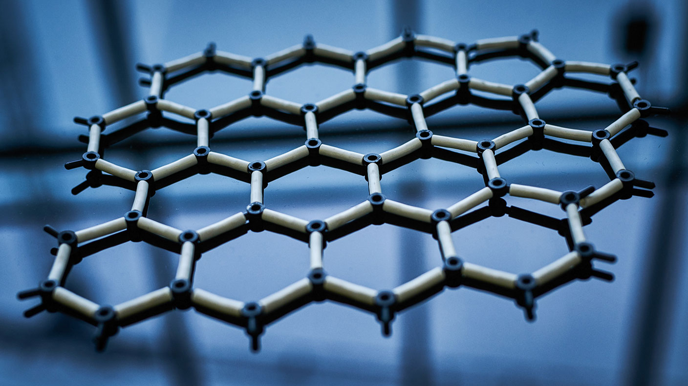

I saw in the news that IBM has developed a new chip technology at the 2 nanometer (10\-9 meters) scale. I thought it would be fun to brainstorm on the differential between nanosheet technology and nature’s fundamental technology — immutable point charges. So let's dive in and see where this goes.

What on Earth is a nanosheet?

> _A nanosheet is a two-dimensional nanostructure with thickness in a scale ranging from 1 to 100 nm. A typical example of a nanosheet is graphene, **the thinnest two-dimensional material (0.34 nm)** in the world. It consists of a single layer of carbon atoms with hexagonal lattices._
> 
> Wikipedia

I wonder what is meant by 'two-dimensional'. Does that indicate that all nanosheets are a single layer atomic mesh with kinks? Here are some artistic images of graphene.

Ok, so let's do some calculations. First let's tally up the point charges in a carbon atom!

- Six protons. Each proton is 15 electrinos and 21 positrinos.

- Six neutrons. Each neutron is 18 electrinos and 18 positrinos.

- Six electrons. Each electron is 9 electrinos and 3 positrinos.

- _N.B. Electrons have one 3:3 energy core; protons and neutrons have **three** 3:3 energy cores, accounting for 9:9 of their point charges. This leaves the remaining point charges to implement the personalities and colorful behaviour of the standard model._

- _N.B. Each electron, neutron, and proton has a wave equation that is a superposition of the potential waves from the path of each point charge. No wonder quantum theory is hard when approached from the topside!_

<figure>

| Standard Model Particle | Electrinos | Positrinos | Particle Count | Total Electrinos | Total   Positrinos |
| --- | --- | --- | --- | --- | --- |
| Proton | 15 | 21 | 6 | 90 | 126 |
| Neutron | 18 | 18 | 6 | 108 | 108 |
| Electron | 9 | 3 | 6 | 54 | 18 |
| Totals |  |  |  | **252** | **252** |

<figcaption>

A carbon atom expressed in point charges.

</figcaption>

</figure>

**There are 504 point charges in a carbon atom!**  

<figure>

<figcaption>

https://www.livescience.com/28698-facts-about-carbon.html

</figcaption>

</figure>

* * *

<figure>

<figcaption>

https://technofaq.org/wp-content/uploads/2017/06/graphene.png

</figcaption>

</figure>

- This infographic specifies the length of the side of a graphene cell.

- The cell area equals 0.052 square nanometers or 5.2 x 10\-20 m2.

How many carbon atoms are there per hexagon cell of graphene? Here's how I think about it. Each carbon atom is a vertex adjacent to three cells. Therefore each vertex counts as 1/3 towards each cell. A cell has 6 vertices which leads to 6/3 or 2 carbon atoms per cell. Therefore, we conclude **there are 1008 point charges per graphene cell**. N.B., presuming the same conditions as the example sample.

- What is the volume of a cell? The area is 5.2 x 10\-20 m2.

- The thickness from earlier was 0.34 x 10\-9 m.

- **Volume of a graphene cell = 1.78 x 10\-29 cubic m3.**

How much volume do the 1008 point charges consume? First we need to calculate the volume of space consumed by an immutable point charge. If we guess the radius of immutability equal to Planck length divide by 2 \* pi, what is the volume of each point charge sphere?

Radius = Planck length divided by tau = 2.5723 x 10\-36 m.

- **The average volume of absolute space around one immutable point charge is 7.13 x 10\-107 m3.**

- How densely do point charges populate the volume of a thin layer of graphene?

- Volume of all point charge regions = 1008 x 7.13 x 10\-107 m3 = 7.19 x 10\-104 m3.

- The volume of the graphene cell was 1.78 x 10\-29 cubic meters.

- Density of space surrounding the average point charge in a graphene cell is 7.19 x 10\-104 divided by 1.78 x 10\-29 = 4 x 10\-75.

- **The thin 3D cell of graphene has a point charge volumetric density of 4 x 10\-75.**

- The volume of a graphene cell is only very slightly consumed by the point charges in the carbon atoms.

In addition to, and perhaps dominating the volume, are the point charges in the permeating aether or in passing neutrinos or photons. .

I presume that the aether at 2.7K that permeates everything is far more dense in point charges than what we call standard matter in the quantum era. One point of evidence is that there are always aether clusters nearby ready to take on energy from a reaction and blast off as a neutrino or photon. This makes sense. We are surrounded by and permeated with a far denser aether of relatively very low energy point charges.

Amazingly for Albert and Mileva Einstein this appears to be true throughout almost the entire range of spacetime aether dynamics, although the two extremes of energy are serious issues. This makes a lot of sense to me. The 3:3 electrino:positrino energy flywheel is a fantastic design as well as the contra-rotating coupled flywheel, the 6:6 photon. Everything is modular and interchangeable (fine print: at certain energies and conditions, i.e., the set of all phase diagrams)

Fortunately all you have to do is zoom up in scale a few orders of magnitude and avoid issues with the extremes of energy because they are unobservable and general relativity is amazingly precise. Given the depth of scale of based nature, it should come as no surprise that our present level of technology (circa 2021 papers) we are only capable of observing behaviour where general relativity is precise.

**If you could play back a space and time visualization of the neighborhood of any point in Euclidean space and time at any scale, and you took the logarithmic elevator to any Planck extreme, you would presumably see dynamical behaviour caused by the immutable point charges.** **General relativity does not address this discretization.**

One extreme is the peak energy Planck core state and presumably around the core and any escaping Planck plasma where immutable point charges make a significant difference in the math of such an extreme condition.

At the low energy end of the spectrum, far below 2.7K, is also unknown how spacetime aether behaves and perhaps somewhat unobservable. Are we simply fortunate that the steady state of the universe with the given density of point charges and energy carried by those point charges settles on a condition where there are no true large Euclidean voids? This will be a fun topic for physicists to speculate upon and astronomers to seek to observe if it is deemed feasible.

One point of this post is that there are many orders of magnitude to go before advancement in technology hits the limits of nature. Whilst we are stuck in the general relativity and quantum theory era our progress is dissatisfactory. In the NPQG era, I expect that after investment and incubation periods, that technology will advance far faster than Moore's Law, for quite some time in a number of areas.

Alas, there is a limit to nature, which Planck and others put right under our noses. The closer you get to limit, the environment gets rather energetic and reactive. That makes it interesting to think about theoretically.

How do point charges implement Planck's Law and what are the physical mechanisms that affect the shape of the function? Is the shape of the curve determined at the level of a single isolated electrino : positrino binary (if it could emit a photon), or is based on interaction with the structure of the aether clusters (12:12)? It’s rather ironic that the Ultraviolet Catastrophe was a failure to the _then_ contemporary theory of classical hard little balls. It didn’t mean that classical was wrong, it was simply that nature implements classical some 20-25 orders of magnitude down the logarithmic elevator.

<figure>

<figcaption>

https://thequantuminsight.wordpress.com/2019/06/21/explaining-the-plancks-curve-of-the-black-body-radiation/

</figcaption>

</figure>

I have an intuition that the peak of the curve corresponds to the maximum apparent energy in the Euclidean space and time base frame. It’s fun and challenging to imagine the physical mechanisms that implement Planck’s Law. I think it goes something like this. It's important to develop a clear vision before attempting to undo the prior era interpretations, while referencing the prior era formulas, and refactor those formulas for the emerging understanding of the immutable point charge universe.

- Let’s start with a breaching Planck core.

- Does an SMBH spin create a frame dragging vortex that causes the breach which releases the jet of Planck energy point charges? How would that work?

- Perhaps the vortex creates a lower density environment including a viscous phase of aether that is nevertheless quite inflated and is brought in contact with the Planck core. This may suck in accretion disk matterial as well. Seems like the ultimate scale rocket engine!

- There is a symmetry breaking degree of freedom that emerges such that point charges can depart the core.

- Binaries form with various quantized energy levels.

- The radius of orbit of emergent binaries may be as small as **electrino** : **positrino** binary curvature limit. That curvature limit corresponds to the Planck scale, i.e., length, frequency, energy.

- This curvature limit is the lowest level of asymptotic safety and it prevents a binary from continuing to absorb energy and go to higher frequencies and smaller radii.

- Long story short, matter-energy is going to basically follow the timeline as defined by the inflationary big bang.

- Orbiting electrino : positrino binaries are emergent and soon stochastically diverge in energy levels as energy transactions occur in the inflating maelstrom.

- Emergent mechanisms including binary capture and standard model personality formation occur as reaction begets reaction and emergence builds ever more complex structures.

- All the while the jet is moving and inflating rapidly, or direct aether emissions are inflating rapidly.

- As the "mini-bang" timeline proceeds, eventually microwave photons can escape and proceed through the aether, redshifting as a function of a set of mechanisms, each with their own model and math.

- Fast forward eons, perhaps around 14 billion years when those photons are being detected far away on a little planet called Earth and are interpreted as the cosmic microwave background of a one time universe wide inflationary big bang. (Oops).

- I wonder what happens when photons and neutrinos redshift down from relativistic speeds? Do they destabilize or react to produce a new low energy structure? Do they join the spacetime aether at some point?
