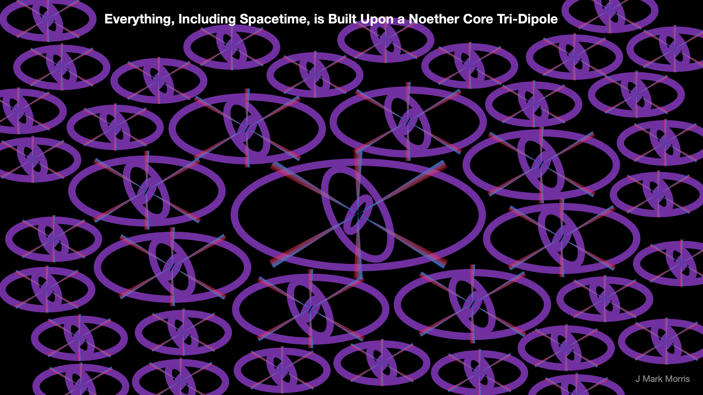

One might argue that Lienard and Wiechert own some responsibility for the false priors established by their circa 1900 work on point charges and action due to history potential. They did not consider fractional point charges, because at the time, all that was known was positive and negative charge. I think this was well before the idea of a neutron. In any case, it was decades before the understanding of quarks and fractional charges in units of |e/3|. When Jefimenko later wrote his equations on point charge path history, he also erred.

Now, it turns out that if we consider point charge with charge magnitude |e/6| then things get really interesting. We've never observed anything with charge magnitude |e/6|. Yet one can easily imagine an architecture which uses |e/6| point charges to construct |e/3| and |2e/3| assemblies which we know as quarks. Thus emergence suggests that we may be able to use assemblies of |e/6| fractional charges to make all the particles of the standard model.

What is the architecture of the standard model particle assemblies? Is a photon an assembly? If a photon is an assembly at a higher ontological level, why did Lienard and Wiechert, and later Jefimenko, limit point charge velocity to "c". This is the second false prior that they introduced. The combination of these two false priors allowed the ill-conceived paradigm shift from classical physics to quantum physics. This resulted in diversion of the field of physics in to effective theories which were productive for technology development, but which have strayed ever farther from understanding the implementation of nature.

Consider a person with a Ph.D. in physics who has spent years mentally challenging themselves to comprehend general relativity, quantum theory, and lambda cold dark matter cosmology. It is understandable that they may have cognitive dissonance with a conjecture that the background to the universe is Euclidean time and 3D space and that point charge based assemblies called Noether core nested tri-binaries are the wonderful culprits that have been responsible for all the tomfoolery about which modern physics is so confused.

My picture can't begin to do it justice, but imagine that the orbital radius of each binary may be anywhere from Planck scale at 10\-35 m up to perhaps 10\-15 m or maybe higher? Spacetime is implemented by a sea of these Noether core tri-binary assemblies permeating Euclidean time and space. The binaries are nested and may be at vastly different scales of energy. Each Noether core assembly used in a standard model particle may have a different set of binary energies in its Noether core. The overall sea of the universe is permeated and populated by assemblies that have widely varying internal energy wells.

A Noether core is on the surface a simple dynamical geometry. It's more nuanced than you might realize at first. Consider path history, the speed of the potential field, any transverse velocity effect on path history dynamics, that the speed of a point charge is not limited by physical law — but by interaction, and then toss in classical mechanics aware of these twists. Remember to consider that standard matter particles also couple personality charges and come in a variety of configurations as documented by the [Particle Data Group](https://pdg.lbl.gov/) listings.

I think it is amazing that such a simple set of base components and physical laws can, via emergence, produce the beautifully architected shape shifting gauge invariant structure I call the Noether core nested tri-binary.

Had Jefimenko, Lienard, and Wiechert avoided their first error and considered fractional charges in assemblies, they may not have made the second error of limiting point charges to speed c. In that revisionist physics history, Michelson-Morley would have been reinterpreted, nor properly, circa 1900. Einstein then might have taken these ideas and combined them with his studies of Brownian motion of uncharged particles. What if Einstein had considered a sea of charged fractional charges? I think he would then have looked for an emergent assembly that somehow implemented his curved geometry and he would have stuck with his 1905 intuition about the variable speed of light. Einstein might have solved nature by 1910 in this alternate imagination. The notion of the quantum would have been evident from the corrected geometry and who knows, the 1927 Solvay conference, instead of ushering in quantum mechanics, might have focused on the positive applications of the solution to nature.

https://videopress.com/v/1F868dZB?resizeToParent=true&cover=true&autoPlay=true&loop=true&muted=true&persistVolume=false&posterUrl=https%3A%2F%2Fvideos.files.wordpress.com%2F1F868dZB%2Fnoether-core\_mov\_std.original.jpg&preloadContent=metadata&useAverageColor=true

In physicists defense, nature personified is amazingly tricky. The dominant core assembly permeating the universe is a shape-shifting battery for energy that powers every type of measurably stable particle assembly. Even spacetime.

If you follow the story, you can see how the misses in logic or creativity happened based upon what was known at the time. It is amazing that such simple deviations have caused over a century of confusion about the actual implementation of nature. I hope I am around when the academic science historians study this and flesh out all the detail and nuance. How near did physicists get at various times in the last 150 years? Were there people that were close to the solution but were discouraged as being out of the mainstream? Why did a tree of false interpretations grow? How exactly did each new narrative false prior come about and what was its root cause?

**_J Mark Morris : Boston : Massachusetts_**
