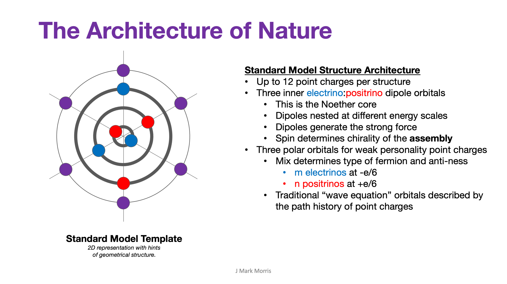

I was listening to a 2019 podcast interview of Steven Weinberg from "The Universe Speaks in Numbers" podcast. The discussion delves into one of my favourite topics — what in nature is fundamentally continuous and what is fundamentally discrete? It turns out that the answer depends on the context and is often highly nuanced. Structures may contain a mix of continuous and discrete behaviours.

> _When I started to learn general relativity a lot of the books on general relativity that I was reading, tried to explain it in terms of the mathematics of curved spacetime. That's not the underlying physical principle. **There is an underlying physical principle \[of GR\] — the equivalence of gravity and inertia.**_ _This concept can then be formulated in terms of curved spacetime, but you can not defend, for example, the appearance of the curvature tensor in Einstein's equations, by saying that's what determines the curvature of spacetime_. _It has to be defended on other grounds, for example the equivalence of gravity and inertia._
> 
> Steven Weinberg

I particularly enjoy this quote and find it to be quite fantastic, since I can tie this discussion of the **equivalence principle**, the equivalence of gravitational and inertial mass, directly into the NPQG implementation. In both cases the particle presents the same mass. Why? First, we need to disprove the equivalence principle on a technicality. We'll circle around to why the equivalence principle is still crucially important.

Clearly gravitation around an orb such as earth vs. inertia in the middle of outer space are two different cases at a macro level at least! They are technically differentiated as well. In the ideal gravitational case the particle is equidistant to the center of gravity and the aether energy gradient is constantly adapting yet **focused** **radially** on the CoG. In the inertial case, the particle is traversing through spacetime aether. There is no CoG of spacetime aether and Earth's matter. There is just an (ideally) **parallel source of force** and the spacetime footprint of the waves in the point charge aether. In both cases there is an energy level and an energy gradient of spacetime locally (which may include the whole of earth in one case, and the vicinity of the elevator car in free space in the other. The equivalence principle appears to say that it is (nearly) the same energy level and gradient and it is most definitely not. Now we can go beyond the equivalence principle and understand why it is useful and explaining this history and the differential will provide a tremendous amount of insight for future students of physics.

It seems to be that mass and inertia have to do with the orientation of the three binaries in each Noether core at the first order, then the geometry of the personality point charges at a second order. Photons are bosons, so reasonably planar (offset bi-planar), which leads to a very low mass or inertia and hence photons sail right through the aether with only a slight analog leakage due to expansion of the aether particles, i.e., redshift. It appears these behaviours are correlated.

- starting with a particle structure at rest

- and then performing work upon the structure to accelerate it

- we are causing the angular momentum vectors of the three binaries to become more aligned

- work is a method of transferring energy to or from the structure

- the energy-momentum relation emerges from this behaviour

- the instantaneous relative mass of an object is directly related to its apparent energy.

- The terminology 'apparent energy' begs the question, "apparent to what?"

- Apparent to all nearby particle structures, which will oft be spacetime aether particle structures.

- We are sneaking up on the conclusion that mass is the coupling of structure energy to spacetime aether.

- The beauty of nature is that this is an a/c coupling. It is only a push me - pull you excitation in passing.

- The orbiting binaries in each Noether core excite all other nearby particles and their Noether cores, including those particles which make spacetime aether.

- These passing interactions of orbitals produce an equilibrium instantaneous standing and passing wave at the same time. I hope I am describing that the right way technically.

- So mass is emergent. Entirely emergent.

- If the aether had not emerged there would be no medium for mass to be transmitted and hence no gravity.

- Thankfully the density of point charges and point charge energy in the universe is such that spacetime aether is not spotty.

An observation of relevance is the neutrino which presents an oscillating mass. In NPQG this is modeled as a dynamical, but regular shift of the orbits of the three planar binaries. It is very possible that photons contain quite a bit of shielded energy and eventually redshift to become neutrinos which happened to be at some resonant energy levels where they are stable, but the binary orientations constantly shift. I presume velocity is a factor too. Gosh it will be fascinating when the theorists can model how far a super high energy photon could travel unobstructed before redshifting into a neutrino and then eventually slowing enough to join the spacetime aether. It's kind of mind blowing, but I will hazard a guess that T >> 13.8 B years.

Higher apparent energy must involve the binary planes moving towards orthogonal. So then what is happening with the photon? Remember the photon is made of a coupling of a Noether core and an anti-Noether core. Overall, it is 6/6 but in reality, it is (3:3) : (3:3). The Noether cores are contra-rotating, hence the perception of the electromagnetic wave. The photon orientation is somehow such that there is virtually no cost to its travel. There is very little inertia but it has energy. Is it some magic configuration that works out due to emergence? It seems to span quite a wide energy range. So when the photon redshifts down to super low energy, what happens then? Is there another case where at super low energy the wings unfold again? Does a photon redshift into a neutrino and then eventually into spacetime aether particles?

The aether has a floating continuous energy level accumulated based on the r.m.s. of all impinging mass waves through the aether itself. Still I wonder if there are more mechanisms, perhaps at different scales that are non-scattering energy reducing transactions. We also have to remember that the aether may be the source of the W, Z, and H bosons as well. What exactly is the configuration and mix of the aether?

* * *

It is ironic that the NPQG point charge era universe is best understood (so far) as an analog implementation in Euclidean space and time with two equal and opposite, charged, and immutable point charge types.

**What is continuous about a point charge?**

- absolute position,

- absolute velocity,

- kinetic energy,

- electromagnetic potential energy

**What is discrete about a point charge?**

- the point charge is a discrete object with certain immutable properties

- Immutability implies conservation

- An analog system can implement structures with quantized behaviour. See the flip flop and digital everything.

There are several ways to model immutability, but the end result is that no point charge can penetrate within a certain radius of another point charge. I suggest a formula based on the permittivity and permeability, which are in turn driven by point charge interactions. But even permittivity and permeability may be emergent concepts. Is it really the case that space provides the limitation or is it an effect of the field of one point charge acting on another point charge? We must address all geometries, symmetries, and asymmetries. Perhaps we can add immutability with a maximum field to point charge interaction. That would be better than to assign the implementation of the limit to space itself, which would cause a turtles all the way down concern.

Now, here is the fascinating next step in emergence : The basis of nature is both analog and binary, or discrete in a sense. Nature provides two types equal and opposite point charge types which ultimately lead to information and the bit in some emergent structure or engineered circuit. Hence we arrive at minus and plus, and zero and one. We also have emergent structures with harmonic behaviour that exchange energy in h-bar quanta.

Quantum mechanics led to a new way to consider nature as driven by energy quanta. While this is true of some emergent structures, energy is continuous in nature.

<figure>

<figcaption>

© 2012 Pearson Education, Inc.

</figcaption>

</figure>

The implementation of quantization is not understood by the theory of quantum mechanics. Let's explore and differentiate what is quantized and what is continuous in NPQG.

CONTINUOUS

- Energy in electromagnetic and kinetic form.

- Gravitational wave energy ebb and flow.

- Position of a point charge in absolute Euclidean space and time

- Spacetime æther displacement due to gravity waves caused by high energy events.

- The strength of potential fields in absolute space and time from an individual emitter and in superposition.

- Absolute time (an abstract concept).

QUANTIZED

- Unit potential point charges, the electrino and the positrino, are discrete and immutable.

- Assemblies that emerge from energetic point charges.

- Energy transfer between Noether core sub assemblies, in wave function harmonics.

- Time experienced by a standard model particle assembly of point charges is related to the frequency of its constituent point charges in the Noether core.

QUANTIZED AND CONTINUOUS

- Assembly energy is a sum of quantized energy and continuous energy ebb and flow. In particular, æther energy, which determines the strength of gravity, is a combination of both quantized and continuous energy.

**_J Mark Morris : Boston : Massachusetts_**
