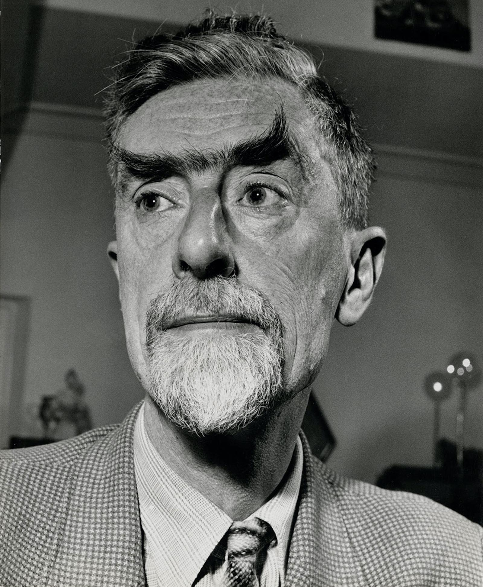

Neutrinos are known to oscillate between flavors (i.e., electron neutrino, muon neutrino, and tau neutrino), but the mechanism is not understood in quantum mechanics. Perhaps 𝗡𝗣𝗤𝗚 can lead to an explanation by showing how energetic rotating binaries of electrinos and positrinos can behave in a loose coupling with geometry varying over time. First, let's examine oscillation probabilities for an oscillating neutrino.

<figure>

<figcaption>

Wikipedia

</figcaption>

</figure>

In NPQG, we hypothesize that neutrinos are implemented as a neutral set of 3/3 weak personality charges supported by a Noether core. Spacetime æther is modeled as being composed of low apparent energy Noether cores. Neutrino mass oscillation could be explained by a precession of the Noether cores that periodically exposes more or less of the energy of the gen II and gen III binaries.

Consider the probability curves in the neutrino oscillation charts. The three probabilities add to one. We can see that the energy of the neutrino is related to the speed of the oscillation. Perhaps we can consider the probability as a proxy for the amount of energy carried by each of the particles in superposition. Wikipedia says, "The basic physics behind neutrino oscillation can be found in any system of coupled harmonic oscillators." This is fascinating, because 𝗡𝗣𝗤𝗚 electrino/positrino binaries carry harmonic waves, and are harmonic oscillators.

How would we describe the physics of a group of electrino/positrino binaries? We might imagine that within each binary the electrino and positrino attract each other. As each particle orbits the other, it is chasing the ephemeral position of where their partner was in the past when it emitted the electric field that is currently arriving after having propagated at the local speed of electromagnetic fields, also called the local speed of light, c. This is only a primitive visualization. The actual dance of the constituent point charges will reveal itself via simulation.

We might explain neutrinos as an attracted group of binaries. They drift apart and back together. There is a regular cyclic trade of kinetic and electromagnetic energy forms for this amorphous group. The electron neutrino is three binaries in a Noether core plus a neutral 3/3 weak personality layer. If you name the binaries abc, you can imagine various clusters forming in a loose coupling: abc, ab + c, ac + b, a + bc, a + b + c. This seems like a reasonable dynamic vision, although reality may be way cooler.

_**J Mark Morris : San Diego : California**_

Update March 2023 : Here's a great video by Sabine Hossenfelder that discusses neutrino oscillation. Sabine also mentions that other standard model particles oscillate too. This is great, because it is consistent with the NPQG model where particles contain tri-binary Noether cores.

https://youtu.be/p118YbxFtGg
