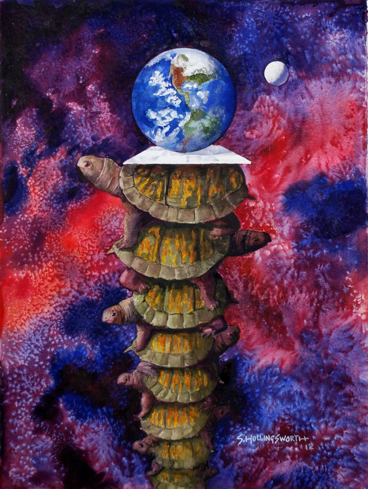
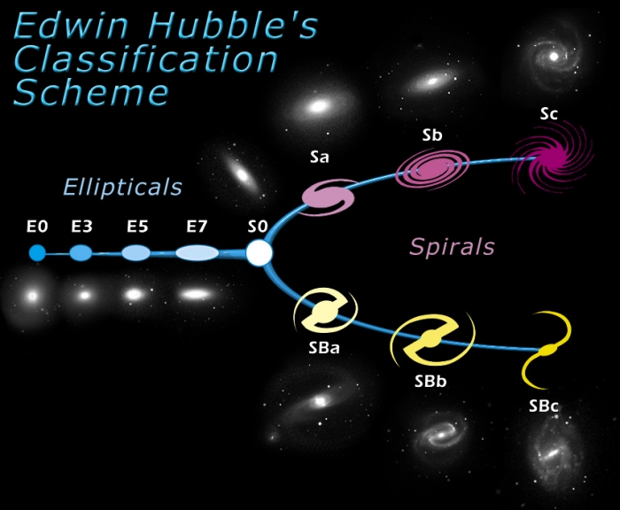
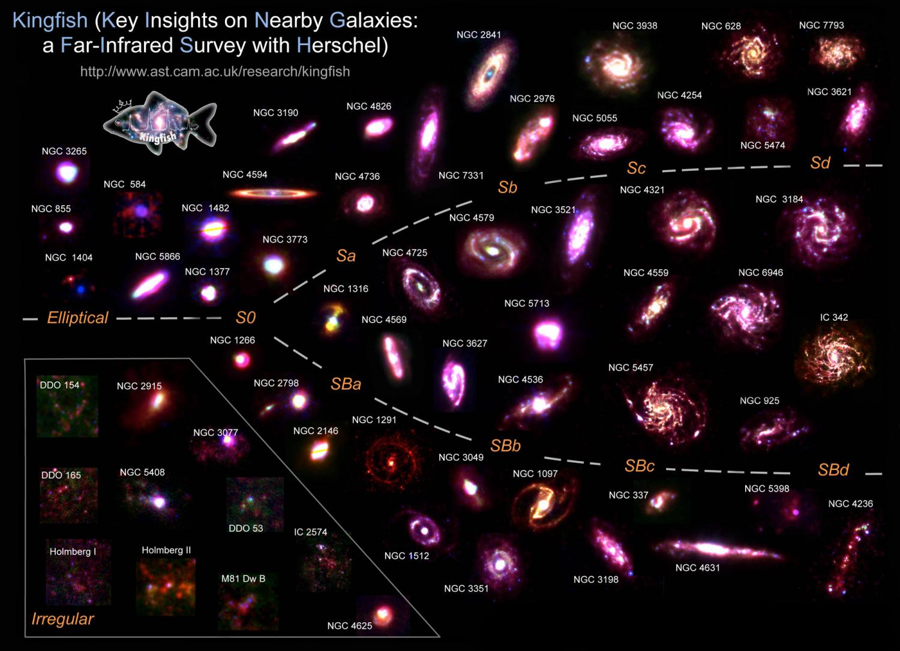

I was watching the video from Domain of Science which has an illustration that resulted in me pausing in dreamland for half an hour. Now I feel like brainstorming on galaxy dynamics.

So here we go. I've written quite a lot about new ways to think about supermassive black holes and their cores and jets. I've posted often about jetted point charges and the structures they form along the route. I've wondered about the terminii of jets and some of Halton Arp's thinking (whether his observations held up or not). I think it will be fascinating when the NPQG era astrophysicists make advancements in understanding the entire flow and reaction products of point charge jets and what escapes the galaxies as well as the characteristics of what falls back to the galaxy via gravity. That is exactly the subject I want to think about now.  
_N.B. this is a fun idea mode blog post and some or all of it may be nonsense_.

https://youtu.be/uniGQrGLEoI

In NPQG we hypothesize that recycling of matter-energy at the fundamental level occurs in supermassive black holes. This seems to fit extremely well with the thinking of some of the top outreach physicists, like Lee Smolin, Carlo Rovelli, Sir Roger Penrose and several others. However, all of them are stymied in their thinking to a large degree by the faults and limitations of their patchwork quilt of observations and effective theories. The misguided interpretations of cosmology are going to be very problematic for the field, but I suspect there will be plenty of re-analysis of data and mea culpas for building on top of convoluted and wrong priors. **It's physicists all the way down** standing on each others shoulders all the way back to the misinterpretation that there is no aether based upon the observations of Michelson-Morley.

<figure>

<figcaption>

"It's physicists all the way down." — J Mark Morris

</figcaption>

</figure>

When I look at these depictions of galaxies in the context of NPQG and the massive point charge jets that can emanate from SMBH, I can imagine several scenarios whereby the shape could be attributable directly to the jets. When you look at the spirals shown in the picture below from DoS video they all have two arms. I realize this is just an artistic depiction and I'll include more galaxy structure images or links below.

Case 1 : SMBH jets slightly tilted from orthogonal to the galaxy plane. The jet has a velocity that will carry point charges very far, even for the ones that fall back. However, because of the tilt, that portion of the jet falls back at a larger radius in the spiral. In a mutual feedback system, the rotation of a galaxy should also influence the rotation of spacetime aether. This would be a very weak form of general relativity's frame-dragging. Then, the rotation of the spacetime aether around and above the galaxy would in turn influence the rotation of the jet plume as particle structures gravitated back to the galactic plane. If there were a single long jet event one could imagine a full rotation or more of the galaxy for the matter-energy to gravitate back. This scenario could cause the spiral galaxies. There are galaxies with more than two arms. Perhaps they could be caused by multiple jetting events.

Case 2 : Like Case 1, but jets tilted farther from orthogonal.  
In this case the strong focused part of the jets are closer to the plane and the material that falls back and forms a bar hasn't had enough time or the right conditions to be curved into a spiral. What causes the sudden transition to the spiral portion? Could there be some transition in the jet or jet cast-off material at that point? The spiral portion would have the same story as Case 1.

Case 3 : Precessing jets, spraying jets, or SMBH ruptures.

I can sort of imagine how a precessing jet could cause an elliptical galaxy, spraying energetic point charges all over the place. The lenticular galaxy looks to me like an elliptical one that is tarting to coalesce around a galactic plane. I have no idea how an SMBH might rupture, but if it did that would release a large scattered collection of energetic point charges.

I have no clue if these ideas are relevant to the shapes of galaxies. However, as a first set of ideas they don't seem unreasonable in the NPQG era. As I learn more about galaxy dynamics I'll see if I can improve these notions.

**_J Mark Morris : Boston : Massachusetts_**

p.s. Here are some real galaxies. See if you can imagine the dynamic that influence the shape in the context of NPQG.

<figure>

<figcaption>

Universe Today

</figcaption>

</figure>

<figure>

<figcaption>

Space Telescope Science Institute

</figcaption>

</figure>

