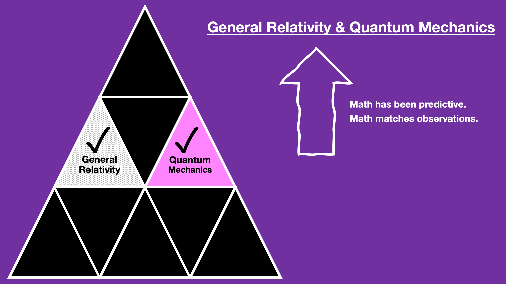
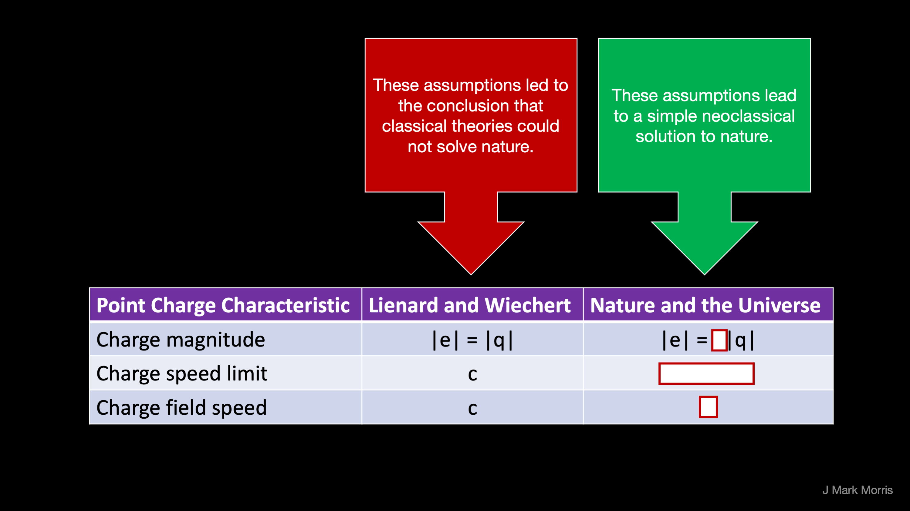
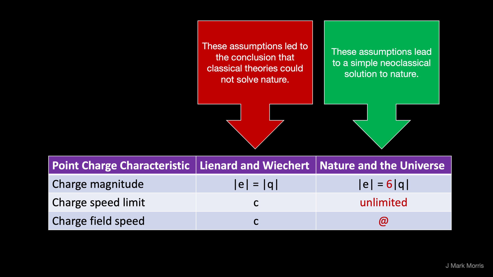
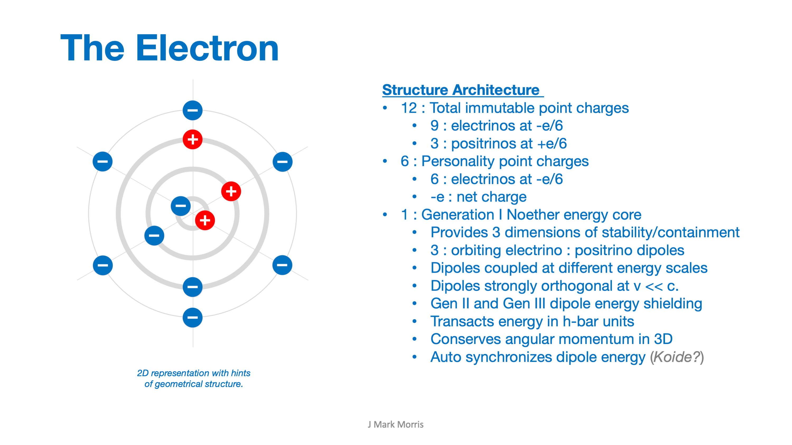
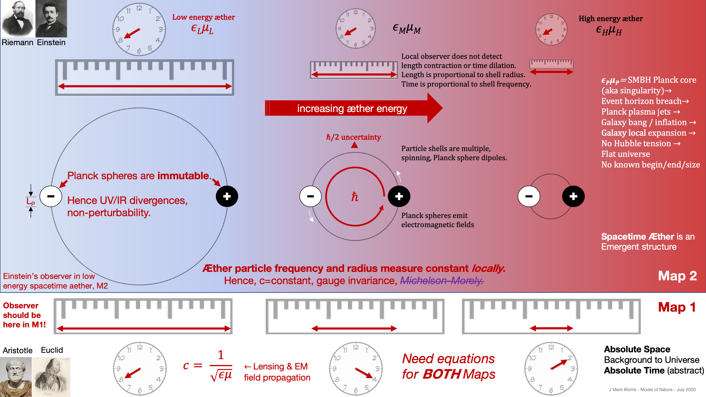
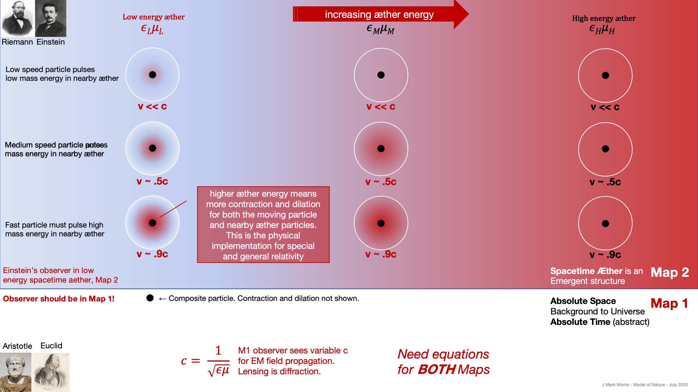
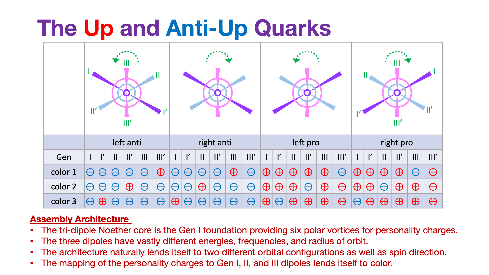
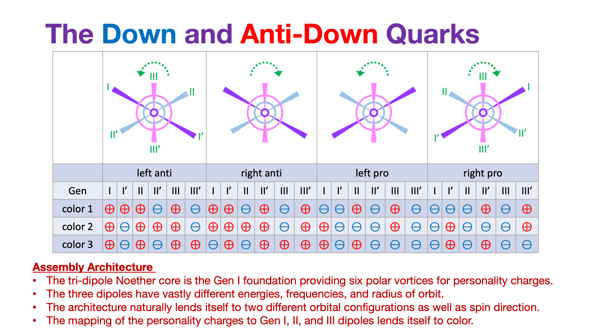
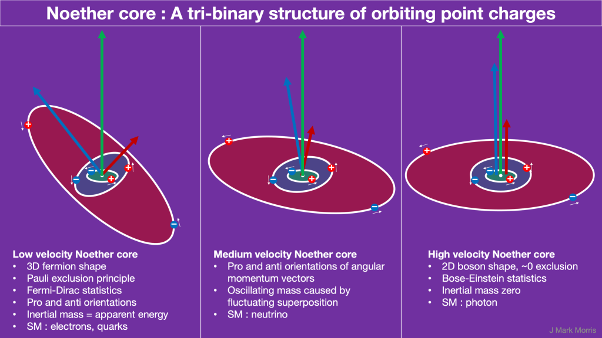
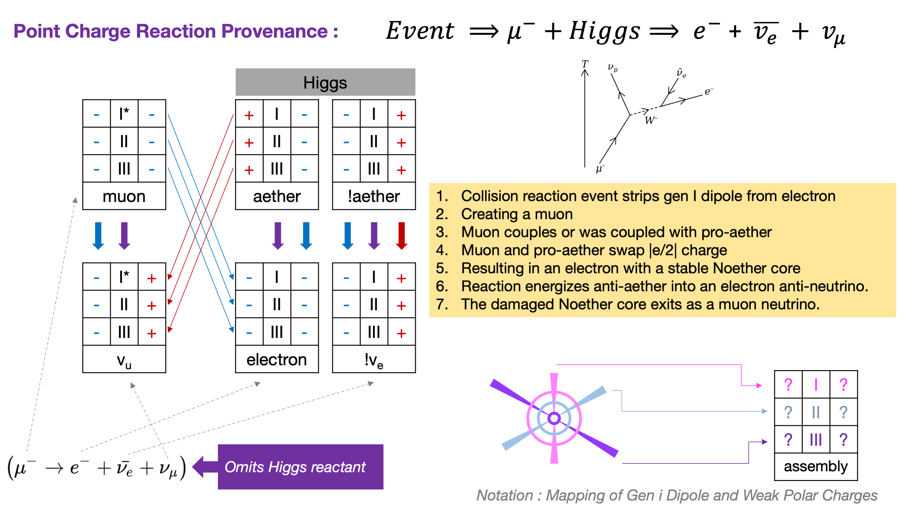

Illustrations of the point charge architecture of nature.

https://videopress.com/v/1F868dZB?resizeToParent=true&cover=true&autoPlay=true&loop=true&posterUrl=https%3A%2F%2Fvideos.files.wordpress.com%2F1F868dZB%2Fnoether-core\_mov\_std.original.jpg&preloadContent=metadata&useAverageColor=true

https://videopress.com/v/Ev4pYz0T?resizeToParent=true&cover=true&autoPlay=true&loop=true&posterUrl=https%3A%2F%2Fvideos.files.wordpress.com%2FEv4pYz0T%2Ffermion\_mov\_std.original.jpg&preloadContent=metadata&useAverageColor=true

* * *

**_J Mark Morris :_**  
**_San Diego : California,_**  
**_Boston : Massachusetts_**
