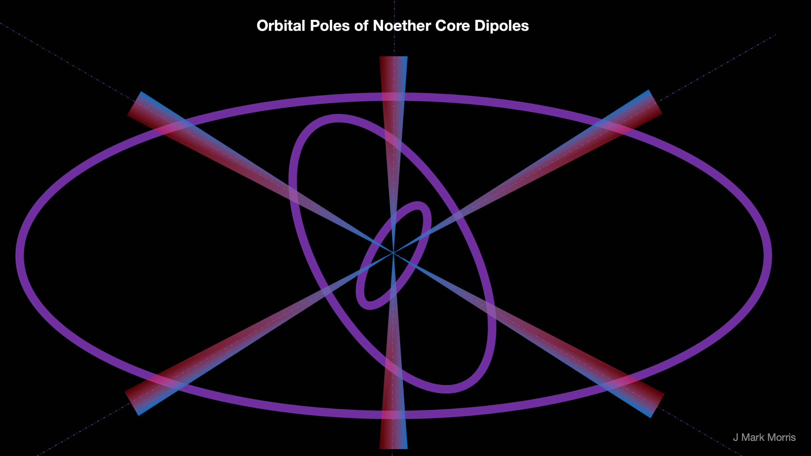

The energy of the inner binaries is shielded by the superposition of the presumably precessing (in an angular momentum preserving pattern) binaries. This is probably one of the largest surprise predictions of point charge theory, that every particle we measure has enormous, shielded energy in the inner binaries of the Noether core. I calculated **25000 X** the standard model mass for a Proton + Neutron + Electron. That's not counting Higgs!

In point charge theory the velocity dependent macro alignment of orbital planes of the three binaries in the Noether core are what shifts a particle between Fermi-Dirac and Bose-Einstein statistics. Of course, it remains to discover the math at this level, but conceptually it seems logical, given how velocity and charge paths, and Dirac sphere potential streams work (i.e., "delayed" potential).

It is also interesting to consider how these binaries couple and what keeps them from decoupling? Or said the other way, why are they so stable? Clearly the potential fields are “knotted” in some way that preserves angular momentum. These orbits are usually on such vastly different scale that if they were planets there would be virtually no risk of collision if a binary wandered off. Yet because these are unit potential point charges and electromagnetism and not planets and gravity the energy levels and the swirling "A/C" potentials something is keeping them together. Examining the figure, we can see that if this were a physical system of brass rings and rulers for axes, it is not possible to decouple any of the three ring/axis subsystems.

Considering the perspective of binary capture is also interesting. My intuition says that since space is three dimensional, a pair of binaries could couple and then decouple but once an assembly becomes a triplet of coupled binaries that it is somehow stable from decoupling if unperturbed.

The next question is whether there is an order to the coupling. Is it H(ML), M(HL), L(MH). My guess is that since the most energetic binary must form in a very high energy event such as a black hole jet of point charge plasma that the order is typically that high and medium couple and then low comes along a bit later and couples. Depending on the ambient conditions it may be possible that all combos of coupling and decoupling and decay are happening. However, it seems that as the plasma disperses the longevity could increase to the point where they are long term stable in the volumetrically dominant portions of the universe.

It is interesting to consider that the orbital planes of the Noether core tri-binaries may have both a micro and a macro motion. The micro motion being a weaving or dance that results in the precession necessary for shielding of energy. The macro motion being dependent on the group velocity of the assembly and resulting in an alignment of the three orbital planes as the particle shifts from a 3D shape towards a flatter 2D shape as the velocity approaches field speed. I suppose the micro motion may map to the concept of spin 1/2.

However as velocity increases the micro motion may have less of an effect and is completely eliminated when an assembly assumes a 2D planar configuration orthogonal to the travel path. This would then correspond to spin 1. What are the conditions where assemblies can survive in a 2D planar bosonic configuration? Well, let's look at the standard model. It's the W and Z bosons which are short lived, and the photon which has a very long lifetime. The neutrino appears to be nearly 2D but it still precesses but the shielding varies, and thus we observe neutrino oscillation. I suspect many other particles would decay as velocities approach field speed.

Here is a mathematical problem in topology or visualization of 3D geometries. If we imagine doing the eigenmath preserving axis rotations that preserve angular momentum do they in some way correspond to spin 1/2? I don't  know the proper terminology in this area of geometry or group theory.  It seems to me it does sort of require a figure eight like precession which is exactly symmetric between both loops of the figure eight. Spin 1/2 corresponds to 720 degrees or two rotations, as we know.

If I were to say grab on to +z axis and rotate it in some direction, the x and y axis would also rotate to compensate. So if I'm grabbing +z and rotate through the x-y plane it is the same as switching +z and -z. If we now rotate the axis back through the x-y plane we return to the original position. Flipping +z and -z means that the next flip returns to the starting point. This system has spin 1/2.

Note that these binaries are running at three different frequency, radii, and energy gauges. This means that the angular momentum vectors may be vastly different in scale. This mechanism seems like it bridges gauges and is scale invariant. It also seems that the angular momentum of each binary maps to its magnetic moment.

It seems that the high energy binary would have a limited range of vector space in which to vary and be balanced by the much smaller angular momentum vectors of the medium and low energy binaries. On the other hand, the medium and low energy binary angular momentum vectors may have a larger range of vector space to which they can rotate.

It's great fun to visualize these mappings, but it remains to discover the mathematics of this new dynamical geometry.

**_J Mark Morris : Boston : Massachusetts_**
