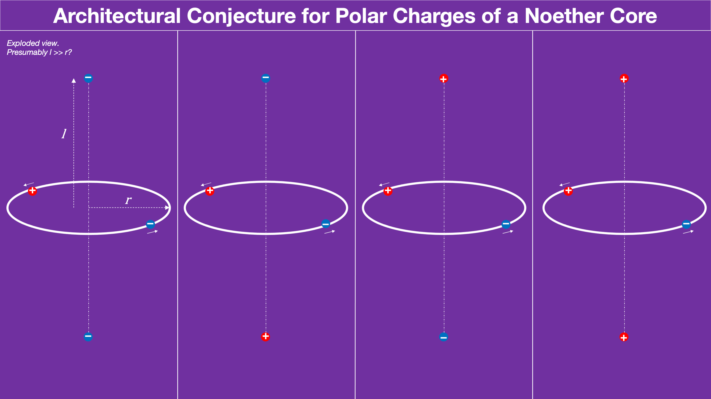
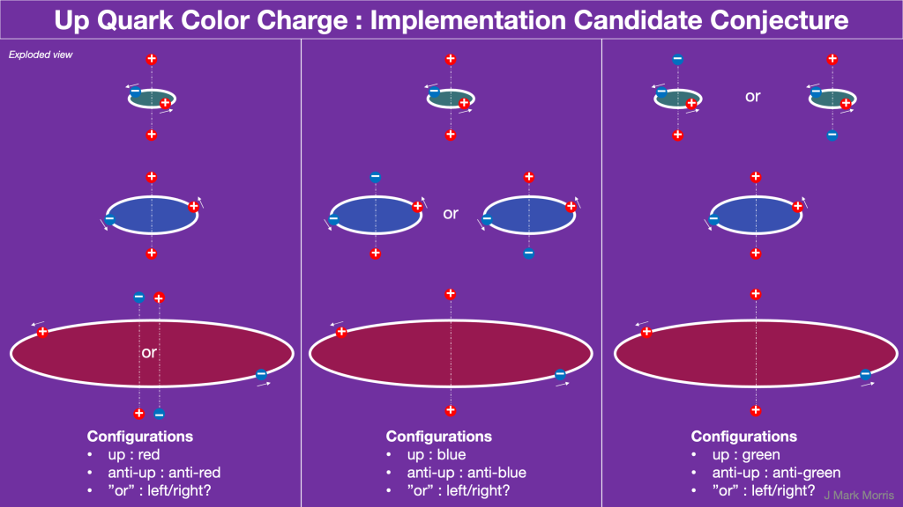
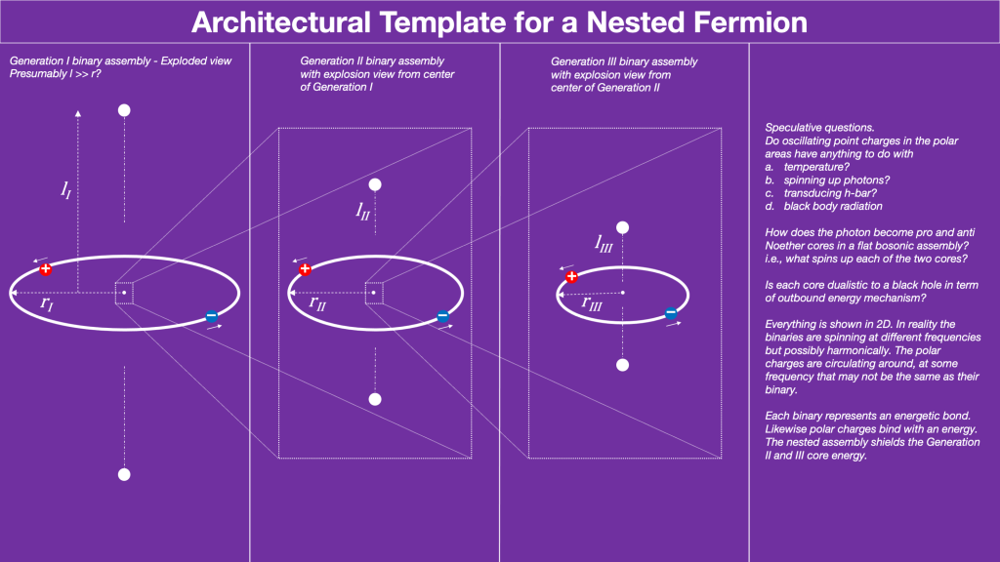

_I've been on vacation for a month in Italy with little time for writing about nature. Perhaps that is good, because my sub and semi-conscious have been grinding on some ideas that are, as always, built on the shoulders of scientists — just not quite in the way they imagined._

The following is speculative conjecture, i.e. brainstorming. The idea is that the six personality charges in a Generation I fermion are strongly bonded in the polar regions of each binary in the Noether core. Therefore we can consider that each binary along with polar charges is an assembly unit.

Let's work our way through this idea and give it the thought experiment test to see if is directionally reasonable. Of course, ultimately the dynamical geometry and/or simulation will help us understand and visualize the natural geometry.

While geometry and simulations are pending, I've been imagining how a unit potential binary operates and how a unit potential point charge is entangled or bonded or coupled in each pole. This is fascinating to consider because it is so simple and so profound at the same time.

Simply imagine the negative and positive unit potential point charges chasing each other around in a tight orbit described by Coulomb's law to first order. We are free to set the magnitude |q| of the unit potential point charges to match nature. |q|=|e/6| works well.

We can consider unit potentials as Dirac delta potentials which are emitting Dirac sphere waves. Now let's imagine one unit potential getting caught up in each pole. We have four possibilities -/-, -/+, +/-, +/+. Note that a virtual observer who at one pole perceives the binary rotating clockwise then at the other pole would perceive the binary rotating anticlockwise. This means that -/+ is a distinct configuration from +/-. Presumably the polar point charges circulate at distances much larger than the radius of the Noether core binary.

I've imagined quad-assemblies of a unit potential binary combined with two polar unit potentials. There are four flavors and various binary energy levels in h-bar. Are the bonded and circulating polar personality charges at far lower energy than the cores bi-directional transducers of h-bar? Do reactions with photons spin them up for transfer to the core? Likewise does an energetic core spin up personality charges to make photons?

Does it become favorable for these sub-assemblies to nest up to 3 binaries in 3D space and perhaps interleave the personality charges? Interdependent path equations.

Let's enumerate the Fermions. Gen I energy binary with polar \[-/-, -/+, +/-, +/+\] Gen II energy binary with polar \[-/-, -/+, +/-, +/+\] Gen III energy binary with polar \[-/-, -/+, +/-, +/+\]

The figure shows brainstorming of potential geometries for the fermions. Not sure this makes sense nor if it is the correct mapping. The good thing is that the degrees of assembly freedom mapping to the standard model is revealing dualities. This is a good sign if it holds. The axial distance to the polar charges is probably much greater than the orbital radius of their more energetic binary. Here's another view that is attempting to depict the nested structure. I've listed a few questions in the sidebar which are imaginative to say the least.

Here is another take that shows orbital orientations.

For the longest time I have vaguely imagined the six personality charges in a fermion at some higher scale radius flying some wave equations. However, I am taking quite fondly to the idea that there is a personality charge caught up in each of the N-S polar vortices of each binary. This gives a whole new canvas for thought experiment where one might imagine the roles polar personality charge might play.

- Does polar personality charge distance vary with energy?

- How do polar personality charges relate to temperature?

- Do polar personality charges transduce energy between photons and Noether cores? Always in h-bar?

- Do polar personality charges act as cantilevered steering devices for binary angular momentum? (creative idea, eh?)

- How exactly is the strong force related to the binary bond and the weak force related to the polar bond?

It is so obvious to me that everything is dynamical. We can precisely characterize certain common situations. Simulation will illuminate the dynamical geometry of the architecture. In the meantime, hopefully at least some of these ideas will have been directionally correct.

**_J Mark Morris : Boston : Massachusetts_**
