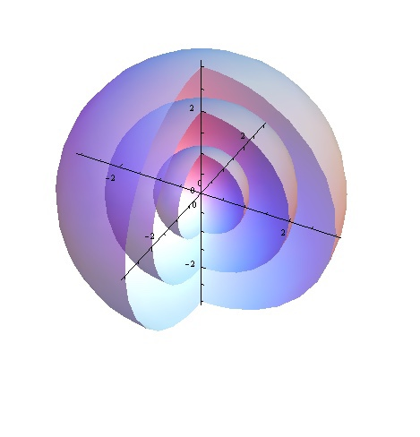

This is it! This is the bridge between GR and QM. It’s a 143 bit counter of Planck's constant **h** J⋅s of energy. It’s a stretchy ruler and a variable clock. It’s a battery. It’s what implements spacetime aether. Its tipping point at one-half Planck's constant **h** J⋅s incremental is QM's uncertainty. It is a reusable sub-assembly and with other binaries can act as a containment device for personality potentials. Fermion generation + containment binaries = 4.

* * *

> Everything is made from energetic point potentials, including spacetime.

* * *

If you are wondering where potential energy is stored, look no further. It must be stored in binaries. So when you do work on your hot cocoa to lift it to your lips you are actually causing binaries in the cup, coffee, and surrounding aether to change orbital angular momentum in Planck's constant **h** J⋅s.

Why you ask? Because the spacetime binaries between your kitchen table and your noggin’ are declining in energy. Each individual binary in spacetime is a 143 bit register with add/subtract of Planck's constant **h** J⋅s. That gradient in spacetime aether energy is how gravity works.

* * *

It's clear we don't need renormalization to deal with a pure binary across its operating range. However, it just occurred to me that since Generation I and II fermions contains higher generation binaries, that when the outer binary is removed that may also be a form of renormalization.

* * *

It is eminently clear that top down science was not the best way to discover the foundation of nature. Approaching from above, through all the complexity of the behaviour of emergent constructs is like climbing down a sheer rock face, backwards, at night, with no safety rope. And then doing that over and over again for an entire career. NPQG on the flip side, is like approaching on a magic carpet ride.

* * *

It occurs to me that each binary may not be limited to orbiting in a plane. I mean how would it know? It can change on a dime. I bet that’s how it works. It’s like each binary has the surface of that radius sphere entirely to itself. And it just goes where the forces take it. Yep! This makes sense. I bet all the interacting equations are what guarantees the conservation. The point particle is following the physics and the physics are so perfect that everything is conserved from an electromagnetic and kinetic energy point of view. All the other conserved quantities that are measured in continuous real numbers are just taken care of by the formulas, by the equations.

* * *

Each pair of personality potentials requires one dedicated binary.

- Eventually we'll need to consider a more general deformable manifold that remains stable at perturbations less than one-half Planck's constant **h** J⋅s?

- Does a precessing binary at radius **r** shield the energy of interior binaries to some degree? This appears to be so in the electron and muon.

- The neutrino shielding is oscillating. What does this tell us?

- Aha! Perhaps the neutrino is quasi-stable.

- Now that we know the architecture it should be straightforward to calculate the radius range of each binary from each mass range.

- As always nature is a trickster!

<figure>

<figcaption>

Mathematica

</figcaption>

</figure>

* * *

It seems like we can start drawing standard model particles as nested groups of circles, with the circle being our 2D notation for a sphere. Here is one way to depict an electron.

* * *

This was a productive day. Physics is fun!

**_J Mark Morris : San Diego : California : December 19, 2020 : v1_**
