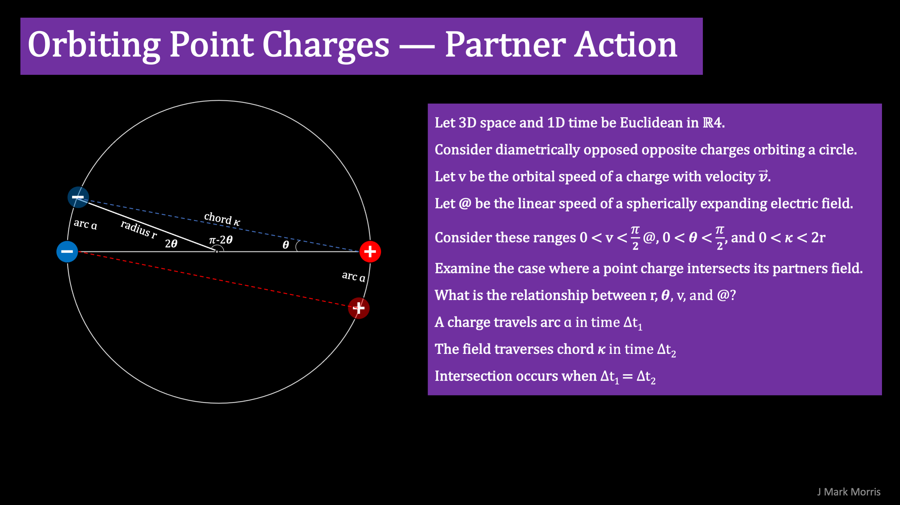

The orbiting binary unifies both general relativity and quantum theories. The binary assembly is composed of one electrino and one positrino, which are conserved energetic point charges with Planck scale immutability as an orbiting binary. Binaries are nested at three vastly different energy levels in the Noether engine, which is the core of all standard model assemblies.

**General relativity maps to NPQG because**

- the binary implements spacetime aether,

- the binary implements variable length with energy,

- the binary implements variable time with energy,

**Quantum mechanics maps to NPQG because**

- the binary implements uncertainty at the one-half Planck's constant **h** J⋅s tipping point of the control mechanism.

- The binary implements the quantum of energy because it clicks off energy in Planck's constant **h** J⋅s.

We may be able to derive exact equations for the motion of the binary.

- The equations for the dynamical geometry will reveal what is happening during QM’s uncertainty period when the binary is in the midst of an energy transfer. I suppose there is probably some overshoot and ringing as the point charges change from one orbit to another.

- Run the simulation for any increment of energy transfer to learn about stability and decay.

- Next simulate the full energy transfer process from end to end between two binaries.

- How is energy is transduced between kinetic and electromagnetic potential forms at each moment of the transaction?

- What is the the specific implementation of apparent energy (mass) excitement of spacetime aether in the theory of gravity?

- When a force acts upon an object made from standard matter, work W is done linearly accelerating point charges as well as changing angular acceleration by spinning binaries up or down.

- This can also be viewed as changes to the momentum of point charges. Note that the first emergent assembly, the orbiting binary, illustrates that angular momentum is really an emergent case of linear momentum between opposite point charges bound together by Coulomb's law..

- That reminds me that I wonder if ‘potential energy’ is the best concept going forward. Is there a better description we could use in the new era?

- Take all that knowledge and model/equations for two interacting binaries in spacetime aether of various energy ranges.

- Then model binaries and other constructs in various spacetime energy levels and energy gradients.

- Now you would truly understand gravity at the lowest possible level of nature.

- It’s odd to think that all the binaries in a rocket ship are being spun up during a launch.

- There’s also an effect due to changing the acceleration of gravity and moving to lower energy spacetime at a reduced gradient. That should be acting to reduce binary energy.

- It’s even more odd to think those spun up binaries convert that energy to gravitational acceleration on the way back down.

- My intuition says we can now find a much simpler way to describe nature, even in everyday language.

- Whenever I say binary and describe its rotation I realize I am visualizing in a circle when they surely can roam all over the spherical surface at radius r due to momentum transfers, aka precession.

- Note that for the specific case of a binary of constant energy a great circular path is mathematically very similar to an arbitrary path on the corresponding spherical surface, ignoring momentum for the moment. 🤓

- And returning to this idea of each binary tracing a spherical surface and the number of binary spheres being given by 4 minus the fermion generation - it is really starting to look like these binary spheres operate as a gimbal.

- Note that wherever I say "spherical" orbit that is shorthand for the more general elliptical orbit. It's easier for me to visualize with circles at this point.

- Therefore generation II and generation III fermions will destabilize in any transaction where they cannot preserve momentum unless there is surrounding environment that provides the missing dimension(s) of containment.

- Every binary has its own clock, its frequency, that is the pace of time it experiences. Imagine binary constructs passing each other closely. The potential from each binary is continuously changing direction at high frequency. Combine that with the spin 1/2 precession of the orbital axis of the Noether core which essentially will look like precession and will add layers of high frequency potential oscillation. The net effect is to shield the energy of the higher energy binaries through superposition.

- A good line of thought experiments is to imagine a construct such as a photon, electron, proton, neutron, or neutrino moving through various energy and energy gradient spacetime aether assemblies - and do that at the Euclidean point charge level.
    - Remember, point charges operate in the flat Euclidean void of time and space.
    
    - Clear your mind of stretchy curvy spacetime when you do thought experiments at the point charge level.

- Even though the binary implements GR, it is amazing that GR is leveraged not just in spacetime aether assemblies at enormous scales, but also inside emergent assemblies at the smallest scales.

- Nature leverages GR inside point charge constructs and that pattern repeats at many scales up to and including large scale structure such as galaxy clusters.

- It would be fun to chart out all the **pattern evolution** in nature, i.e., what patterns are traceably related even though they may be different scale or different structure or exist in different conditions.

I think I can presume the radial forces balance in the stable planar binary, so I am only looking at the force in the line of motion from the swirling potential. It's momentum is the energy store. Then work is done to the binary by applying a force to one charge for N revolutions to boost the frequency by 1 and transfer an Planck's constant **h** J⋅s of energy. Of course both charges in the binary may experience forces of acceleration and deceleration. I say N because the QM concept of spin may be related, especially for composite assemblies with one or more binary. It is as if QM spin is sort of like a set of gears related to energy transfer.

I presume the binary can take a wide range of energy deposit and withdrawal amounts. Presumably its stability is related to its energy (and any personality charges, and any other inner or outer binaries). The more energy, the more difficult to cause the particle to split. **The binary is the most awesome gizmo in the universe!**

Wow! I just realized that if the binary receives a large deposit of energy that the angle theta gets even larger. Then the control system kicks in and causes the binaries to swerve more and reduce the radius according to number of Planck's constant **h** J⋅s received. And the same thing happens to all other transmitters and receivers of energy in the reaction! How cool is that?! That is conservation in action and guaranteed by the new extensions to Maxwell’s equations for variable permeability and permittivity that will be necessary.

* * *

I predict that NPQG will lead to significant improvement in the ability to model N-body motion with math, simulation, and AI possibly all in conjunction. NPQG will result in incredible opportunities in many technologies. I hope I am around to see that, but I have already been imagining.

**_J Mark Morris : San Diego : California_**
