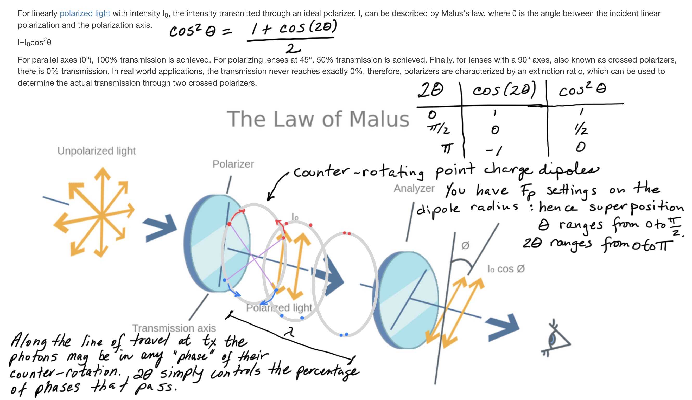

I’ve been thinking about photon polarization and it’s clear that the point charge structure of photons is going to solve the mysteries and issues about polarizers and polarization with a very cogent physical explanation.

Let's examine background information on polarization.

> _Polarization is a property applying to transverse waves that specifies the geometrical orientation of their oscillations. In a transverse wave, the direction of the oscillation is perpendicular to the direction of motion of the wave. A simple example of a polarized transverse wave is vibrations traveling along a taut string; for example, in a musical instrument like a guitar string. Depending on how the string is plucked, the vibrations can be in a vertical direction, horizontal direction, or at any angle perpendicular to the string. An electromagnetic wave such as light consists of a coupled oscillating electric field and magnetic field which are always perpendicular to each other; by convention, the "polarization" of electromagnetic waves refers to the direction of the electric field relative to the line of travel._
> 
> Wikipedia

| Concept   _Source : Wikipedia_ | Quantum Ontology   _Source : Wikipedia_ | Point Charge Mapping |
| --- | --- | --- |
| electric dipole moment | the electric dipole moment is a measure of the separation of positive and negative electrical charges within a system, that is, a measure of the system's overall polarity. | Same definition. The charges are understood to be the electrino and positrino point charges that make the assemblies of the standard model. |
| polarizability | polarizability refers to the tendency of matter, when subjected to an electric or magnetic field, to acquire an electric or magnetic dipole moment (respectively) in proportion to that applied field. | All assemblies are polarizable, including the Higgs spacetime aether assemblies (i.e., "vacuum" polarizability). |
| linear polarization | the fields oscillate in a single direction.      composed of photons that are **_in a superposition_** of right and left circularly polarized states, with equal amplitude and phases synchronized to give oscillation in a plane. | All point charges potential fields are constantly in superposition at each point in spacetime.      The potential fields of the left-handed spin binary and the right-handed spin binary will superimpose locally and match observations. |
| right circular or elliptical polarization | the fields rotate at a constant rate in a plane in a right hand sense (right hand rule).      composed of photons with only right-hand spin. | Point to research: Is it the polarizer that is filtering for one constant rate or is it a natural process that is emitting photons that have an equal rate or are both possible? |
| left circular or elliptical polarization. | the fields rotate at a constant rate in a plane in a left hand sense.      composed of photons with only left-hand spin. | See point above. |
| unpolarized light | Examples : Light from the sun, flames, and incandescent lamps, consists of short wave trains with an equal mixture of polarizations. | How literal is "equal mixture"?   What proportion linear, right, left?   What proportion by rotation rate?   Is linear polarization when rate = 0? |
| polarizer | material that allows waves of only one polarization to pass through. | It will be fun when we can simulate this and understand the specific interactions and reactions that occur in a photon event with a material. |
| birefringence, dichroism, or optical activity | materials that affect light differently depending on its polarization. | This will be fascinating to simulate the different assembly behaviours in detail, with point charge provenance! |
| partial polarization | Example : light reflects at an angle from a surface. | How does a photon assembly bounce off a material surface for example? Or pass through a material for that matter! |

| Concept   _Source : Wikipedia_ | **Quantum Ontology**   _Source : Wikipedia_ | **Point Charge Mapping** |
| --- | --- | --- |
| vacuum polarization | In quantum field theory, and specifically quantum electrodynamics, vacuum polarization describes a process in which a background electromagnetic field produces virtual electron–positron pairs that change the distribution of charges and currents that generated the original electromagnetic field. | The "vacuum" is spacetime aether assemblies, aka clusters of low apparent energy pro and anti Noether cores. When subjected to certain potential fields they reconfigure into equal and opposite particle assemblies. |
| "virtual" pro-anti pairs | These particle–antiparticle pairs carry various kinds of charges, such as color charge if they are subject to QCD such as quarks or gluons, or the more familiar electromagnetic charge if they are electrically charged leptons or quarks. Such charged pairs act as an electric dipole. | The definition is the same, but the assemblies are real, if ephemeral, and not virtual. |
| screening | In the presence of an electric field, e.g., the electromagnetic field around an electron, these particle–antiparticle pairs reposition themselves, thus partially counteracting the field. The field therefore will be weaker than would be expected if the vacuum were completely empty. | This is the effect in point charge theory called **shielding via superposition**. Keep in mind that binaries are orbiting so the potential field is switching directions at the frequency of each binary and the overall superposition. |

> _Goodbye LCDM, you were confused but helpful. Malus’s Law is easily explained with point charges. This is another confirmation of NPQG and a requiem for LCDM. #AAS237 attendees prepare yourselves for galaxy local inflationary mini-bangs and zero tension. 🤓_
> 
> My tweet to the #AAS237 astronomy conference hash tag.

Update March 2023 : I had a nice discussion on reddit with a curious person who asked, "_Your head-on diagram oh the photon shows the orbits such that the proximity of same charges results in the EM maxima. A photon can have left or right, circular polarization, or a superposition of the two. Would that correspond to both assemblies orbiting clockwise, or counterclockwise, or one in each direction?"_

I remember watching this particular video by Eugene Khutoryansky and visualizing how it would work. I was thinking that the polarizer would let through photons at a particular point in their orbit based on alignment.

https://youtu.be/8YkfEft4p-w

The electromagnetic fields shown for a photon represent magnitude and direction as measured on the path of photon travel. Those 3D representations are **not** showing a 3D spatial representation of the super-imposed potential. Interesting. I wonder how this will turn out in animation.

Which of these photon types are feasible?

- **Right-handed.** Lead photon rotates according to right-hand rule.

- **Left-handed.** Lead photon rotates opposite to right-hand rule.

Is it possible that the illustrated polarizations are showing us the exact path history of the charges in the photon assembly? It's difficult to say. Almost certainly they are missing the high frequency components from the gen II and III binaries.

If so, could circularly polarized light represent a sifting of left-handed photon assemblies and right-handed photons assemblies? Or is it a separation of pro and anti Noether cores? My intuition says the former makes more sense at this point.

> An individual photon can be described as having right or left circular polarization, or a superposition of the two.
> 
> Wikipedia

This makes sense if unpolarized light is a superposition of left and right-handed photons. The emitter must produce both, in equal proportion. However, this does make a presumption that observations are of a stream of photons, not individual.

Is elliptical polarization due to a photon flying obliquely to its group velocity? Sounds odd. How can that happen, if it does?

The good news is that all of these are such a regular structure that it should be straightforward to model them mathematically and see how the potential field evolves over time. This also an experiment using an ideal simulation so it should answer a lot of questions.

* * *

Imagine point charges traveling an ideal circular path around an axis of rotation. Now imagine that the binary has a speed v along that axis. The virtual observer would note that the path of each point charge would spiral around the axis as it progresses. The wavelength of the photon is measured in the direction of travel and it is directly related to one full revolution of each binary around a much smaller circular orbit in a plane orthogonal to the line of travel. What is the total distance traveled by the point charges? Isn't it the wavelength PLUS the circumference of the orbit?

It seems like integrating over the spiral would yield that formula, right? If this geometry is correct, what is that telling us? Do we now have enough to derive the formula for r? Are there implications for how we think about the speed of light? If this is correct, the longer the wavelength, the greater the orbital circumference. I am currently pondering whether or not the existing formulas already account for this. I need to look up how wavelength is physically measured. If it is only calculated, then the existing formulas appear to take this into account (without realizing). If wavelength is measured only in the direction of photon travel, then we need to look at the precision of the measurement because the circumference of orbit may be too small to detect with those observations. No worries. This will sort itself out in due time.

**_J Mark Morris : San Diego : California_**
