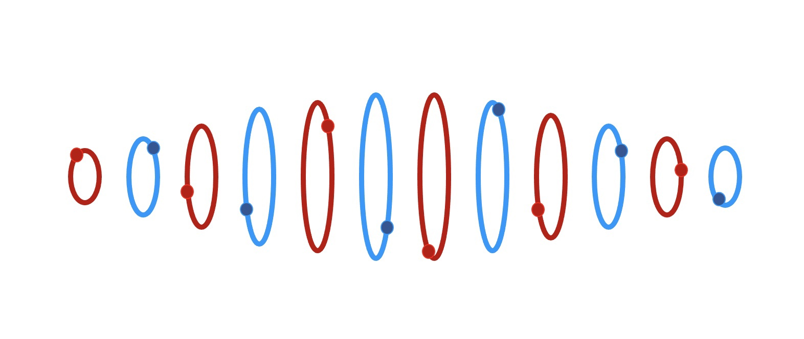
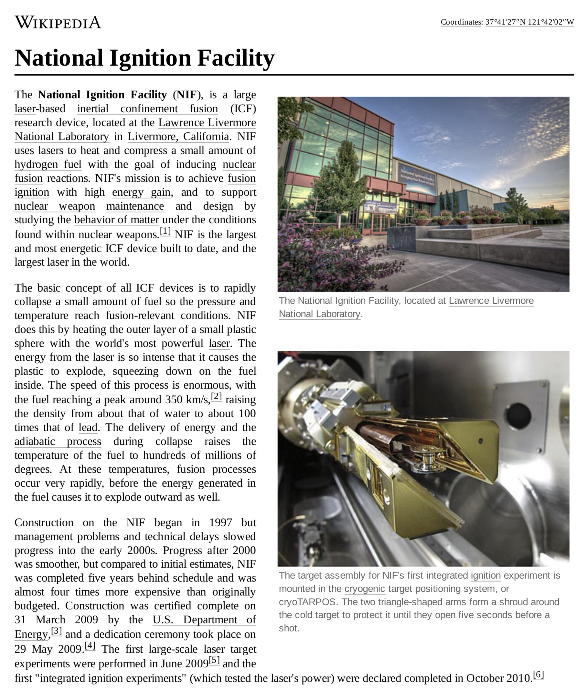

I am having fun envisioning how point charges physically implement the standard model. There is so much known information about the standard model that is a perfect fit with ways to structure point charges. I've deciphered the composition for many particles and it’s straightforward to pencil out the rest from known physics. The geometry of point charge structure is revealing itself. Fermions have energy cores that are structured like a high energy electron neutrino. Bosons are a multiplanar structure with all orbits aligned to the direction of travel (and possibly contra-rotating). Color charge clues are abundant. Spin direction and magnitude are known.

Another iteration. Less ink. Interesting symmetry on the tau neutrino regarding chirality and anti-ness. I’m starting to noodle how a binary in a core would emit some energy — I mean clearly it has the option of transferring it to a low energy binary in the aether. But how does that really happen? The model enables tracking of individual point charges roles in the reaction and where they end up. So considering all that must be conserved, I wonder how the point charge structures pull that off! This will be fun to think about. Anyone else playing along? Let's keep an open mind.

By the way, I visualize the various worldlines for the point charges in circles, spirals, ellipses, tiny perturbations, and yes, even abstract wave equations. Whatever works is fine. Point charges sail along scalar and vector potential field seas.

Do we really need the QM concept of virtual particles? Were they yet another ignored clue that countless physicists saw plain as day? Why did they look away and collectively shrug? Because of QM? Popper? Field happy? We need lots of science historians sleuthing out the nuanced details of the major wrong decisions and missed opportunities.

It appears that the bosons W+/-, Z, gluon, and photon have all of their binary orbits aligned orthogonal (more or less) to the direction of motion. The binaries may lag each other and even oscillate in position due to their couplings.

The photon is a six electrino and six positrino composite, aka 6/6 notation with electrinos/positrinos. A photon might also be considered as pro and anti Noether cores coupled in a geometrical structure. See the figure for abstraction in a U(1) circular orbital topology. The orbital _reality_ of a photon may be involve more complicated wave equations.

https://youtu.be/qKVpknSKgE0

Watching the PBS SPACE TIME episode on the electroweak theory and the origin of the fundamental forces, I am thinking that a single planar binary has a U(1) symmetry (the circle ⭕️) while the overall assemblage of the photon has SU(2) symmetry.

* * *

It looks like the Pauli exclusion principle doesn’t apply to bosons since they are planar. It’s not like we ever tried to stack up 1035 photons per meter and see what happens. Hint, that’s a lot of energy. I wonder what the photon density is for the National Ignition Facility?

Fusion energy, like many industries, will make huge technology gains enabled by NPQG. New, superior technologies will also arise. The age of abundance is starting now.

**_J Mark Morris : San Diego : California_**
