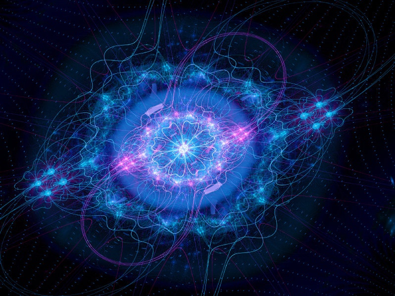

https://youtu.be/MmG2ah5Df4g

Check out this fascinating video on QFT. It will be tremendous when physicists realize that their **fields** each correspond to electromagnetic and mechanical behaviors of geometric structures made from immutable, energetic, point charges. Even spacetime itself is an aether of point charge assemblies. I assure you the only fundamental particles in this universe are potential field generating plus and minus point charges quantized in charge magnitude |e/6|. Weak charge, strong colors and each oddball field with its unique behaviours are entirely due to assemblies made from electrinos and positrinos. All QFT math is preserved, but it can probably be simplified, and of course vastly extended, once the actual structures are modeled. Imagine if chemistry defined a field through all of spacetime for each type of atom on the periodic table. _Look at that iron field! Wow look at the oxygen field!_ No, that is not how chemists model atomic matter. It is high time for particle physicists to move on to the next layer and model standard matter particles as structures created out of point charges.

It’s rather fun to sit back and imagine all these point charges in structures - how much energy they each have, how they interact with each other, how portions spin relative to their velocity, how their electromagnetic fields change, how reactions progress, the aether always present to provide reactants and consume products of reactions at scales well below our observation ability. Pair production and annihilation are the tip of the iceberg of the abilities of the aether.

<figure>

<figcaption>

NPR

</figcaption>

</figure>
