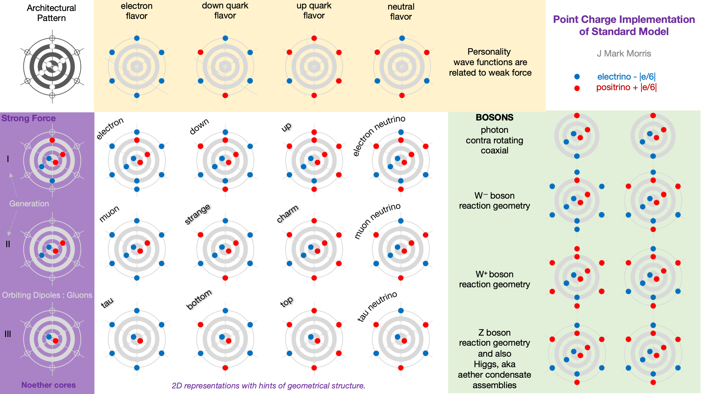

https://youtu.be/4\_qJptwikRc

> _Today I tell you how my opinion about dark matter has changed and why. Is modified gravity better or worse? What evidence speaks for one side or the other, and is the case really as clear-cut as many astrophysicists claim?_
> 
> Dr. Sabine Hossenfelder

Sabine was kind to post the video transcript, which I will quote in _italics_ below. I'll focus on describing nature's solution via the immutable point charge universe and the differential in perspective in the new era.

> _First things first, dark matter is the hypothetical stuff that astrophysicists think makes up eighty percent of the matter in the universe, or 24 percent of the combined matter-energy. Dark matter should not be confused with dark energy. These are two entirely different things. Dark energy is what makes the universe expand faster, dark matter is what makes galaxies rotate faster, though that’s not the only thing dark matter does, as we’ll see in a moment._ 
> 
> All quotes from Sabine's transcript.

Knowing the solution, here is the most charitable translation for someone of the NPQG era looking back to 2021 : “_We’re really confused about matter and energy theoretically and besides that we’re kinda slow to realize that lots of particles below our detection capability really add up in mass and energy._ _Also we’re still big bang worshippers and haven’t figured out galaxy local inflationary mini-bangs._”

All particles in the standard model are emergent structures that include at least one Noether energy conservation core. Each Generation I standard model particle includes a Generation I Noether energy conservation core. Protons and neutrons each have three Noether cores!

The main particles we typically encounter are :

- Electron = Noether core + 6 electrinos = 9 : 3

- Proton = 3 x Noether core +6 electrinos and 12 positrinos = 15 : 21

- Neutron = 3 x Noether core + 9 electrinos and 9 positrinos = 18 : 18

- Neutrino = A Noether core + 3 electrinos + 3 positrinos and enough energy to fly like a high velocity butterfly through spacetime aether with imperfect shielding of Gen II and III.

- Photon = A pro-Noether core coupled and contra-rotating with an anti-Noether core, both pretty much planar until they redshift away enough energy to gain mass and they slow down.

- Spacetime aether = Near perfectly shielded Higgs Noether cores plus a detritus of ultimately redshifted photons and neutrinos as low apparent energy Noether cores. These are all ready to absorb energy from a reaction and pair-up and zing off as a photon at the speed of light c, or launch as a neutrino at high velocity.

Remember, everything that is even somewhat stable is built from Noether energy conservation core binaries. Guess what, these binaries are stretchy rulers and variable clocks and perfect black bodies. Those are their out of the box features!

This background shows that Noether cores are an essential emergent structure and backbone of the universe. Even as a detritus of reaction decays and redshifted assemblies the aether is still built on Noether energy cores and they still function perfectly. Hence the aether is the floating ground for gravitational energy. Gravitational energy is simply the A/C coupling interaction of aether with matter-energy, i.e., point charge assemblies. Hence spacetime aether implements dark matter. The accumulated gravitational mass-energy in aether is a strong candidate for at least part of the problem called dark matter. There are other point charge era galaxy dynamics that may be factors as well, but which are covered elsewhere. Oh, another factor is that matter-energy is redshifting and energizing the aether.

> _Historically the first evidence for dark matter came from galaxy clusters. Galaxy clusters are made of a few hundred up to a thousand or so galaxies that are held together by their gravitational pull. They move around each other, and how fast they move depends on the total mass of the cluster. The more mass, the faster the galaxies move. Turns out that galaxies in galaxy clusters move way too fast to explain this with the mass that we can attribute to the visible matter. So Fritz Zwicky conjectured in the 1930s, that there must be more matter in galaxy clusters, just that we can’t see it. He called it “dunkle materie” dark matter._

Now that we begin to understand that spacetime is an aether of Noether energy cores, consider the implications on the energy and energy gradient of the aether. Just from the inverse r2 relationship we can see the thin neck of warmer spacetime aether that bridges every pair of galaxies in the cluster, based on their distance. Any matter-energy structures in the entire volume will tend to convect towards higher energy aether. That's gravity, after all.

> _It’s a similar story for galaxies. The velocity of a star which orbits around the center of a galaxy depends on the total mass within this orbit. But the stars in the outer parts of galaxies just orbit too fast around the center. Their velocity should drop with distance to the center of the galaxy, but it doesn’t. Instead, the velocity of the stars becomes approximately constant at far distance to the galactic center. This gives rise to the so-called “flat rotation curves”. Again you can explain that by saying there’s dark matter in the galaxies._ 

Again, it seems that spacetime aether, that soup of relatively low energy Noether cores could very well be a cause, given that aether does carry gravitational energy and therefore has some slight mass. Suffice it to say that spacetime aether particles are very small and permeate everything, so saying there is a LOT of them is an understatement.

> _Then there is gravitational lensing. These are galaxies or galaxy clusters which bend light that comes from an object behind them. This object behind them then appears distorted, and from the amount of distortion you can infer the mass of the lens. Again, the visible matter just isn’t enough to explain the observations._ 

Well, now we drop down to another level of understanding. Look, the aether influences the permittivity and permeability throughout space and time. Lensing is simply refraction. Yes, from within the aether the speed of light, c, is a constant. Why? Because every particle you interact with is based on Noether energy conservation cores. Noether energy cores implement Einstein's spacetime. Not only that, Noether energy cores are perfect black bodies. This is another reminder that nature is a trickster. As if you could personify nature. Seriously though,who overlays a Euclidean geometry with a Riemannian geometry at such an early stage of the game?

> _We also know from observations that the mass of a galaxy is correlated to the fourth power of the rotation velocity of the outermost stars. This is called the baryonic Tully Fisher relation and it’s just an observational fact. Dark matter does not explain it. It’s a similar issue with Renzo’s rule, that says if you look at the rotation curve of a galaxy, then for every feature in the curve for the visible emission, like a wiggle or bump, there is also a feature in the rotation curve. Again, that’s an observational fact, but it makes absolutely no sense if you think that most of the matter in galaxies is dark matter. The dark matter should remove any correlation between the luminosity and the rotation curves._

There are several new galactic scale processes we must consider. Mass shielding, Planck core-jet events. Mass reappearance. I’ve written about these in other posts.

> _Modified gravity solves all the riddles that I just told you about. There’s no friction, so high relative velocities are not a problem. It predicted the Tully-Fisher relation, it explains Renzo’s rule and satellite alignments, it removes the issue with density peaks in galactic cores, and solves the missing satellites problem. But modified gravity does not do well with the cosmic microwave background and the early universe, and it has some issues with galaxy clusters. Purely from the perspective of data, the simplest explanation is that particle dark matter works better in some cases, and modified gravity better in others. But more importantly, if you look at the mathematics, modified gravity and particle dark matter are actually very similar. Dark matter adds new particles, and modified gravity adds new fields. But because of quantum mechanics, fields are particles and particles are fields, so it’s the same thing really. The difference is the behavior of these fields or particles. It’s the behavior that changes from the scales of galaxies to clusters to filaments and the early universe. So what we need is a kind of phase transition that explains why and under which circumstances the behavior of these additional fields, or particles, changes, so that we need two different sets of equations._

> _Particles are **NOT** fields._  
> _Fields are **NOT** particles._  
> _Point charges emit potential fields — **that’s it!**_

In the NPQG era we have logical mechanisms and new physics that will make this all fairly easy to sort out. The whole discussion is frankly moot already.

I think everything is much simpler than you may realize Dr. Hossenfelder. All we need is to pick up point charges from the discard pile and give them immutability. Everything works out. All standard matter particle assemblies are based on binaries which behave as stretchy rulers and variable clocks. It all maps. So then when we look at what is now an aether of relatively low energy nearly undetectable assemblies, it is just the same binaries, with low apparent energy relative to our matter-energy, perhaps taking on some quasi-stable structure that we observe as the Higgs or 'quantum vacuum'. Aether assemblies are highly reactive and available to absorb energy and go zinging off as a neutrino or photon or other reaction product. So then you just need to look at the main processes energizing the aether. They are the original formation of Higgs Noether cores, the A/C lossless ebb and flow of energy from matter-energy, AND the red-shift toll that is paid by any traveling energy core based on conditions encountered.

NPQG offers a simple answer:

1. All standard matter contains at least one pair of orbiting point charges.

3. Orbiting point charges are the perfect black body - they absorb radiation in h-bars and emit radiation according to Planck’s law.

5. Spacetime is an aether of standard matter, most likely Higgs Noether cores, tired redshifted photons, and tired redshifted neutrinos that have lost so much energy as to be unable to shield internal point charge binary energy.

7. Now we need to look at the major processes contributing energy to the spacetime aether.
    - Formation of Higgs Noether cores with near perfect shielding in high energy events, i.e., SMBH jets.
    
    - Concentrated matter-energy induces a lossless A/C floating ground type energy to the aether.
    
    - Quantized redshift transfers h-bars to the aether from passing standard matter (photons, neutrinos, etc).
    
    - These factors contribute to the energy level and gradient of the aether, which are what we call the gravitational field.

9. So there you have it - there are two different drivers of aether energy and the influence of matter-energy becomes less concentrated around the galactic - intergalactic surface layer. That could explain part of why MOND math works. But there is more…

11. Lastly, physicists need to get on with understanding that mass is emergent. A photon has energy but "zero mass". A neutrino has oscillating mass. Why? Mass is an emergent feature of point charge structures. All processes that change apparent mass are relevant.

13. Processes that change apparent mass:
    - redshift (of all energy cores)
    
    - shielding of energy in a Planck core
    
    - reappearance of some energy as mass in a Planck core breach (SMBH jet) event
    
    - shielding of interior binary energy in a Noether engine.

Nature is not easy, but at least it is a lot more logical.
