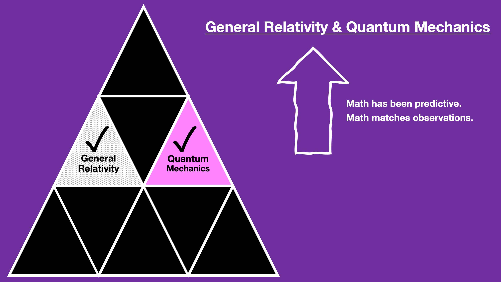
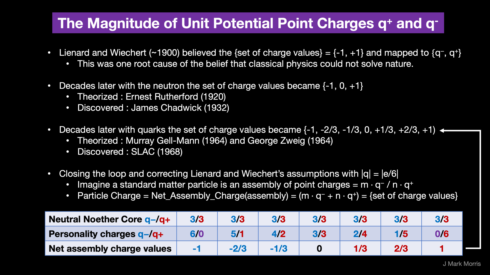
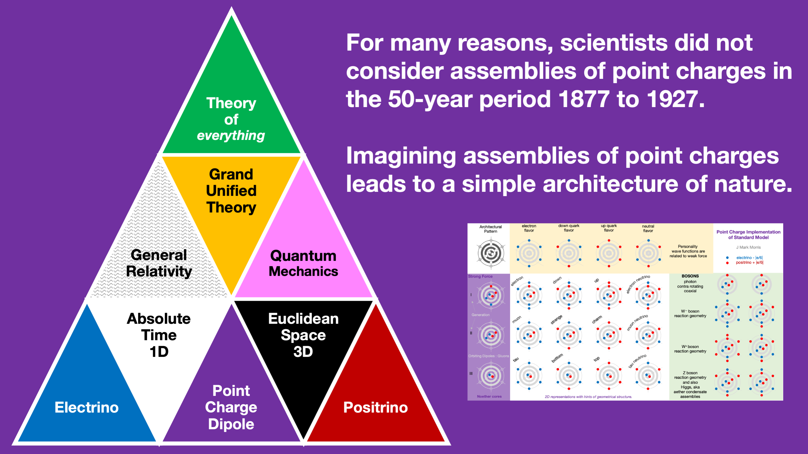
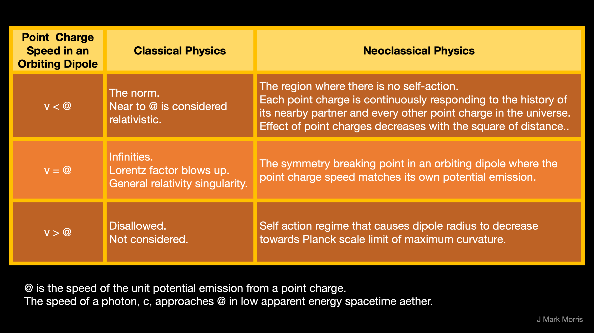
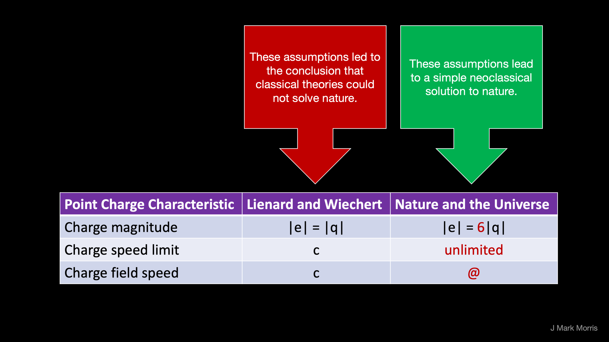

<figure>

<figcaption>

Fig 1. **The Good.**

</figcaption>

</figure>

Our two most successful theories of space, time, matter, and energy are general relativity (GR) and quantum mechanics (QM). Yet these two theories are not unified and have no underlying foundation or explanation in nature. While both GR and QM are quite amazing, there is far more science to discover.

<figure>

<figcaption>

Fig 2. **The Bad and The Ugly**

</figcaption>

</figure>

During the period called the "classical to quantum transition" scientists proposed a primitive and unimaginative point charge model of nature. The classical point charge model maps point charges one to one with the electron and proton. The classical point charge model was properly falsified in the early 20th century. However, there are an infinite number of point charge models to be explored and those were not considered and were not falsified. Let's explore the design space around key elements of the classical point charge model.

The assumptions of the falsified classical point charge model were:

1. The magnitude of a point charge |q| is equal to that of the electron or proton, i.e., -|e| or +|e|.

3. The speed of the spherical potential field emitted by a point charge is c, the speed of light.

5. The speed of a point charge may not exceed c, the speed of light.

In summary, the classical point charge model does not match nature. As a result, a deduction was made that no classical point charge or point potential solutions could model nature. Hence the diversion to "effective theories" of general relativity and quantum mechanics that enabled technological progress but have failed to discover what is in hindsight a straightforward reductionist implementation of nature.

<figure>

<figcaption>

Fig 3.

</figcaption>

</figure>

A re-examination of this history has led to a neoclassical model of point potentials, their spherically expanding potential fields, and the influence of point potential path history on the formation of structure, i.e., assemblies of point potentials that form the standard model particles. Three key areas of change are shown in Figure 3.

Let's first examine the assumption about charge, q. It is logical that the neoclassical model considered only magnitudes q = {-1, +1} given what was known at the time. It was 60+ years later that "fractional" charge was discovered. The discovery of fractional charge warrants a revisitation of the classical point charge model assumptions. Let us focus on the conjecture where |q| = |e/6|. Specifically, that the unit point potentials have a charge magnitude equal to the electron or the proton divided by six.

<figure>

<figcaption>

Fig 4.

</figcaption>

</figure>

Let's articulate minimal ground rules for a neoclassical model.

1. No appeal to the mystical or non-causal.

3. The neoclassical model, at maturity, must be predictive and match observations, possibly with reframing of general relativity or quantum theory.

5. There should be ontological and mathematical mappings between the neoclassical model and general relativity and quantum theory.

These are the minimal requirements for a neoclassical theory, but of course the advanced insights into nature and the resulting technology are the real test of the model.

The parsimonious architecture that emerges is one with a universe entirely and emergently assembled from Euclidean space and time and an equal and opposite density of point potentials carrying a density of potential and kinetic energy. The ontology diagram can now be completed with the missing elements. The standard model of particle physics is re-imagined as an assembly architecture with re-use of emergent subassemblies.

<figure>

<figcaption>

Fig 5. **The Emergent Architecture of Nature and the Universe**

</figcaption>

</figure>

There are many aspects to consider when developing a new model, in particular the mathematics of the action that occurs when emitted potential meets a point potential. Key concepts include:

1. The role of 3D Euclidean space and 1D linear time.

3. The behaviour of potential emissions, i.e., constant rate emission, spherically expanding potential.

5. The role of point potential history and the delayed of action from point of emission to point of intersection.

We must also rethink foundational ideas from classical, relativistic, and quantum theories. Which concepts are fundamental and which concepts emerge naturally from the behaviour of a sea of energetic point potentials? For example, is angular momentum intrinsic or emergent? Can an assembly of point potentials self-propel?

Next, we observe that an orbiting pair of opposite point potentials is a binary with a net neutral charge. Orbiting binaries may have vastly different kinetic and potential energy, the kinetic related to the orbital speed of the point potentials, and the potential due to their proximity. A stationary unit potential emits a field where x2 +y2 +z2 = @t2, where @ is a symbol for the speed of the spherically emitted wave from each point potential.

One of our requirements is to map to quantum theory, so let's now consider that each binary orbits around an axis, and there are two poles per axis, and in each pole is a vortex of potential that is related to the energy of the binary. Let's imagine three binaries at different energy scales (and different frequency and orbital radii) that are strongly nested or coupled. There are six polar vortices. Let's imagine that a point potential with lesser energy may be bound in each of the six vortices. Interestingly, as the left portion of Figure 6 illustrates, we have now defined a geometry of an assembly with a dozen point potentials that produces all the charge levels we need for the standard model fermions.

<figure>

<figcaption>

Fig 6. Reimagining the Standard Model of Particle Physics as a Reductionist Assembly Architecture

</figcaption>

</figure>

Why did we consider a nested set of three binaries? The point potential model incorporates classical Euclidean time and 3-dimensional space. The location of a point potential is given by (t, x, y, z) in absolute Euclidean dimensions. Likewise, we can imagine the path of a point potential as a continuous sequence of real (t, x, y, z) locations. Each binary has an orbital axis. Therefore, it seems reasonable to consider a nested set of three binaries such that the three orbital axes are translatable to 3-dimensional space.

Without realizing it, we have now modeled standard model particles as assemblies of point potentials with an architectural pattern, for fermions at least, as strong sub-assemblies and weak vortex-bound personality point potentials. If this conjecture turns out to be true, then we may imagine the photon itself as an assembly of point potentials.

_Aside: it's too deep for this note, but consider photons implemented as contra-rotating coaxial planar tri-binaries traveling along their orbital axis sailing on their own potential emissions. Through superposition of potential, this assembly geometry results in electromagnetic waves. Now consider the role of photons in scientific measurements. The implications are profound._

At this point we should note that the scientists of the classical to quantum transition era chose the speed of the photon, c, as the speed of the potential field and the maximum speed of a point charge. This is an ontological inversion! Now that we are imagining photons as assemblies of point potentials, on what rational basis would the speed of a photon assembly determine any characteristics of a point potential? It wouldn't! Rather the characteristics of the point potential would determine the behaviour of all assemblies of point potentials, including the photon. Therefore, we need to reconsider these assumptions.

Let's give the speed of the spherically expanding emitted potential a separate symbol, let's say "@", which will turn out to be the upper limit of photon speed. However, what shall we set the maximum speed of a point potential? We have no observations to guide us for an individual point potential, so for now we select "unlimited". Yet, how far would an individual point potential travel before reacting with other point potentials and producing assemblies? It depends on the conditions of course.

We can consider the upper bound on point potential speed in an isolated binary assembly. First, we note that when the speed of the orbiting point potentials in the binary reaches field speed @ we have a symmetry breaking point. Below speed @ the point potential experiences no self-action. Above speed @ the point potential experiences self-action from its own path history. The self-action leads to a maximum curvature of a binary, i.e., a minimum radius with a maximum orbital frequency. This natural limit signals the emergence of the Planck scale.

<figure>

<figcaption>

Fig 7.

</figcaption>

</figure>

Let's complete our Fig 3 chart with new assumptions.

<figure>

<figcaption>

Fig 8.

</figcaption>

</figure>

The patterns that emerge from this set of assumptions are amazing. Simulation and analytics of the dynamical geometry will reveal far more insights. For more patterns see [New Physics in Pictures](https://johnmarkmorris.com/2021/06/15/new-physics-in-pictures/).

If these conjectures are correct, the error occurred circa 1900 and has not been detected by the scientific method in the intervening period. If we then reframe the Michelson-Morley experiment, we have 150 years of off kilter science. Why did the scientific method, which is in the domain of philosophy, not detect this problem? In my view, for the case of a field long in crisis, the scientific method does not include sufficient proactive detection and correction of historic errors in the science consensus.

If these conjectures are correct, this is a huge step forward in the ontology of nature. With the "source code to nature" in hand, how might philosophers and science historians re-evaluate the historical bodies of work in physics, cosmology, philosophy, and history of science?

The incredible power of the point potential model of nature is revealed when we consider its ability to explain problems that have perplexed physicists for decades. The era of general relativity, quantum theory, and lambda cold dark matter has been successful, but the cost of working with foundation-less "effective theories" is that many interpretations and narratives are confused and incomplete. With the new model, we have a clear line of sight to transforming science with a commonsense narrative that addresses the following issues.

1. The structure of spacetime and the standard model is based upon assemblies of point potentials.

3. The geometry of special and general relativity is explained by the dynamical geometry of the collection of emergent assemblies in the universe. The most primitive assembly is the binary of equal and opposite orbiting point potentials. In three-dimensional space these binaries nest at vastly different energies and radii. In total isolation the orbital planes would be orthogonal, i.e., x-y, y-z, x-z. Wave equations are redefined as the potential emissions of an assembly. The root cause of the quantum era need for renormalization becomes apparent and suggests far more elegant mathematics and simulation computation.

5. The highly re-usable tri-binary core of the assembly architecture explains the existence and structure of fermion generations as well as dark matter, and dark energy. Dark matter and dark energy are hidden by superposition inside the tri-binary Noether core that is the foundation for all standard model particles, including Higgs spacetime assemblies. These in turn resolve the issue of galaxy rotation curves.

7. The photon and the neutrino are reinterpreted as assemblies of point potentials, while gravitational waves are reframed as a wave through the spacetime assemblies. This in turn leads to a new understanding of redshift. This will require reframing multi-messenger astronomical observations yet will result in the science being on a solid foundation. The root cause of neutrino oscillation becomes evident.

9. The models of the Big Bang, inflation, and expansion are reinterpreted in the context of spacetime assemblies which are emitted by supermassive black holes. These spacetime assemblies inflate as they disperse energy (_aside: this process/mechanism creates a fascinating volume and pressure dynamic that likely maps to Einstein's spacetime model_). Inflation is followed by expansion with the transition being related to the symmetry breaking point in Noether core binaries. The spacetime assemblies continue to expand in size as energy reduces towards local equilibria in the galaxy and beyond in deep space. There are two extremes of the point potential recycling process corresponding to the lowest energy deep spacetime and the highest energy supermassive black hole. As this process evolves, all along the energy/size/frequency scale, Higgs clusters of nestled spacetime assemblies may participate in reactions, as reactants and/or products. One example is the production of standard model particle pairs.  
    _N.B., Concepts such as the quantum vacuum, pair production, and annihilation are transformed._

11. The quantum itself is explained as an emergent behaviour of a point potential binary.

13. The horizon problem is resolved with identical physics determining the recycling process shown to be galaxy local. This in turn resolves the confusion around the big bang, big crunch, and big rip. The universe age and physical extent are recast as unknown and possibly infinite. Note however, that the origin of the Euclidean time and space background as well as the energy generating and carrying point potentials is not solved by the new theory.

15. The overall theory and model are a candidate for a "theory of everything" as it bridges and explains the conceptions and misconceptions of all prior eras in physics and cosmology. The next set of questions are: what is the source or origin of Euclidean time and 3D space? Is it infinite? Has it always existed? What are the origins of point potentials? Where did they come from? Have they always existed? Are they really indestructible? Do they have any other characteristics? All of these questions will help to establish the true foundation of nature, which is either at hand or close by.

These are a small sampling of the many unsolved problems in particle physics and cosmology for which the solutions become logically evident in the point potential model. Nature is incredibly parsimonious, and this leads to emergence, selectivity, and survival through the network of reaction processes in the grand distributed recycling process in the point potential universe.

To be sure, an enormous amount of effort will be required to reframe, recast, and transition between the ontological eras. Let's get on with the fun!

**_J Mark Morris : Lynn : Massachusetts_**
