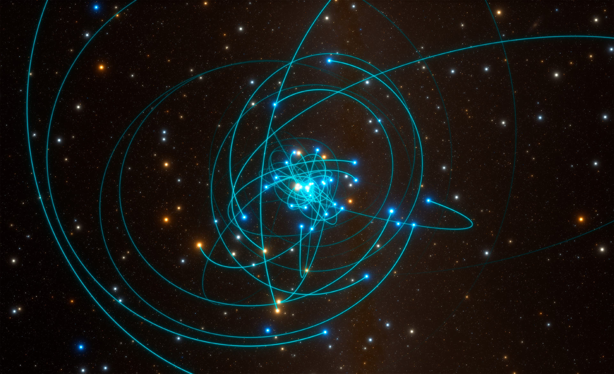
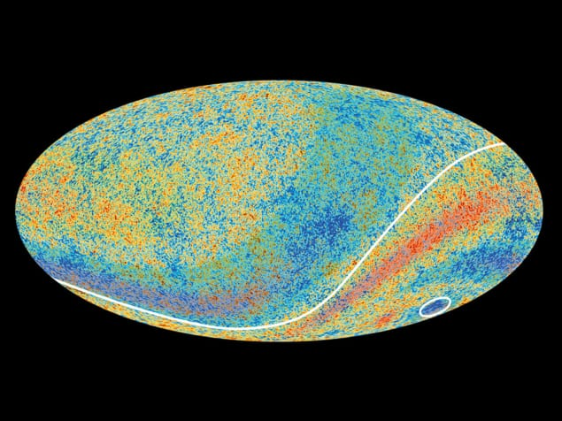
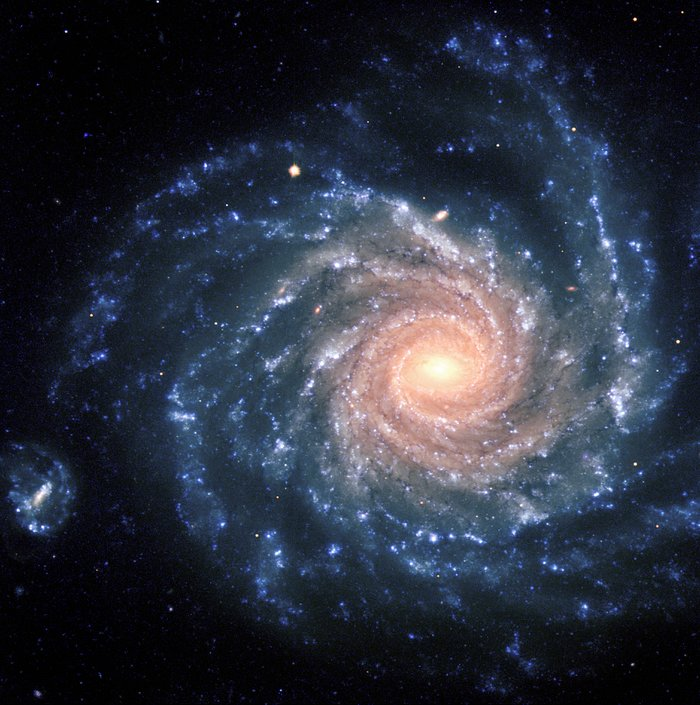
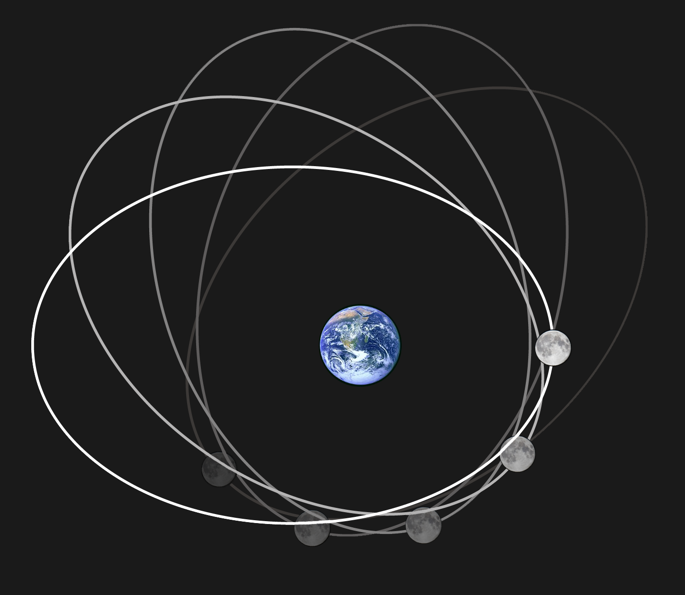
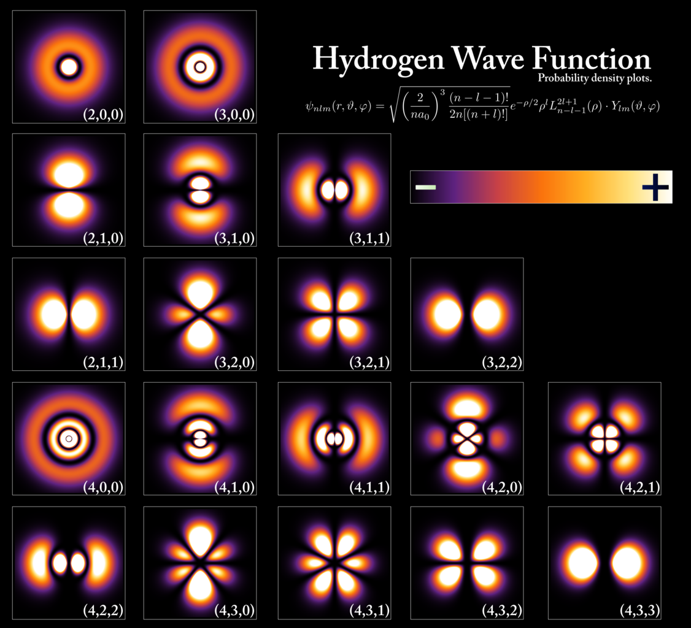
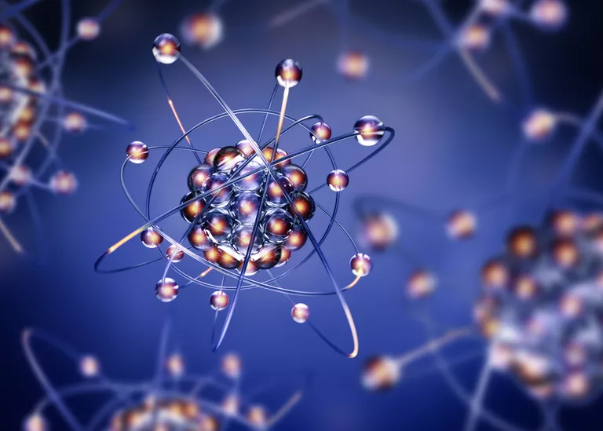

Let's think about this image of stars orbiting around Sagittarius-A, the super-massive black hole (SMBH) at the center of our galaxy. This system of an SMBH and nearby stars is an assembly, a construct. A measurable and predictable aspect of this assembly is the (x,y,z,t) path of each orb through spacetime. Not only must we consider the relative path of each orb around the SMBH, but we must also consider that the entire galactic assembly may be translating on orbits at larger scales. We could consider the path of each orb to be its wave equation, and the collection of paths of the assembly to be the wave equation of the system.

<figure>

<figcaption>

cdn.sci.news

</figcaption>

</figure>

To set the scale, I believe it to be common understanding, and most definitely my intuition, to expect that each galaxy's highest density of point potentials, carrying the highest scalar energy density, would be found in and around its SMBH. Each galaxy is one in ~200 billion in the observable universe with scale ~1030 meters.

Imagining these orbital dynamics, the clues nature presents are **_teasing_** us with sweet whispers of the ultimate solution! It is well known that nature often repeats patterns at higher scales with limited recursion in some cases. Since we know of this meta-pattern, we can also take a large scale pattern and imagine that it is a repeat of smaller scale problems, and that there may be patterns that repeat all the way to the Planck scale, if as I infer, Planck scale is related to the fundamentals of nature. The largest scale pattern in terms of extreme matter-energy is the SMBH and the matter-energy that orbits closely. This is an enormous scale and the major large scale force is intense gravitational attraction.

How might we drop down scores of orders of magnitude in size and imagine the proximity of Planck scale with comparable densities of matter and energy? In my view, the Noether core is the ideal solution : an assembly of unit potential point potentials forming a tri-binary gyroscopic flywheel, each binary at vastly different scale points. Instead of gravity providing the attractive force, it is the Coulomb force between opposite point potentials, which of course is a force dominated by proximity. The axial vortex of the binaries in the Noether core implement the strong force. In the terminology of chemistry the point potentials in each binary are strongly bonded.

This post is an attempt to capture your imaginative, creative, and logical selves to imagine how nature echoes and amplifies a pattern from scales near 10\-30 meters to scales near 1030 meters. I think it is truly amazing and beautiful. Here are a few amazing visual illustrations of the dualities of orbital systems at different scales.

## 13.8B LY radius : CMB

<figure>

<figcaption>

Arctic anomaly: A map showing the cosmic microwave background (CMB) temperature as observed by ESA’s Planck satellite. While fluctuations in the CMB were expected, and were observed by Planck, an unforeseen anomaly is the cold spot (circled), which extends over a large patch of sky and has a much lower temperature than expected.  
(Courtesy: ESA/Planck Collaboration)

</figcaption>

</figure>

## 30M LY : Galaxy

<figure>

<figcaption>

Credit : Nature  
A typical galaxy cluster contains 50 to 1000 galaxies, and has a mass between 100 trillion and 1 quadrillion solar masses, stretching over a distance of 30 million light-years.

</figcaption>

</figure>

## 3K to 300K LY : Galaxy

<figure>

<figcaption>

ESO

</figcaption>

</figure>

## 1 LY : Solar System

## 100M to 1B M : Earth-Moon

## 1 M

<figure>

<figcaption>

reddit : provenance unknown

</figcaption>

</figure>

## 0.1 M

<figure>

<figcaption>

wikimedia

</figcaption>

</figure>

## 10\-10 M : Electron Orbitals

<figure>

<figcaption>

Wikipedia

</figcaption>

</figure>

## 10\-14 to 10\-15 M : Nucleon

<figure>

<figcaption>

thoughtco.com

</figcaption>

</figure>

## 10\-19 M : Quark

<figure>

<figcaption>

 Image credit: DOE’s Jefferson Lab

</figcaption>

</figure>

## 10\-35 M : Immutable Point Potential Binary

I really enjoyed the PBS Space Time episode, "**How Was the Modern Milky Way Born**?". I love learning about the variety of gravitational behavioral events at different scales in a galaxy merger. The law of gravitation is a lot like Coulomb's law for classical point charges.

https://youtu.be/e3jGWXeBtPo

NPQG proposes that the standard model is composed of assemblies of Dirac delta point potentials orbiting at extremely small scales with intense Coulomb forces in a dynamical geometry. It's basically the duality of galaxy dynamics in this PBS Space Time episode, but at the other end of the scale and with point potentials instead of massive orbs. At the small end of the scale we have unit potentials swirling around with asymptotic safety, constantly emitting a spherical potential that trails off in intensity. Turns out they assemble into cool structures too. We call those assemblies the standard model. The potential magnitude |q| of a point potential equal to |e/6| works out very well.

A major factor here is that the velocity of a point potential is independent and not limited by it's own potential field speed. A key assembly, the photon, sails on the potential field. This has been confusing to scientists since photon impacts on sensors has been essential to observation. Without knowledge of underlying structure, scientists declared that nothing can travel faster than the speed of the photon. This tricky emergence and symmetry of nature has led to a lot of confused narrative in science.

Those with an understanding of NPQG realize that unit potential point potentials can have a velocity greater than their own field speed and thus potentially experience self action. Yet scientists have not considered unit potential point potentials exceeding the speed of the photon. Therefore an entirely new unexplored sector of science has has been discovered.

Everything in the following chart is spinning with binaries and personality potentials at a variety of frequency scales and radii and hence speed and therefore at very different energy levels. The next level is the relationship of apparent energy to mass as well as the concept of shielded energy through superposition.

Now, as we know, standard matter particles themselves are moving and orbiting and following wave equations and forming higher level assemblies, like protons and neutrons and then atoms and molecules. Everything is moving. By adding one more level to the model, we've solved and simplified the architecture of nature. Of course, there is still a tremendous amount of highly valuable research to be done to build out this new model of nature.

**_J Mark Morris : Boston : Massachusetts_**
