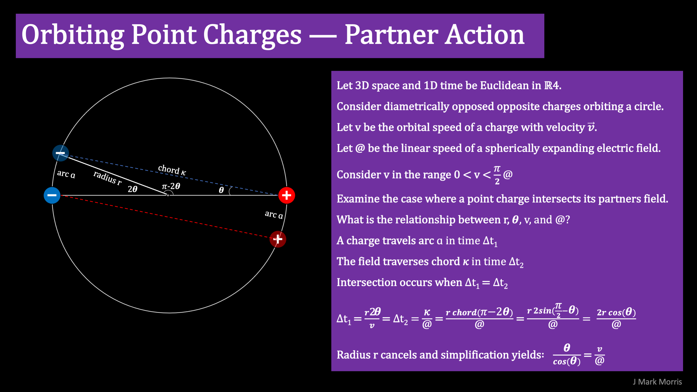
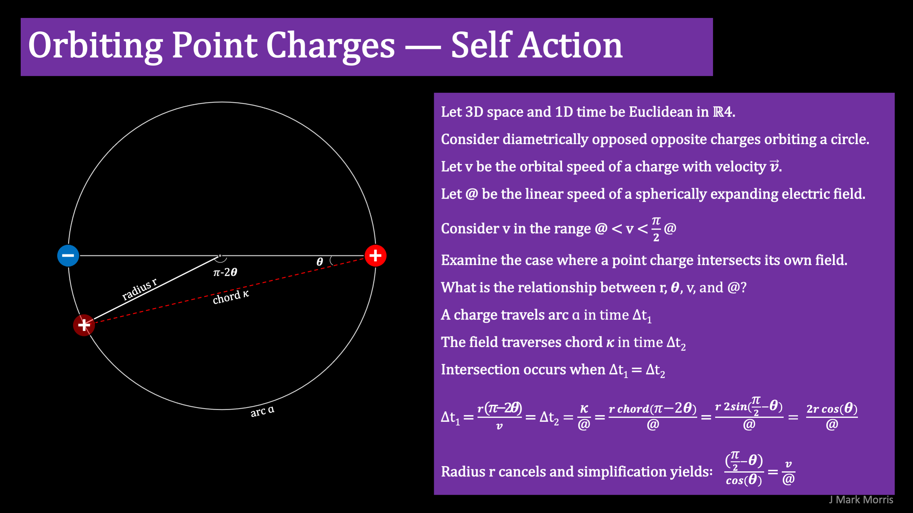

---

I'm continuing to work on the math of orbiting point charges. Here is a primitive static half step along the way, prior to examining the potential gradient and the momentum.

I've made charts for partner action and self action.

Partner action in the regime 0 < v < @ pi / 2 (where @ = field speed)

Self Action in the regime @ < v < @ pi / 2

I think it is kind of cool that these equations are independent of radius. I think (hope) what is going to happen is that the E and B fields and the kinetic energy will regulate the radius, and that will hopefully map to Planck's law and the Lorentz factor and therefore Einstein's GR. Further, hopefully the energy bumps between stable solutions in integer frequencies will map to the the quantum of energy, tying in QM. One step at a time.

