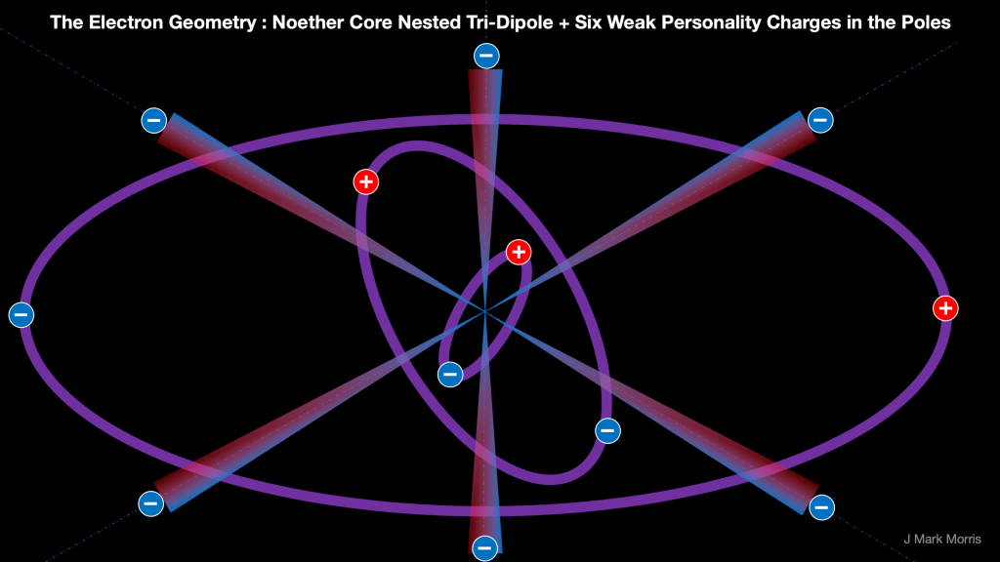

Let's consider equal and opposite unit potential point charges, an electrino and a positrino, each orbiting the other and traveling a common circular path when group absolute velocity is zero and isolated from external perturbation. The video loop shows three different orbits, each with a different energy, frequency, radius of orbit, and point charge velocity. Note that in the ideal unperturbed scenario with group velocity zero the point charges follow the same path, but are out of phase by 180 degrees.

https://videopress.com/v/1iz5NJFV?resizeToParent=true&cover=true&autoPlay=true&loop=true&muted=true&persistVolume=false&posterUrl=https%3A%2F%2Fvideos.files.wordpress.com%2F1iz5NJFV%2Fdipole-orbits\_mov\_std.original.jpg&preloadContent=metadata&useAverageColor=true

At extremely low energy the frequency of binary orbit would be slow, the binary radius would be tiny in scale, and the velocity of the point charge would be low. Then as energy is added the frequency, radius, and velocity would increase until the velocity reaches field speed @ (Note : c is a proxy for @) . Then as velocity increases further towards the maximum of @ pi/2 the binary is experiencing self action as well as partner action and the radius decreases again. The range where velocity is greater than field speed @ is unexplored physics leading to a neoclassical ontology. At the Planck energy the binary reaches the smallest radius of orbit = Planck length / 4. These tiny orbiting binaries appear statically neutral from larger scales, but dynamically they are producing swirling alternating potential.

These point charge binaries exist in a Euclidean time and space so if they are unperturbed they never lose energy and don't radiate. In the real world surrounded by low apparent energy aether also made out of assemblies of binaries, then high energy binaries in standard matter will slowly redshift away energy into the aether, probably by a very gradual phase shift.

The orbiting binary is the most basic assembly possible. Consider the impinging potential field and gradients from their partner and if v > @, from themselves. Note that each point charge sees an unchanging situation. The orbit is symmetric. Isolated in Euclidean time and space, and unperturbed, this stable assembly would continue forever, meaning it would not lose energy or change in any way. Alas, all assemblies find themselves in a sea of spacetime aether, which is also made of point charge assemblies. All binary-based particles will redshift a small amount of energy to the aether.

Now imagine a Noether core, which is three of these binaries at vastly different energy, radius, and frequency all nested with the same origin. Here is another ten second movie showing the Noether core in a flat 2D representation. Try to imagine that this is 3D and each binary is orbiting in its own plane. Imagine the angular momentum of the three binaries pointing in different directions. Now imagine that these three momentum vectors can change as long as the sum stays conserved. So the internal high energy binary basically stays at the same orientation and gently shifts. This causes the mid energy binary to precess to compensate, and the outer low energy binary to precess like mad.

https://videopress.com/v/1F868dZB?resizeToParent=true&cover=true&autoPlay=true&loop=true&muted=true&persistVolume=false&posterUrl=https%3A%2F%2Fvideos.files.wordpress.com%2F1F868dZB%2Fnoether-core\_mov\_std.original.jpg&preloadContent=metadata&useAverageColor=true

Furthermore as we perform work on the Noether core and it gains group velocity the angular momentum vectors begin to converge and the orbital planes begin to align. This is the beginning of a shift from Fermi-Dirac 3D shape towards a Bose-Einstein 2D shape. The combination of the orbit and the translation velocity v causes the point charges to corkscrew through Euclidean space and time. Note that for the case of a single binary traveling perpendicular to its orbital plane, with velocity v < @, the history potential of the partner is always arriving from behind the translating binary. This means there is a force of attraction in the opposite direction to v. The open question is how does the geometry of the binary adapt?

It gets really interesting as v approaches field speed (the limit of absolute c in the spacetime aether) because of accelerated and delayed potential histories.

There may be a way to derive special relativity and the Lorentz factor from this geometric model and without a physical observer. I am starting to see how this works both for length contraction and time dilation.

One of the wilder ideas here is that the Lorentz factor may be implemented physically by both a combination of a continuous phase shift of the binary as well as step function h-bar transitions. Continuous phase shift of the binary may map to redshift.

Ok, I know that is a lot of word salad to most of you, but we are really only talking about a minus and a plus point charge orbiting each other while also translating through time and space at velocity v. It's a very simple and pure case. Seems like mostly geometry and trigonometry to calculate the low energy solution. When the point charge velocity exceeds the field speed it's harder for me to visualize, but it must be stable to map to GR/QM.

Now, let's take a huge leap in imagination to conjectured unit potential geometry of an electron. We have three binary orbits in the Noether core **strongly** bonded at vastly different radius and frequency and possibly with the unit potential point charges exceeding their own field speed. Then we have the personality charges at another huge scale leap in radius yet bonded by the essence of the weak force. This is a symmetrical particle so perhaps the Noether core planes are mutually orthogonal when at absolute rest. This geometry may explain the unique properties of the electron (and positron). Now imagine that as we do work upon this electron and change its group velocity, that the three orbital planes begin aligning. Some or all of the work expended is related to the change in orbital planes and this is related to the path history of all the emitters in the assembly. Assembly local, each unit potential is experiencing a continuous potential wave from the 11 other point charges. Each may also be experiencing its own potential wave if its velocity has exceeded the field speed. How does one model that analytically? Or is it only solvable via simulation?

Remember forces are based on 1/r2, so scale differences separate out the gauges. For example, just three orders of magnitude in radius means the force is muted by a million. That also means that the forces we are talking about inside the Noether core are enormous. Science today can observe in some cases to 10\-19 meters. The orbits in the Noether core are presumably well below that. There is a lot of room all the way to 10\-35 Planck scale. You just have to trust in logarithms.

You have to really exercise your scale thinking ability on this, because from the perspective of each successive layer, the interior charge locus is very small, is neutral overall, and is sensed as alternating potential fluxes at different frequencies. The poles seem to churn quite a bit and this is where I think the personality charges get weakly bonded. So even though each unit potential is interacting with others, some of those interactions are vastly muted by scale. Now give this whole assembly a group velocity and start introducing a changing potential source in path history meaning a different angle and distance and things start getting complicated.

https://videopress.com/v/vSe2QGNj?resizeToParent=true&cover=true&autoPlay=true&loop=true&posterUrl=https%3A%2F%2Fvideos.files.wordpress.com%2FvSe2QGNj%2Fscreen-recording-2022-08-15-at-9.48.48-pm\_mov\_std.original.jpg&preloadContent=metadata&useAverageColor=true

Here's an animation of the architecture. The three Noether core binaries are orders of magnitude apart in frequency in reality. The six purple question marks dancing around the poles of each binary are the personality charges. Put any combination of six positive and negative point charges there and you get a fermion. Six electrinos you get an electron. Six positrinos you get a positron. Three of each you get a neutrino, although the neutrino may be more like a wobbly photon. 5/1, 1/5, 4/2, 2/4 those are your quarks and anti-quarks. Cause the outer binary to decay, you get a generation II fermion that is not stable for long. Cause both the outer and middle binary to decay and you get a generation III fermion that decays in a flash.

Do work on this particle to give it a velocity and the three orbital planes will start to align, causing the length to contract in the direction of motion. See how that would work? The closer the velocity approaches c, or more correctly potential field speed, the more aligned the three planes until they are flat. Well, I presume at some point along the way the fermion would decay since the personality charges would start colliding.

I think there are enough unique configurations considering spin, and which charges are on which binary to account for pro/anti, color charge, and left/right. Yes, of course, it begs for a mathematical treatment, and ideally that will be built up step by step from the foundation. Every point charge is constantly acted upon by history potentials from the others. If any binary has charges with velocity > field speed, then things get really interesting because those charges will experience self-action. Anyway, it's a dynamical geometer's dream machine.

For extra credit, imagine three quarks fused into a Proton or Neutron. If you know about how that physics works, maybe you can imagine how they might reconfigure into what is a long-term stable pattern for a Proton, but which takes a Neutron on average ~14 minutes to decay through what I imagine is the orbital wave equations of all these point charges are such that an unstable pattern occurs after a large number of cycles through the pattern. I think the flux tubes might correspond to coupled binaries and it sounds like there might even be an exchange of binaries (i.e., a gluon like interaction) going on.

The way I imagine a Noether core is that the path traced by the precessing outer binary races over an oblate spheroid. For a symmetric particle like an electron with zero absolute velocity the shape might be a sphere. For quarks with their asymmetric personality charges, perhaps the v=0 shape is already oblate. In any case, the more work done on the overall assembly, the higher its velocity, and the more oblate it becomes. Now, you might ask, well is it really a perfect precession? It doesn't really have to be because the motion is determined by angular momentum preserving oscillation of the binary axes. It's easiest to see this in the simple case of the outer binary tracing the surface of a sphere where each point charge would be equally happy to turn on a dime as long as overall momentum is conserved. So when I talk about orbits, the most general case is really any scrambled momentum preserving path on the surface of an oblate spheroid. This path would map to the wave equation in quantum physics. Of course, imaginative thought experiments are fun, but simulation and math will reveal the actual behaviour someday.

I think that work to accelerate a particle assembly changes the orientation of the orbital planes of its Noether core. I think momentum conservation may be captured by orientation to assembly path history. To what extent is the assembly propelled by the past position of orbital partners? Is conservation of momentum intrinsic or does momentum have an implementation dependent on the path history of the point charges in an assembly? As an aside this also raises the question of whether angular momentum intrinsic or emergent? Since individual point charges have no concept of spin, my inclination is to think that there is no intrinsic angular momentum, i.e., that concept is not in the fundamental physics of nature. Instead, angular momentum is emergent from the binary, which is the most primitive assembly.

It's fascinating to think about how path history and spherical potential emission affect a translating orbital assembly. Clearly velocity is going to play a major role especially as velocity approaches field speed. It's hard for me to imagine when the individual point charge velocity exceeds field speed. Think of the interplay between orbital velocity based on frequency and radius and the translation velocity. Think about orbital planes. I'm still working on visualizing the self-action regime. That's what was missed. That's how we go from classical to quantum to neoclassical.

**_J Mark Morris : Boston : Massachusetts_**
