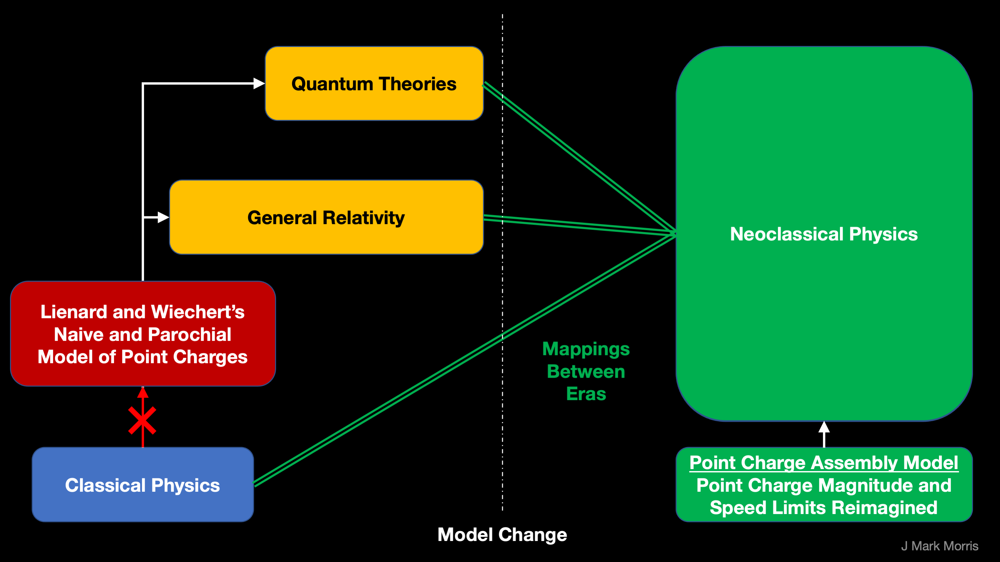

Dr. Paul Sutter recorded a [podcast](https://www.pmsutter.com/shows/askaspaceman-archive/2022/09/20/aas184-quantum-mech-part2) about quantum mechanics. I thought I would respond with some insight from the point charge era. I tweeted many responses to Paul's podcast announcement tweet.

Hi Paul. I would love to talk about the standard model and quantum mechanics. Specifically I would like to discuss the false priors in the assumptions of Lienard and Wiechert that have made particle physics extremely difficult. With proper assumptions the solution to nature is child's play. Seriously!

Circa 1900 there was work on dynamical classical point charges with regards to their paths and how the action(s) upon the point charge was from a spherical wave instantaneously emitted in the path history of other point charges.

Unfortunately based on what was known at the time, the researchers chose point charges with magnitude equal to an electron's charge. The concept of fractional charge was unknown at the time and was only discovered decades later. As far as I can tell, they didn't close the loop.

The term 'fractional charge' is a misnomer. It really means that the charges we measure must be composed of multiples of the most fundamental charge. In other words, the particles we observe must be assemblies of unit potential point charges.

So if we close the loop and go back to examine Lienard and Wiechert's assumptions, we could choose a different fundamental charge. We could choose a magnitude q = |e|/6, i.e., net one-sixth the electron. An electron assembly could be either 6-/0+, 7-/1+, 8-/2+, or 9-/3+, etc.

Now we can start sleuthing around and looking for assemblies that might have sub-assemblies. It turns out that fermions fit a pattern of \[m-/n+\](3-/3+), where m+n=6. What is this pattern (3-/3+)? Now we need to use our imagination and think about how energetic point charges move.

Long story short, it's fairly straightforward to realize that standard matter particles are structured assemblies of point charges. And it is easy to understand how nature actually works at this lowest level of a Euclidean time and space populated by energetic point charges.

The second false prior is now evident. Lienard and Wiechert assumed that point charges can travel no faster than the speed of light, c. Yet if a photon is an assembly of point charges, then it is ontologically upside down to limit the individual point charge to assembly speed.

This line of logic leads to the implementation of both general relativity and quantum theory. And best of all, it is truly a physical dynamical geometry. It is therefore not pure mathematics. Apparently, unit potential point charges exist and they are immutable. Or simulation.

@0:30 I never realized until now that quantum mechanics pertains to low energy "particles". Oh my gosh. There is a much better way Paul. We can cover the range all the way to Planck scale. We just need to talk about the two false prior assumptions from Lienard and Wiechert first. Oops!

@1:20 Paul correctly notes that quantum mechanics is only math equations. In our ghosts view, the lack of a physical implementation is a death knell for a theory that attempts to solve nature. Thus quantum mechanics is known as an "effective theory". QM is a tired old excuse.

@1:25 Paul mentions the speed of light C. I am sorry to say that this is an area incredibly fubarred by physicists. Photons are assemblies of point charges that sail on their own field. Point charge speed is not limited by photon speed. C varies in the absolute Euclidean frame.

I have intuited no reason that nature would impose a speed limit on point charges. That said, with the density distributions of point charges in this universe it would be challenging for an individual super high velocity point charge to go very far before shedding energy.

I can imagine a NS/BH/SMBH jet of incredibly high energy point charges in any nascent assemblies moving with a group jet velocity far greater than C. The energy density could be so high that it would clear out anything in its path until a terminii was reached.

Uh Oh. @5:00 Paul mentions the notion that the speed of light C is a constant. Oy vey! So many problems. First off the photon is a coaxial contra-rotating pair of planar bosonic tri-binaries. The photon is an assembly! We need to go deeper ontologically to find nature. #Potential

In Einstein's curvy space, it is true that photon speed C appears to be a constant. However, when we consider the absolute Euclidean frame of time and space, then we realize that photon speed varies depending on the conditions in the spacetime aether.

In nature there is only one type of field and that is the potential field. Unit potential point charges continuously emit a potential field that spherically expands at velocity @. The speed of potential @ is a universal physical constant. C approaches @ in low energy spacetime.

@7:00 Is an appeal to abstractness. I see this as quantum theory trying to back into some justification for its goodness — when quantum mechanics is truly an effective theory with no implementation. Plus, there is a physical implementation in nature. So nope, not buying this.

@8:00 is hilarious when Paul lambastes quantum mechanics for not being understandable to anybody. Actually not to worry. The beauty of the point charge formulation is that it maps directly to general relativity and quantum mechanics, so we can develop a physical understanding!

@11:15 we can really simplify the definition of state. First of all there is an absolute frame of time and space, so state means in this context a snapshot in absolute time. The state of the system is the path history of each and every point charge up untili the snapshot.

The instantaneous state of all path histories determines the continuous evolution of the state of the universe. The floating causally disconnected potential aura of all distant point charges most assuredly influences reactions to some degree and this is what assures free will.

@14:00 Oh my. How can you even imagine the states of the electron when you don't understand its implementation? Here is the fermion model. Replace the ? with negative point charges. It is a beautiful physical dynamical geometry. This is logarithmic of course.

https://videopress.com/v/Ev4pYz0T?resizeToParent=true&cover=true&autoPlay=true&loop=true&muted=true&persistVolume=false&posterUrl=https%3A%2F%2Fvideos.files.wordpress.com%2FEv4pYz0T%2Ffermion\_mov\_std.original.jpg&preloadContent=metadata&useAverageColor=true

@14:10 Physicists care about the state of the electromagnetic field. Oy vey! They have no freaking idea! You have three precessing binaries at vastly different energy, frequency and radii. You have personality charges circulating in the poles. Really? Tell me about your interest!!

@14:20 Planting a flag here to discuss later. The question is whether observables imples photons. We must remember that photons are assemblies and have their own lifecycle depending on the last energizing event. The issue is that we don't want photons to be rose colored glasses.

@14:45 We may not be able to observe, but we can simulate precisely the behaviour of unit potential point charges in various scenarios. They are simply responding to the impinging potential waves. Change the scenario. Run Monte Carlo's. There is no uncertaintly in a simulation.

@16:30 time evolution. Tragically this is hard to conceptualize in quantum theory due to false priors. Instead, imagine red and blue spherical point charges and how a collection of these point charges interacts dynamically. It turns out the evolution is sensible and logical.

@18:50 Regarding the fuzziness of quantum mechanics. Ok this is where the rubber meets the road. Did Mileva, Albert, or other contemporaries obfuscate the solution to nature for fear of evil exploitation? They really should have figured it out. How could the solution be missed?

As an aside, the simple solution has been missed for 150 years. Historians will need to study this matter in extreme detail to understand what really happened. The story may be quite complex. Or, humans often being derps, it may have simply been a failure to close the loop.

@19:00 "Arrow in infinite dimensional space." I am ROFL. I can't breathe! OMG! And Paul knows we will go nuts on that phrase and I'm dead. Dead. C'mon Paul, feel free to message me. I can throw you a life preserver. I know the way. It's all good. Everything will work out.

@20:00 The beauty of point charges and assemblies of point charges following orbits and emitting waves is that everything has provenance. We can simulate every point charge in any reaction. It is a precise predictive science.

@21:30 Regarding Fourier series being related to infinite dimensional space. Well, that's a good thing because we can simplify. We have three binaries at vastly different frequencies in each Noether core tri-binary. Then we have the personality charges circulating in the polar vortices of each binary and who knows what frequencies or paths those point charges take in each vortex. It makes eminent sense that Fourier series would be useful to describe these physical dynamical geometries we call standard matter particles.

@21:45 "Observables interact with the observed." Of course! That's just the tip of the iceberg. Emitting photons is shedding energy, with a momentum transfer. This isn't complicated. It's point charges emitting potential fields, transferring energy, and the emergence that ensues. Imagine the interaction of a photon, which is an assembly of contra-rotating coaxial nested point charge tri-binaries colliding with say a fermion which is a tri-binary Noether core with six personality point charges. Gizmo1 interacts with Gizmo2. Of course they change state.

@25:00 This is where lack of understanding of the point charge geometry of the standard model particles renders the episode moot. Paul is awesome, but he hasn't yet seen the light. Or perhaps I should say he hasn't yet understood the universe at a higher level than photons.

@25:10 Particle position and energy. Alas, science is lost. An electron is a physical dynamical geometric assembly of 12 high speed point charges. Each of those has a position. The electron isn't a single thing so it doesn't have a position per se. 12 x (x, y, z, t, x', y', z')

@25:15 Energy of a particle. Oy vey. Science doesn't yet understand the concepts of apparent energy and shielded energy. Shielding is simply plain old superposition of orbiting binaries that are precessing. Mass is determined by apparent energy. Quantum theory falls flat here.

In case it isn't obvious, the Gen I fermions contain the Gen II and Gen III energies, but shielded for the most part. Someday technologists will figure out how to tap into that energy. No more oil, solar, nuclear, etc. Just extract energy from spacetime aether. Awesome, eh?

@27:00 Q: What is the implementation of quantum levels of energy? A : The point charge binary. Simple math. Think of the incoming potential from partner's previous position. When v = @ ~= C is the symmetry breaking point. v > @ is what solves the UV catastrophe. Self action.

@28:00 QM says the results of measurement are random because QM does not understand the implementation of nature. It looks random because who knows when your photon bounces off and where each of the point charges are in their wave equations and in absolute coordinate metrics.

@29:00 QM asserts that the reality is that nature is a fuzzy cloud of probabilities. Wow. Ooops. How can a theory with no implementation make such an assertion? It makes no sense. Once the point charge implementation is known, it is quite clear why quantum mechanics theory and observation would err in their understanding of the particle as a fuzzy cloud of probabilities.

In summary, quantum mechanics is an effective theory. It matches observations and has been useful for technology development. However, quantum mechanics also represents an abject failure of imagination and includes non-scientific efforts to forestall certain investigative avenues, such as asserting that nature is only quantum probabilities. Fortunately, the point charge era will resolve all the nonsense and provide far superior understanding of nature and a new geometry upon which to calculate precisely and efficiently.

_**J Mark Morris : Boston : Massachusetts**_

* * *

p.s. A tragedy occurred.

> While tweeting responses to Paul on Twitter  
> he blocked me. Wow. I'm shocked and sad.  
> That is so incredibly disappointing.
> 
> J Mark Morris September 28, 2022

What shall I make of Paul's blocking me on Twitter? It seems odd to block a person who is intelligently engaging with your podcast content. Does that mean Paul could not follow the simple logic from root false priors of Lienard and Wiechert? That's hard to believe. On the other hand, physicists who are on the false prior worldline have so far been incapable of considering the point charge solution to nature, even when the false priors are the beginning of the story. Who knows? I still like Paul and he has taught me a lot.

I posted a comment on Paul's website (which he later deleted!) :

> _"Hi Paul, I'm a huge fan and I have learned so much from you. Imagine my shock and sadness when I was engaging with your content on Twitter and after a number of my response tweets while I listened carefully to your podcast, you BLOCKED me! Wow. Why? Why block a super fan who is engaging with your content? Plus I started with two simple false priors that are inarguable. I realize you were educated on a false prior worldline - but of all people, I thought you would be open to new ideas, especially those that begin with false priors and show an alternative. Anyway, I'm really bummed out."_
> 
> J Mark Morris

Well, I'm not going to dwell and be upset about being blocked on Twitter. I've already known for years that physicists on the false prior worldline are close-minded and defensive. That's their problem, not mine. I've also realized that it is probably impossible to get through to them. I still try every once in a while as my arguments improve.

One of the recursive tragedies of the general relativity and quantum eras is that they are so complex mathematically and confusing narratively that even scientists don't truly understand. Those I've encountered that claim to master it to a large degree are pre-disposed to bully those who have not inculcated themselves in the math of these theories, which are based on false priors and have no implementation. It seems that ne'er the 'twain shall meld minds.

* * *

p.p.s. Paul also published a similar talk in a YouTube video.

https://youtu.be/vgzTXnVQe\_E

Paul published [another podcast](https://www.pmsutter.com/shows/askaspaceman-archive/2022/10/04/aas185-quantum-mech-part3), part III on his quantum eeries. Gosh he says so much that can be explained and fixed easily.

Here is the comment I posted on his podcast page. **He deleted it.**

> _Hi Paul,  
> It is so fascinating to listen to the history the way you tell it in detail. Say, I think I have found some false priors in physics around the decision point where the conclusion was drawn that classical physics could not solve nature._
> 
> _These are in the studies of point charges and their history potential emissions, by Lienard and Wiechert (and later Jefimenko). If we choose a different charge magnitude and point charge speed limit then there is a solution to nature that becomes evident._
> 
> _**A neoclassical solution.** While listening to the podcast I was visualizing everything in terms of nature's complex assemblies of point charges and it all pretty much makes sense, including De Broglie, who is I think underappreciated. I'd love to share ideas.  
> Best, Mark_
