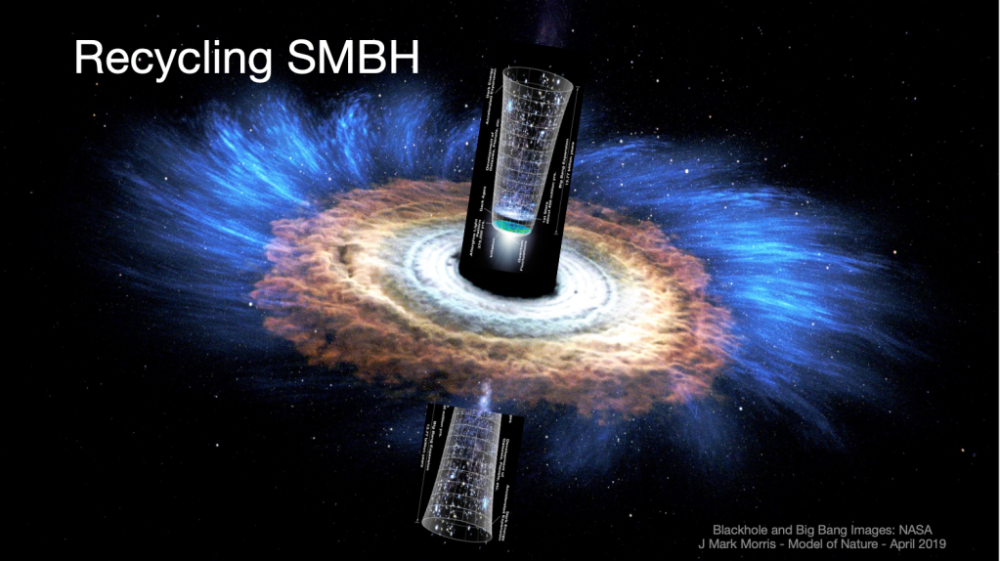

This is a review and commentary on Natalie Wolchover's June 6, 2019 Quanta Article "[Physicists Debate Hawking’s Idea That the Universe Had No Beginning](https://www.quantamagazine.org/physicists-debate-hawkings-idea-that-the-universe-had-no-beginning-20190606/)." I recommend reading Natalie's article in parallel with this one, because I will drop a few quotes (_in italics_) to show areas where I think Hartle-Hawking's idea has some connection with the Neoclassical Physics and Quantum Gravity (𝗡𝗣𝗤𝗚) model.

> _In 1981, many of the world’s leading cosmologists gathered at the Pontifical Academy of Sciences, a vestige of the coupled lineages of science and theology located in an elegant villa in the gardens of the Vatican. Stephen Hawking chose the august setting to present what he would later regard as his most important idea: a proposal about how the universe could have arisen from nothing._
> 
> Quanta Magazine, Natalie Wolchover, June 6, 2019.

The article goes on to explain Hawking's idea that time had a beginning, and it was therefore nonsense to talk about time before that. The parallel to 𝗡𝗣𝗤𝗚 is that time, as we know it, can only exist for matter-energy enveloped in spacetime æther. So, if we think about a high energy event involving point potentials (in-core or plasma) there is no experience of time as we know it **within** the Planck core phase, because the point potentials have reached the ultimate time dilation with zero kinetic energy in this highest energy state. Note that immutable point potentials prevent the "**singularity**" as it was called in the GR-QM era.

| **Phase** of Matter-Energy | The Experience of **Time** |
| --- | --- |
| Planck particle, Planck Plasma, Planck photon all based on a particle with the Planck Energy. | **Time is not experienced in Planck phase.** Planck phase is what Einstein called the singularity. It's not mystical at all, it's simply matter-energy so dense that it has no degrees of freedom, zero entropy, maximum order, no ability to participate in gravity one way or the other, no mass when bounded by other Planck particles. General relativity does not apply to Planck phase matter-energy. |
| High energy spacetime   æther, e.g., high gravity. | Time runs slow, per general relativity.      e.g. your battery has a high charge, your deadline is a long time from now, etc. |
| Low energy spacetime æther, e.g., low gravity. | Time runs fast, per general relativity.      e.g. your battery has a low charge, your deadline is approaching fast, etc. |
| Zero energy,   Zero temperature | It seems from above that we are approaching the answer "time runs infinitely fast". What would that mean? This is some pretty far out there physics.      _I'll put this line of thought in the queue on low priority. Something to think about in the future. Share your ideas in the comments, please._ |

The moment a standard matter particle (photon, neutrino, etc.) is created from released Planck scale point charge plasma is the moment time begins anew for that particle. An external observer could witness the radiation from such a point charge plasma emission, and therefore be aware that time was elapsing in their frame of reference as that emission continued, but an in-core Planck particle itself experiences no time. You can imagine time ceasing as the ultimate time dilation of Einstein, that time actually stops at the the Planck phase which prevents Einstein's "singularity.” A Planck point charge core has one microstate and zero entropy and no information can survive in the core, including information about time. Time begins for standard matter-energy, including spacetime æther, when standard matter particles are created from Planck plasma. In 𝗡𝗣𝗤𝗚, time is related to energy. Time is stopped at Planck energy, runs slow at high energy and fast at low energy.

Also, 𝗡𝗣𝗤𝗚 makes use of an absolute _mathematical_ time in conjunction with Euclidean 3D void space. So, external to all cores there are multiple conceptions of time, but not within any such core. However, 𝗡𝗣𝗤𝗚 does not have a single origin like the Big Bang. Instead 𝗡𝗣𝗤𝗚 has many ongoing intermittent plasma emission events from active galactic nuclei (AGN) supermassive black holes (SMBH) and possibly other forms of high energy mergers and events where Planck energy is reached and plasma is emitted. So, unfortunately, Hawking's hope that his idea could stop the "_... and what comes before that?_" question does not apply in 𝗡𝗣𝗤𝗚.

Hawking partnered with Hartle to create the "“no-boundary proposal” which...

> _...envisions the cosmos having the shape of a shuttlecock. Just as a shuttlecock has a diameter of zero at its bottom most point and gradually widens on the way up, the universe, according to the no-boundary proposal, smoothly expanded from a point of zero size._

In the 𝗡𝗣𝗤𝗚 model, that point of zero size would correspond to the manifold surface of an exposed Planck core and any Planck plasma. This is where photons and other standard matter may emit from the core and form more standard matter in reactions. In the process of reacting, spreading energy, and cooling, these reaction products locally **inflate** from the Planck scale by many orders of magnitude.

Now, here is a fascinating excerpt:

> \[Borrowing from Feynman's path integral approach\], _Hartle and Hawking expressed the wave function of the universe — which describes its likely states — as the sum of all possible ways that it might have smoothly expanded from a point. The hope was that the sum of all possible “expansion histories,” smooth-bottomed universes of all different shapes and sizes, would yield a wave function that gives a high probability to a huge, smooth, flat universe like ours._

That description fits well with 𝗡𝗣𝗤𝗚 where smooth expansion of the universe may be the **net** long term outflow of æther through any closed manifold containing one or more objects or events emitting Planck plasma.

PREDICTIONS AND HYPOTHESES

- In the NPQG model there is no single Big Bang. Therefore the age of the universe must be considered unknown, until a new consensus theory may someday emerge on how and when the recycling universe began. I suspect that the age of our Universe may be boundable at best and never known to a high degree of accuracy. If it is not boundable should we call it infinite?

- Our universe is not expanding outwards from "the big bang". Instead active galaxies drive the bang/inflation/expansion cycle in galaxy local processes. It may turn out that some regions expand and others contract. However, net expansion, or outflow of æther may correspond with net inflow of matter-energy over the long term if we are in a fluctuating, but steady-state universe.

- If the æther is flowing regionally, and in general outwards, away from galaxies, then the aggregate outflow ("expansion") of the universe may fluctuate. That means that in regions or in the universe as a whole, the balance of matter-energy vs. æther may fluctuate. They are both made from the same fundamental particles and they both carry energy, so this is a straightforward conclusion. It is also possible that a galaxies life cycle may include periods of recycling and periods of pause pause with no emissions/jets over large time scales.

- The Hubble constant is the GR-QM era's method of measuring Universe expansion. However, universe expansion is a moot point since it is steady state on the grand scale, because inflation and net expansion or deflation are local phenomena. Therefore, measurements of Hubble’s scalar are actually a measure related to the total expansion experienced by an observed photon.

- The concept of redshift from both inflation and expansion needs to be revisited separately in the context of 𝗡𝗣𝗤𝗚. See [https://johnmarkmorris.com/2019/06/13/fresh-thinking-about-redshift/](https://johnmarkmorris.com/2019/06/13/fresh-thinking-about-redshift/)

The key meta-level takeaway from this post is that GR-QM era scientists were thinking like a uniprocessor in the 1960-70 era of computers. They hadn't even gotten to the stage of symmetric multi-processors (SMP) or parallel processing. Much less talk about single threaded synchronous software versus multi-threaded asynchronous threads and processes. Here is the deal: **THE UNIVERSE IS PARALLEL AND MULTI-THREADED!** The universe is self similar both in time and space if the universe is infinite. If our bubble is finite then there is some interesting variation at the cosmos surface and that is new science to be discovered.

All in all, this was a fascinating article in **Quanta** by **Natalie Wolchover** on the ideas related to time and the Big Bang. Even though the Big Bang is incorrect, we can still derive insight from the science as recast for 𝗡𝗣𝗤𝗚.

_**J Mark Morris : San Diego : California**_
