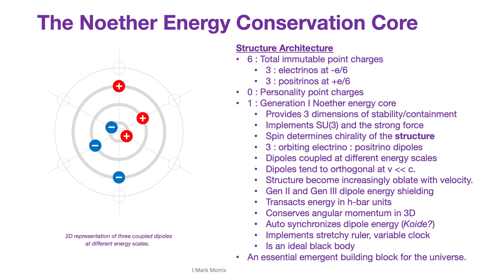

The Noether core is the most re-used assembly in the universe. Whether it is a simplex, duplex, or triplex Noether core — it is a naturally emergent assembly that is so common that it forms an elementary building block assembly of nature. Of course it is commonly occurring! A pair of electrinos repel each other. A pair of positrinos repel each other. Only opposites attract. An electrino attracts a positrino and vice versa.

Think about that, a sea of swirling energetic point charges, yet only opposites attract and begin forming assemblies. What do we mean by the term ‘assembly’? An assembly is simply a quasi-stable pattern of point charges that are flying around kinetically under the influence of electromagnetic fields. The universe is electromechanical.

Stable and abundant assemblies are clearly observable in our universe. Even quasi-stability will be important in many new fields. Yet many assemblies are assemblies of sub-assemblies. You might think in terms of orbital layers for now, each layer of point charges playing a different yet quite exotic role within the assembly. Imagine the most complicated electromagnetic pattern in space and time that repeats and you might sort of get what is happening in a assembly.

A point charge assembly is a pattern in nature that couples point charges and their fields into a dynamical relationship of space, time, and velocity. Each assembly influences the the energy and energy gradient of the space time aether in the vicinity and vice versa. That's gravity.

The Noether cores are at the heart of every particle, even if it is a low energy triplex Noether core flying through space and time which we call an electron neutrino. The Darwinian evolution of point charge binaries is fascinating. Apparently lower energy electrino:positrino binaries can capture higher energy binaries and this can continue until the third level of capture which now matches the dimension of the 3D space which these point charges find themselves residing.

Ok, so look, it is obvious. We already know energy dissipates over time. We call that redshift. We just don’t know the mechanism(s). Well that’s ok, let’s just assume there are non-scattering mechanism(s) that transfer energy to the particulate aether. That shouldn’t be hard to believe. You are a Noether core based mechanism flying through a cold 2.8K Noether 3D bath. What is the big deal? Why is that so challenging to everyone? It shouldn’t be. It is a parsimonious solution that easily leads to solutions to all the big questions.

* * *

Let’s brighten our day with this video by Anton Petrov.

https://youtu.be/UzVXNFkI60Q

Oh my gosh, why isn’t this obvious to physicists? The “Higgs field and particle” are simply aspects of the detritus at the low apparent energy end of spacetime aether. Some assemblies shield enormous energy equal or greater than the Higgs mass. Other of the glowing detritus in that aether junkyard are super redshifted neutrinos and photons. They eventually traded their velocity as energy dissipated. What is the composition of this detritus that makes spacetime aether? How much of it is supercold neutrinos or anti-neutrinos? How much of it is super low temperature photons? What are the rules for the alchemy of these aether assemblies? Obviously it must be easy for a drop of energy to cause spacetime aether to be re-animated as a neutrino or photon and zip off on new travels!

**_J Mark Morris : Boston : Massachusetts_**
