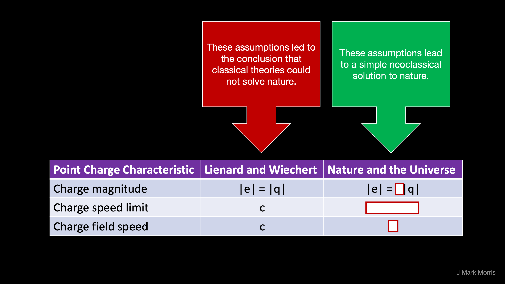

Nobel season every year brings a slew of social media posts and outreach about the research area of the Nobel Prize for Physics. 2022 was no exception, with the award focusing on a key area of quantum physics related to Bell's inequality.

I encountered this tweet stream from Will Kinney.

> _Einstein, Podolsky, and Rosen argued in a famous 1935 paper that the quantum wavefunction must be an incomplete description of the physical state of systems. This involved assumptions, such as locality, that Einstein believed must be properties of any reasonable theory of reality. This is why this year's \[2022\] Nobel Prize is so significant. John Bell first showed that the assumptions built into EPR could be experimentally tested, and Aspect et al. went out and did those experiments. The result was that Einstein was wrong, and -- as far as we can tell -- the assumptions underlying EPR must be violated. As far as we can tell, quantum wavefunctions are complete representations of quantum systems. This is an excellent example of why philosophical argument — as useful as it is for formulating precise questions — is insufficient. Science is more than that, and requires comparison to outside reality. Science is empirical._
> 
> Will Kinney - Twitter Thread

Hold up! Sabine ([@skdh](https://twitter.com/skdh/)) already specified the superdeterministic corner case. Guess what? Yep. Physics has false priors in the bedrock consensus that there was no classical solution to nature. Turns out physicists missed an opportunity to discover the architecture of nature circa 1900, and apparently no one ever closed the loop.

> _Superdeterminism is presently the only known consistent description of nature that is local, deterministic, and can give rise to the observed correlations of quantum mechanics. I here want to explain what makes this approach promising and offer the reader some advice for how to avoid common pitfalls. In particular, I explain why superdeterminism is not a threat to science, is not necessarily finetuned, what the relevance of future input is, and what the open problems are._
> 
> Superdeterminism: A Guide for the Perplexed  
> Sabine Hossenfelder  
> arXiv:2010.01324

We can solve nature given the degrees of freedom to change the point potential magnitude, realize the implications, and flip the ontology. I wonder if the Einstein's knew the solution given their work on brownian motion.

A reply to Will mentioned a Steven Weinberg article and a particular paragraph. Here is a free [pdf available for download](http://quantum.phys.unm.edu/466-17/QuantumMechanicsWeinberg.pdf).

Weinberg's books are already dated, but that's fine for experienced professionals who know the history and can correct. In the next era it becomes clear that Weinberg was looking at shadows on a cave wall. Yes, it is amazing he was able to do what he did even while Houdini'd by false priors.

> _The introduction of probability into the principles of physics was disturbing to past physicists, but the trouble with quantum mechanics is not that it involves probabilities. We can live with that. The trouble is that in quantum mechanics the way that wave functions change with time is governed by an equation, the Schrödinger equation, that does not involve probabilities. It is just as deterministic as Newton’s equations of motion and gravitation. That is, given the wave function at any moment, the Schrödinger equation will tell you precisely what the wave function will be at any future time. There is not even the possibility of chaos, the extreme sensitivity to initial conditions that is possible in Newtonian mechanics. So if we regard the whole process of measurement as being governed by the equations of quantum mechanics, and these equations are perfectly deterministic, how do probabilities get into quantum mechanics?_
> 
> Fair use excerpt from _The Trouble with Quantum Mechanics  
> by Steven Weinberg  
> The New York Review of Books_

Part of the problem here is physicists have no comprehension of the genesis of the wave equation and it's complexity. They aren't aware of unit point potentials, orbitals, precession, and floating potential ground. They have no idea about provenance. The situation is both a tragedy and travesty, all caused by the failure to detect false priors.

Weinberg's powerful intuitions are amazing despite physics taking the most incredibly difficult path for finding a solution to nature. I wish he had lived to learn of the false priors and the solution.

**_J Mark Morris : Boston : Massachusetts_**
