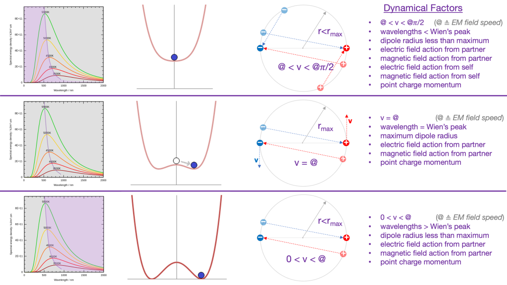
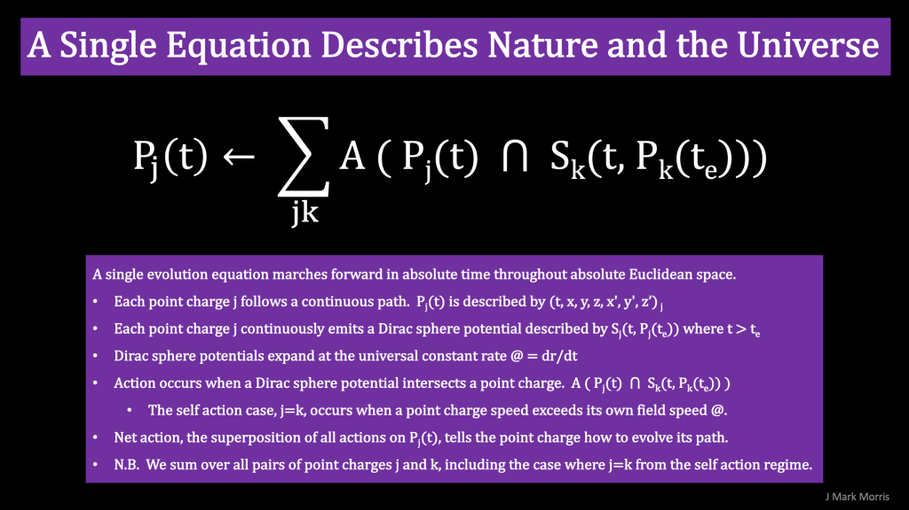

Before we get into a discussion about point potentials, l'll set the stage with a quick review of the high level description of the classical theories. Some areas are considered _reference models_ due variously either to their

1. scale differential of the classical theory from the scale of point potentials,

3. the lack of classical understanding of the spacetime aether, and

5. the reaction influencing effect of incoming fields from point potential structures which are themselves emanating from sources beyond causal influence.

Here are the high level definitions of the classical theories.

> _**Classical mechanics** is a physical theory describing the motion of macroscopic objects, from projectiles to parts of machinery, and astronomical objects, such as spacecraft, planets, stars, and galaxies. For objects governed by classical mechanics, if the present state is known, it is possible to predict how it will move in the future (determinism), and how it has moved in the past (reversibility)._
> 
> _The earliest development of classical mechanics is often referred to as Newtonian mechanics. It consists of the physical concepts based on foundational works of Sir Isaac Newton, and the mathematical methods invented by Gottfried Wilhelm Leibniz, Joseph-Louis Lagrange, Leonhard Euler, and other contemporaries, in the 17th century to describe the motion of bodies under the influence of a system of forces. Later, more abstract methods were developed, leading to the reformulations of classical mechanics known as Lagrangian mechanics and Hamiltonian mechanics. These advances, made predominantly in the 18th and 19th centuries, extend substantially beyond earlier works, particularly through their use of analytical mechanics. They are, with some modification, also used in all areas of modern physics._
> 
> _Classical mechanics provides extremely accurate results when studying large objects that are not extremely massive and speeds not approaching the speed of light. When the objects being examined have about the size of an atom diameter, it becomes necessary to introduce the other major sub-field of mechanics: quantum mechanics. To describe velocities that are not small compared to the speed of light, special relativity is needed. In cases where objects become extremely massive, general relativity becomes applicable. However, a number of modern sources do include relativistic mechanics in classical physics, which in their view represents classical mechanics in its most developed and accurate form._
> 
> Wikipedia

> _**Classical electromagnetism** or classical electrodynamics is a branch of theoretical physics that studies the interactions between electric charges and currents using an extension of the classical Newtonian model. The theory provides a description of electromagnetic phenomena whenever the relevant length scales and field strengths are large enough that quantum mechanical effects are negligible. For small distances and low field strengths, such interactions are better described by quantum electrodynamics._
> 
> Wikipedia

Based upon these rather weakly portrayed definitions in Wikipedia circa 2022, it is very clear to me that _the so called advancements in physics_ that superceded the classical theories actually went in the wrong direction theoretically. The field _erroneously_ chose a technologically effective path which resulted in tacking on complex and difficult to understand theories like general relativity, quantum mechanics, and lambda cold dark matter.

The superior theoretical solution is to abstract the classical theories down to their essence with point potentials. This was a massive ontological failure for the field of science. Yes, such things are plainly evident as a paradigm shifts. I eagerly await the analysis and perspectives of the professional science historians.

One problem is that the classical theories are rooted in macroscopic concepts. My goal and challenge is to continue to reduce the essence of the classical theories to the minimum set of ingredients and natural laws that can produce our universe via emergence. Maxwell's equations appear to be part of that essential set of concepts, although it is possible that they contain redundancy in the point potential formulation.

Let's examine the concept of mass as an example. I think mass is fundamentally misconceived in the classical theories. Therefore mass must be reformulated with a new definition at the point potential abstraction level that can map to the concepts of mass in the classical theories. The emerging idea is that what the classical theories call "mass" appears to be an interaction between the apparent energy of a point potential structure with the spacetime aether (which is also made of point potential structures). So if you think of it that way, what is mass? Mass is not a fundamental concept at all. Instead we have a sea of spacetime aether structures with extremely low apparent energy (while shielding additional energy) and we have a standard matter structure with apparent energy (while shielding energy) and we model the interaction between the two with c2 from E=mc2, but c2 is really an expression of the permittivity and permeability of the spacetime aether. Note in this context the speed of photons, c, is a very confusing way to think about mass, unless you understand how nature operates at the lowest level and can link these concepts into a sensible cognitive line of reasoning. This is an example of why physics is so confusing to so many people. It's not that complicated in reality! Phew.

* * *

_Aside, I do have an outside bet on a pre-1928 conspiracy where some of the scientists had at least an inkling of the point potential solution to nature if not the full picture and decided to divert the field due to concerns given the geopolitics and risks of the era. There are so many indications in the annals of physics where overt actions were taken to stifle creativity directed towards the natural solution, including bullying of DeBroglie and Bohm, the fawning objections by Einstein towards Quantum Mechanics, and even forward to the "shut up and calculate" mantra from the acme of the academic power hierarchy to the hoi polloi run of the mill academics._

_That all said, probability suggests that the likelihood of such a conspiracy going undivulged for over a century would suggest that even if it were true, the set of conspirators must be small. I could actually be persuaded that Mileva, or Mileva and Albert, figured it out and intentionally deflected. Is it feasible that the Einstein's could have enlisted a small additional number of luminaries over the era 1905-1927 to conspire to obscure a true solution with confusing theories that obfuscated and even forbade further inquiry, such as the finality of the quantum, and a geometrical description of spacetime? Remember, Mileva and Albert studied Brownian motion, and it is only a short leap to imagine Brownian motion with point potentials. I place my main bet on the solution simply being right beyond the grasp of all of these great scientists. Yet I wonder about the truth, so I would definitely place a longshot bet on a small conspiracy._

NPQG attempts to follow the classical theories of mechanics and electromagnetism as close as possible, and really doesn't have any deviations from them as far as I know. NPQG reduces the classical theories to their essence at the point potential level of nature's implementation. At the same time NPQG is working towards recasting the classical theories in the new set of concepts, language, and mathematics that emerge from the highly parsimonious formulation of universe ingredients as energetic point potentials and emergence.

NPQG makes several advancements, for example :

1. NPQG illuminates and clarifies the idea of photons being a higher level emergent structure made from point potentials themselves.

3. NPQG includes a vision of a spacetime aether sea of low apparent energy point potential structures through which we observe nature as photons, neutrinos, and gravitational waves are detected by our instruments.

5. NPQG explores orbiting binaries and that point potentials could exceed their own field speed and experience self-action.

Self-action of point potentials was not a part of the original classical theory. I do understand there is scientific consideration of self-action for the electron and positron fermions which are considered to fundamental particles by quantum theory. However, in NPQG we know the assembly structure of the electron and positron to be a 3:3 Noether core with personality potentials (6:0) or (0:6) respectively.

> _Self-action was most definitely considered in classical electro-dynamics. It was one of the attempts to explain the unbalanced spiraling nature of electrons and positrons in a cloud chamber. Basically, anything cyclical, you most definitely have to consider self-action. A spiral is a clear case of self-action. Any differential equation with an in-spiral is cyclic in nature._
> 
> Interlocutor I

"The tracks of electrically charged particles passing through a bubble chamber of superheated liquid hydrogen at CERN. The tightly coiled spirals are electrons or positrons (which coil in opposite directions), while the straighter lines are more massive particles. The V-shaped intersections come from a neutral (invisible) particle decaying into two oppositely charged new particles." - CERN

> _The reasoning was that if there were not self-action, the electron and positron would have mirrored spirals. Yet, the electron seems to spiral inward faster than the positron. So it was considered that the positron's self-action aligned with the experimentally applied magnetic field, and the electron's self-action against. I remember even seeing the mathematics worked out for the case. However, the implication here would be that any electron would spiral inwards given an external magnetic field. In fact, that's exactly one of the reasons the Bohr orbital-model was unstable, just rationalized from a thermo-dynamic (radiation) perspective. However, that is not to say the same principle shouldn't be explored from the starting point of viewing electrons through the lens of quantum mechanics. Or maybe even your model has a solution to this._
> 
> _On another note, there is something intriguing about how we can consider the various geometries corresponding to equal-length chords. They each represent a different order to the cycle. A triangle made of chords means every third rotation of the charge experiences a self interaction. The integer nature of these cycles alludes to some sort of integer multiple of self-action, perhaps a link between your model and discrete energies._
> 
> _This is quite similar in several regards to the Bohr model of electron orbitals, but I will say, the key may be that since you have a pair of orbiting charges, they may self-stabilize to form the cycle your model shows. Alleviating the issue of the inward-spiral, or radiant energy. Although I cannot say I have explored the mathematics of that, I am curious, and so I will._
> 
> Interlocutor I

* * *

> _The classical theory does have some (non-information conveying) faster than light effects due to self-interaction._
> 
> Interlocutor II

Mapping that thought to orbiting point potential binaries it is curious why it would be non-information carrying. My thinking is that it is simply a matter of orbiting binary frequency, and that Wien's peaks correspond to the maximum radius of the binary orbit when the velocity magnitude v equals the electromagnetic field speed @.



So, from the highest energy near the Planck wavelength, Planck frequency, Planck length radius as a binary sheds energy it's radius would rapidly inflate. In tri-binary form this would be the basis of inflation imagined by Guth, et al. I wonder if the process of tri-binary formation might be the root cause of the first two peaks in the CMB? Yes, that's a leap but everything must map if I am to respect the observational findings of physics, which I do.

So at velocities greater than @ (which the photon at v = c approaches) the frequency of the binary continues to increase until reaching the Planck frequency. In terms of information carrying ability, we normally think about information storage density increasing with frequency in computer memory or mathematics. But the unusual aspect here is that binaries vary their radius and frequency with energy, so the density of information in R4 modeled absolute space and time is also a function of this inflation or deflation. Of course, this would all depend on how we could map information on to such binary or tri-binary devices by controlling the frequency at extremely fine granularity, which sounds like a heck of a technology challenge for quite some time to come.

* * *

**A New Mathematics?**

Might we geometrically and dynamically model the universe as :

- Absolute unbounded continuous Euclidean time and space

- Euclidean time and space modeled with a properly dimensioned R4 geometry.

- An infinite set of energetic point potentials contained within Euclidean time and space.

- Each point potential emitting a spherically expanding electric field object continuously along its R4 path.

- Each point potential maintaining an action relationship with every other point potential, including itself.

- Action is determined by the intersection of a point potential current location with a Dirac sphere stream of electric potential. Each action can be calculated and the superposition combined with the point potential path will determine the movement.

From this basis, we need to extract and apply the essence of classical mechanics and electromagnetism. Precisely how do we define action of a field object emitted by (polaritym, tm, xm, ym, zm, vm) taking action upon itself or any other point potential (polarityn, tn, xn, yn, zn, vn)? Would it make sense to write this as a matrix? Something like this?

```
[ 
    (polaritym),
    (tm),
    (xm, ym, zm), 
    (dxm/dtm, dym/dtm, dzm/dtm)
]
point potential action
[ 
    (polarityn)
    (tn),
    (xn, yn, zn), 
    (dxn/dtn, dyn/dtn, dzn/dtn)
]
for all m, n, including m = n
```

We need an intersection operator that determines both when a potential sphere coincides with a point potential and the net action at that point in (t,x,y,z). From the point of view of simulation, the greatest efficiency to be had is to efficiently winnow the intersections of field objects and point potentials. One method is to compute an object structure for each pair of point potentials, including the self.



Consider the expanding spheres of the electric potential emitted by a point potential at tm.  
**\[(polaritym), **(tm)****, **(xm, ym, zm), (dxm/dtm, dym/dtm, dzm/dtm) \]**

- The point potential travels interior to the emitted potential spheres when v < @.

- The point potential travels exterior to newly emitted potential spheres when v > @.

- A point potential might travel with it's field front velocity v = @. **This is the symmetry breaking point.**

- A point potential might cross over its own field front an arbitrary number of times depending on action upon it from other field fronts.

These ideas should all be covered under the area of geometry called dynamical systems. I think it is rather fascinating to consider the specific eight-vector above in the context of dynamical systems. It is a special eight vector over a path.

- Potential
    - Potential with a magnitude q, equal and opposite.

- Absolute 1D time
    
    - Absolute time moves forward linearly and continously.
    
    - Do not confuse absolute time with causal time.
    
    - Reactions depend upon causality as measured with absolute time.

- Absolute location in 3D space (and 1D time).

- Absolute velocity in 3D space (and 1D time).

What else do we need to describe nature's emergence from this formulation? It is straightforward to determine the large scale density of energy and point potentials in absolute terms and we already know that an immense range of such density of point potentials and energy exists. Is anything else required?

**_J Mark Morris : Boston : Massachusetts_**
