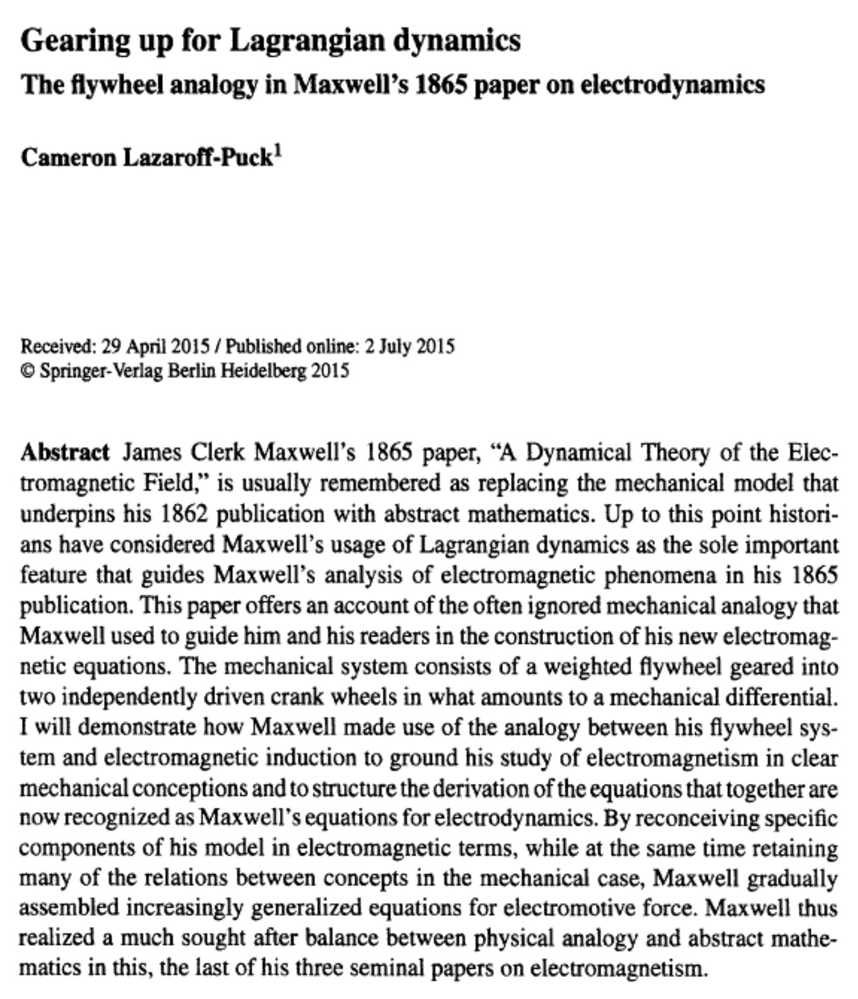
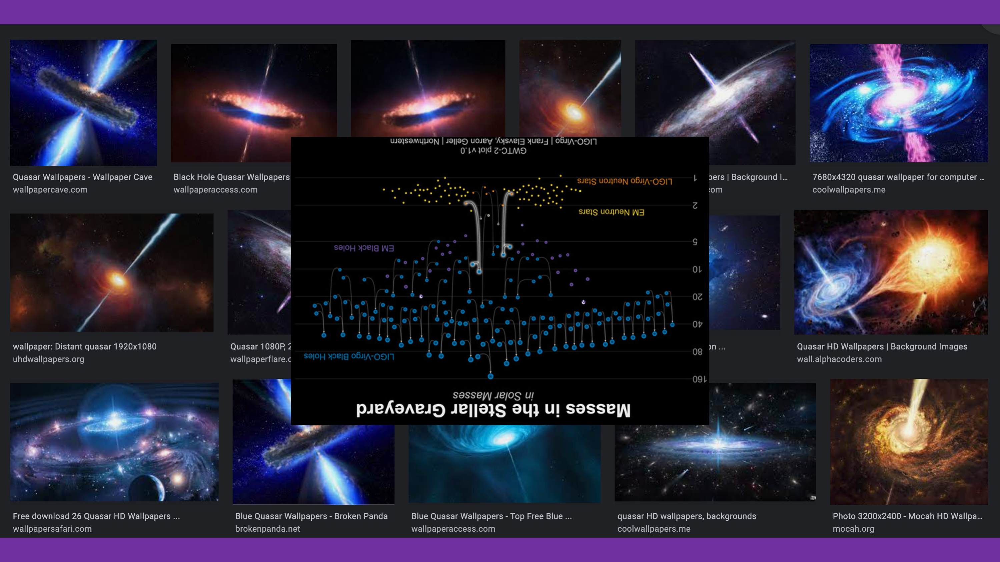

My thinking has crystallized regarding the failures of LCDM cosmology. I'll go through the key concepts in point potential cosmology and provide a comparison to prior era LCDM. Let's start with a relevant show from Anton. Commentary follows.

https://youtu.be/HRaQj\_IMAjY

There are five observable radio frequency events of size greater than a galaxy and possibly extending to multiple galaxies. It is highly likely that the source of each event occurred in the galactic nucleus of a single galaxy and involved the SMBH. The suggestion is a merger of two SMBH.

Well that is fascinating. No doubt these events belong in the set {mini-bang events}. They most certainly release high energy Noether cores which inflate and expand no matter their destiny, whether that be to power photons, neutrinos, fermions, or even destined to be tired low apparent energy Noether cores of spacetime aether. Does an ORC meet requirements for an inflationary bang event? Yes. But don't get too excited, there are all sorts of processes in which Noether core energy ramps up really high and they get released and dissipate energy and inflate/expand again. It's all one curve!!!

Another _eureka! doh!?_ moment has occurred. **_It's all one curve!_** Of course it is. I've said many times that the binary travels the Planck's Law curve and that at Wien's peak I would expect velocity v to equal @ the field speed of potential. Noether cores are tri-binaries. Assembly structure number 1 is the electrino : positrino point potential binary. These binaries are amazing traders of h-bar angular momentum. When they are nested in a structure they will auto-synchronize at various frequency multiples. This is probably why several physicists have conceived cogwheel (t 'Hooft) and gear models. There is a huge opportunity based upon infusing t 'Hooft's cogwheel framework with point potentials and the nested binary model. Just look at those 2pi/3 factors and imagine three nested binaries. That looks like a sign of frequency synchronization.

> In his 1861 model, Maxwell showed that, when suitably adjusted, the workings of his complex machinery of gears and wheels matched those of electromagnetism. Magnetic energy was stored in the kinetic energy of the spinning gears, and the gears would spin and bulge, capturing the way changes in magnetic fields generated currents.
> 
> "The laird of physics" : https://www.nature.com/articles/471289a

The dominant structure in the universe is the binary. Nature selects for binaries that nest once per dimension of space. A single high energy binary is unshielded and reactive. A nest of two binaries has poor shielding and is reactive. A nest of three binaries has excellent shielding and is a survivor selected by nature. More levels of nesting? It kind of depends what you call the next orbitals. Certainly there are many structure designs that are unstable as we see in our particle colliders.

The stable or transactional realm includes several standard matter particles. Weak personality potential layers around a Noether core make a fermion. I've written about the photon and the neutrino which are compound Noether core structures. The W and Z bosons have another level of nesting and/or personality potentials and the geometry is highly planar and therefore Bose-Einstein statistics apply. And we have the aether which is somehow related to Higgs. I'm imagining two pro and two anti Noether cores with extremely low apparent energy forming a little cluster, but it could be something else entirely. It seems to me that Higgs are somewhat puffy given that I think a lot of them have a lineage from redshifted photons and neutrinos.

It's all one curve! Everything is powered by Noether cores. The cores self-synchronize their three binary energy levels. Therefore, Noether cores have highly predictable behaviour which we also correlate to tests of general relativity. What does it mean to all be one curve? It means the energy of the Noether core is directly related to the total energy of the three binaries and this is related to the frequencies and the radius of each binary and the effective volume of the Noether core. The volume of the Noether core is the effective exclusionary zone that ties into the Pauli exclusion principle. I'll guess that volumetric exclusion by Noether cores is related to pressure in Einstein's equations. The predictable dynamical geometry of the Noether core is the root cause of Planck's law and the quantum for that matter. Noether cores and their binaries are ideal black bodies. It's logical to imagine that the decay of a binary or decay of a Noether core may result in photons and/or neutrinos as reaction products.

It's all one curve! All of the observed structure in the universe, as well as the aether are based upon Noether cores. There was no one time big bang. Instead, there are various events throughout the universe that cause high energy Noether cores or point potential plasma to become super dense and then an event or process occurs that releases these incredibly high energy Noether cores or point potential plasma in an explosion or jet. Noether cores inflate and expand. Distributed sources in space and time are perfectly compatible with existing bang and inflation theory. You also pick up the best parts of several other theories, like CCC, eternal inflation, white holes, and the multi-verse. Let's run through the interpretational errors in LCDM and compare to point potential cosmology.

| LCDM Interpretational Error | Point Potential Cosmology |
| --- | --- |
| Universe expanding outward | Universe expanding in-place. Universe recycling in place.       |
| Galaxies receding | Large scale gravitational patterns are retained. |
| Comoving distance, proper distance, cosmological time, and other prior era concepts you can find in [Ned Wright's cosmological calculator](https://www.astro.ucla.edu/~wright/CosmoCalc.html). | It's simply absolute Euclidean geometry and distance in a steady state universe. |
| A single Big Bang event | High energy events isotropically distributed in Euclidean space and time. |
| Photons from the Big Bang have redshifted for 13.8B years. | The photons we detect at microwave frequencies from deep field surveys were emitted by high energy events billions of years ago pending reformulation of the redshift-distance relationship.      This is a mundane chemistry of reactions and does not have any relation to size of the universe or the age of the universe. |
| "Hubble's law, also known as the Hubble–Lemaître law, is the observation in physical cosmology that galaxies are moving away from Earth at speeds proportional to their distance. The velocity of the galaxies has been determined by their redshift, a shift of the light they emit toward the red end of the visible spectrum." — Wikipedia | Hubble's law is nonsense. The universe is dynamical steady state.   Noether cores are what inflates and expands and they also recycle into denser higher energy forms. |
| Expansionary redshift understood as a toll that is linear with distance. | We need new research on the dynamical geometry of redshift as a function of photon energy and aether energy. We can count on isotropy of astronomical observations to sleuth out the shape of the curve. |

Circling back to Anton's **ORCS**, it does occur to me that they may be rare, with only five observed so far in the universe. It's early days in the science of ORCS, so a few scattered observations may not be representative of the true density of these events in time and space. Hopefully JWST will have a greater field of vision for ORCS. I presume that ORC events have a lifecycle and eventually dissipate into the background. This begs, the question as to the ability of astronomers to detect dissipating high energy event patterns (at a range of scales). This would help us establish the Euclidean time and space density of ORCS. I wonder if dissipating ORCS might leave a signature related to the Hawking Points idea of Sir Roger Penrose? I don't know the current confidence levels on Hawking point theory.

It also occurs to me that ORCS could be a sign of an intelligent life discovering the source code to nature and blowing itself up. That would be a form of strong emergence that would really suck. Nah, I don't think that scenario makes sense. ORC events require extremely dense matter input, such as SMBH. My sense is that an ORC would be consistent with a catastrophic failure of the SMBH event horizon and release of large scale point potential plasma in an explosion. It seems reasonable to imagine a collision of an SMBH with another of near the same scale.

> _Starburst galaxies are galaxies that are observed to be forming stars at an unusually fast rate (about 103 times greater than in a normal galaxy). At these high levels of star formation it is estimated that the supply of gas and dust within the galaxy would be exhausted within about 108 years, meaning that these episodes of intense star formation must have started relatively recently and will end in the not too distant future._
> 
> _Most starbursts are observed in a small region around the nucleus. Although hidden from us at optical wavelengths by the enshrouding dust, massive stars are formed out of the available gas. They emit copious amounts of ultraviolet wavelengths which is absorbed by the surrounding dust and reemitted at infrared wavelengths, making starburst galaxies among the most luminous infrared objects in the Universe. Ironically, it is the rapid rate of star formation that ultimately terminates the period of starburst. Supernova explosions and stellar winds from the newly formed massive stars can be sufficient to sweep the gas from the galaxy thereby halting all further star formation._
> 
> _Starburst galaxies have also been observed in the early universe and appear to be more prevalent than they are now. These galaxies located about 12 billion light years distant, appear to have the same characteristics as the nearby starbursts and indicate that galaxy interactions were much more common in the past._
> 
> https://astronomy.swin.edu.au/cosmos/s/starburst+galaxy

Anton mentions starburst events as a possible related behaviour along the causal chain of an ORC-type event. That would make total sense in point potential cosmology. Releasing point potential plasma generates a lot of Noether core based matter which leads to the gaseous matter required for star formation. As to the last paragraph in the starburst quote, this is an example where a transformative mapping is required to point potential cosmology where isotropy ruleZ and the redshift-distance relation is reformulated.

**_J Mark Morris : Boston : Massachusetts_**
