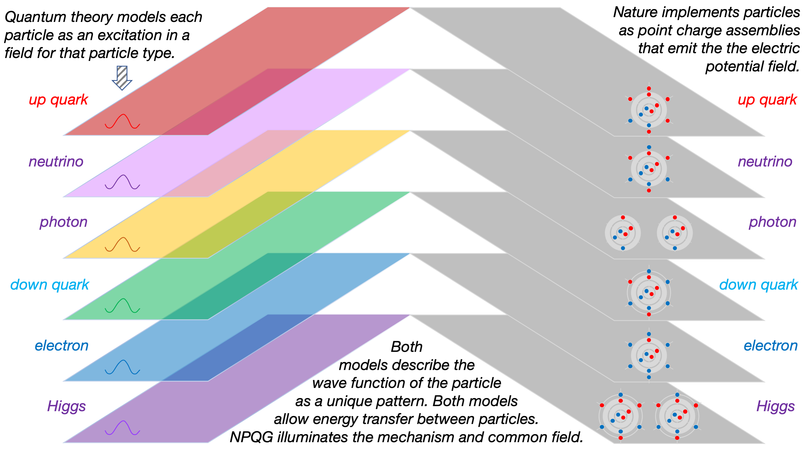

Here's an excellent diatribe from Dr. Paul Sutter on Quantum Theory. It is both hilarious and tragic. A lack of imagination during the classical to quantum transition caused the quantum mess.

https://youtu.be/uJmam-gkgFY

One signal of the root issue is that quantum mechanics is dissatisfying to many who dive into it, no matter how deep they go. Why should we accept that the best science can do is a probability of outcome? Particle assemblies have multiple frequencies and we don't know where in the wave equation the reaction is going to occur. Instead of throwing up our hands and capitulating to probabilities, this is a clue for where to look for a solution. Why should we accept the concept of the quantum with no implementation? The QM proponents were very aggressive in walling off various lines of investigation by stating that quantum were fundamental.

For my part, I was skeptical as soon as I began reading about QM. I understand it is an effective theory. I simply can not accept limitations on the search for an implementation to nature. GR also presents certain limitations conceptually due to its geometry. The beauty of pure geometry appears to distract in some sense from the search for an implementation of that geometry. Oddly, physicists are correct that nature is ultimately a dynamical geometry, but GR and QM stopped a few assembly levels short of the goal.

In the figure above I show the one aspect of the architecture of quantum field theory, that each particle is an excitation of a field for that particle type. NPQG makes huge strides towards a parsimonious model with only one field type, the electric potential. Particles are implemented as assemblies of point charges and those assemblies generate the wave equations already known to science.

**_J Mark Morris : Boston : Massachusetts_**
