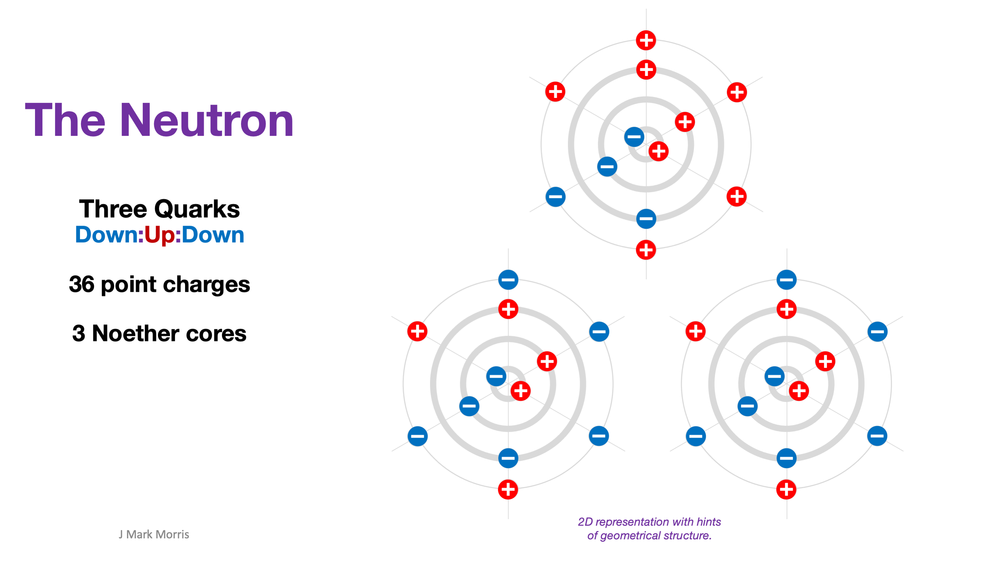

Let’s remap the Big Bang cosmology timeline to the point charge universe! This series has already covered higher energy epochs listed below.

- [Planck Epoch : Peak Density of Energetic Point Charges](https://johnmarkmorris.com/2023/04/22/planck-epoch-peak-density-of-energetic-point-charges/)

- [Grand Unification Epoch: Binaries Dominate](https://johnmarkmorris.com/2023/04/23/grand-unification-epoch-binaries-dominate/)

- [Inflationary Epoch : Noether Cores Form](https://johnmarkmorris.com/2023/04/23/inflationary-epoch-noether-cores-form/)

- [ElectroWeak Epoch : Personality Charges Bond to Noether Cores](https://johnmarkmorris.com/2023/04/28/electroweak-epoch-personality-charges-bond-to-noether-cores/)

| **Big Bang Cosmology** | **NPQG Cosmology** |
| --- | --- |
| _The Quark epoch was the period in the evolution of the early universe when the fundamental interactions of gravitation, electromagnetism, the strong interaction and the weak interaction had taken their present forms, but the temperature of the universe was still too high to allow quarks to bind together to form hadrons.      The forces of the Standard Model have reorganized into the "low-temperature" form: Higgs and electroweak interactions rearranged into massive Higgs boson H0, weak force carried by massive W+, W-, and Z0 bosons, and electromagnetism carried by massless photons. Higgs field has nonzero vacuum expectation value, making fermions massive. Energies are too high for quarks to coalesce into hadrons, instead forming a quark–gluon plasma._ \[W\] | The hadrons of interest here are the proton and the neutron. The quark "epoch" is a portion of the inflation/expansion process that starts with intensely energetic point charge plasma being emitted from supermassive black holes. As energy density declines there comes a period where quarks have formed and the density of these nascent assemblies is high enough that they are somewhat stable (or at least forming, decaying, and reforming) but they have not yet reached an energy level where they combine together into a more stable proton or neutron. |
| The quark epoch began approximately 10−12 seconds after the Big Bang, when the preceding electroweak epoch ended as the electroweak interaction separated into the weak interaction and electromagnetism. During the quark epoch, the universe was filled with a dense, hot quark–gluon plasma, containing quarks, leptons and their antiparticles. Collisions between particles were too energetic to allow quarks to combine into mesons or baryons. The quark epoch ended when the universe was about 10−6 seconds old, when the average energy of particle interactions had fallen below the binding energy of hadrons. The following period, when quarks became confined within hadrons, is known as the hadron epoch. \[W\] | This all makes perfect sense in NPQG. The exact timeline and specific mechanisms will be illuminated by precise simulations of point charge behaviour under the conditions in the inflating/expanding maelstrom of point charge plasma and the nascent assemblies that form and react. |

The following illustration shows the quarks that compose the neutron and proton. In the quark epoch these quarks have formed but have not yet bound together into super-assemblies.

In the quark epoch we are likely to see ephemeral hints of coupling of binary vortices. Scientists call such couplings gluons as shown below.

As you can see, the point charge architecture of nature provides simple and logical explanations for the processes that occur in the quark epoch.

**_J Mark Morris : Boston : Massachusetts_**
