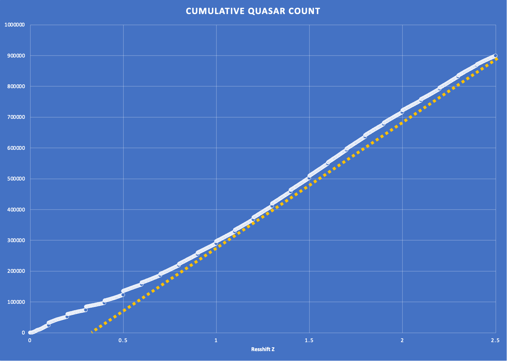

I recently wrote about a Dr. Paul Sutter episode in the post titled : [Ontological Transformation of the Big Bang](https://johnmarkmorris.com/2022/03/20/ontological-transformation-of-the-big-bang/). Paul said something in this episode that has been ricocheting around my subconscious and a major insight has dawned upon me that I've known for a long time, but couldn't articulate. The background story is that in point charge theory the universe doesn't expand outward as a whole, but instead expansion is internal and driven by recycling processes that energize Noether cores which causes them to get very small and then exposes them to less dense environments where the Noether cores can dissipate energy and inflate and expand. Some Noether core based particles fly out of the galaxy as photons or neutrinos and take their energy with them. For these and other reasons, it has been evident to me for a long time that we need to rethink the meaning of photon redshift.

When a photon travels, it is continuously phase shifting a tiny amount of energy from the photon to the spacetime aether through which it is passing. Photons are contra rotating coaxial Noether cores in a planar formation. Spacetime aether is made from super low apparent energy Noether cores in clusters that we call Higgs particles. For these structures to trade in continuous energy via phase shift is fine. This is a realm below the quantum of angular momentum based energy, i.e., h-bar. The Noether core can certainly transact energy in h-bar discretely, but it can also transact energy continuously via phase shift.

Now we have a basic idea of how redshift is implemented in nature, but how are we to determine the precise mathematics of redshift? If we think of redshift as a continuous toll on energy, a very tiny battery drain, then what is the rate of that drain over Euclidean time and space? Let's list out some of the factors that might be present in the math.

- The energy of the photon itself may be a factor. All other conditions held constant, a super high energy photon might redshift at a different rate than a low energy photon.

- The energy and energy gradient of the spacetime aether may be a factor. We already know about gravitational redshift when a photon climbs out of a gravity well.

Is there anything else? The bottom line here is that we need to sleuth out the redshift formula from first principles and experimental observation.

What Paul said that gnawed at my subconscious was that quasar density is higher at farther distances and earlier times. We can discount the earlier times notion, because the point charge universe is a dynamical steady state and there is no evidence of anisotropy in our large local neighborhood of galaxy clusters. That leaves variation with distance. This caused me to recall earlier interactions on Dr. Stacy McGaugh's blog where cosmologists and astronomers were informing me about other forms of observational variation with distance and time.

So this is yet another "Eureka! Doh!?" moment where I realize that the set of all those observational variations is exactly what we need to start sleuthing out the dynamical geometry of photon redshift. Why? Because those photon sources must be equally distributed through space and time at large scales. Therefore, if cosmologists perceived large scale time variation in the contents of the universe, perhaps each such case is a clue about that type of radiating object and the redshift that its emitted photons experience.

I downloaded the million quasars data set and plotted the cumulative count (y) of observed quasars by redshift (x=z). Sure enough, it's not a straight line. Are there other observations in cosmology that show a distinct difference between our nearby galaxy clusters and observations of photons from long ago and far away?

Let's start with a rough first order analysis of quasar data. Hopefully this will lead to directional insight. First, we see that the count of quasars by redshift is not a straight line — the slope is higher at high redshift Z and high Z represents photons from farther away in time and distance.

The standard model of cosmology, LCDM, tells the story that there were more quasars in the "early universe", subtly sneaking in the Big Bang narrative assumption.

Let's explore the contra-narrative and assume that quasars are actually distributed isotropically through space and time. The task is to analyze the redshift values vs. this assumption of isotropy. I think the data says that higher energy photons pay a higher redshift toll. _I might be twisted on this early attempt at intuitive logic and math, so think through this yourself._

> _Most cosmological observations of the early universe have to do with elemental concentrations above helium (i.e., a very loose calibration of the relative importance of various nuclear fusion cycles, etc.). We also don't have a working numerical model that bridges from the cosmic radiation background point, to galaxy shapes, etc. before say z-factor 4. The error between numerical model and observed is commonly said to be in the 15%-20% range for the "early universe"._
> 
> Interlocutor

Nobel winner Brian Schmidt mentioned in a 2012 lecture that the Hubble deep field images each cover about one 32 millionth of the sky and that each image shows around 5000 galaxies.  I wonder how scientists leapt to the conclusion that the CMB is a background, if each image shows 5000 galaxies. How do you distinguish the photons on the CCD as originating in those galaxies or in other less or non visible galaxies?

Does all of nature trace back to a single big bang? Study this image overlay. Now what do you think? Scientists are trained in parallel thinking. Many of their algorithms are massively parallel. It is a simple intellectual bridge to map the "Inflationary Big Bang" to a massively parallel process. Isn't this the most obvious scenario with regards to a recycling point, in hindsight? What structures do we actually observe that are higher energy? The CMB is not a structure.

> _Strictly speaking, any "model failure" between the Big Bang singularity and the cosmic microwave background radiation could be tolerated (e.g., splicing out the singularity this way is how both Penrose's conformal cyclic cosmology, and Wheeler's bag of gold cosmoology, work). And yes, the singularity's shape depends on the average curvature "just afterwards" (negative overall curvature is unvisualizable; positive originates at a point; zero originates from a Euclidean geometry three-dimensional space)._
> 
> Interlocutor

Remember, there is nothing in the theory of the big bang that requires a single place or time. A set of events distributed in time and space, emitting the photons we detect from farthest away in distance and time, is compatible with the theory of big bang and inflation.

> _In particular, if you intentionally compensate for our velocity relative to the cosmic microwave background then there doesn't seem to be any directional or z-factor sensitivity for the hydrogen and helium  spectra (this tests for variation in fine structure constant alpha)_
> 
> Interlocutor

Ok, good, observations match the predictions of point charge theory.

> _… now we know that alpha can and does vary because "what atoms are" starts changing even before rest mass plummets to zero for almost everything in the electroweak realm_ _(and this much is verified, since the large hadron collider can create tiny regions with the appropriate energy density to trigger electroweak realm behavior)_
> 
> Interlocutor

When you say atoms here, do you mean fermions? I.e., are we talking about quarks and leptons? And what does it mean for rest mass to plummet to zero? Is this the floating ground problem?

> _but it doesn't seem to vary measurably out to the earliest galaxies (z-factor 7.2-ish) (i.e….I think the galaxy formation, etc. models are calibrated properly by the time the Milky Way is estimated to have formed \[10 billion years ago…the ex-dwarf galaxies consumed after that point is still being mapped, seems like one or two more are inferred each year right now\])_
> 
> _The alterations in rest masses for electron and up/down quark result in measurable changes of the hydrogen spectrum, yes (which is close to how the fine structure constant is defined). I.e., the way atomic units are defined, is changed around. 1/alpha is ~137 in our regime, but Large Hadron Collider can walk 1/alpha down to ~127 without actually entering the electroweak regime, where all fermions have rest mass zero (no hydrogen atoms at all)._
> 
> _"floating ground problem" … no opinion (haven't seen that terminology in a quantum mechanical context). Search engine check is getting me results about house electrical circuits. I could be sold on the idea that there's a strict analogy with meta-stable vacuum, etc. (Higgs field issues), but some non-trivial work is required._
> 
> Interlocutor

I think we don't understand redshift. If we assume isotropy in space and time, then this will tell us how to calibrate the redshift curve to distance. There are a lot of moving parts.

- spacetime aether is dissipating energy and expanding or contracting depending on energy

- photons are constantly contributing energy through phase shift redshift toll

- neutrinos are paying a heavier toll and eventually drop into a galaxy and stay a while as terminal aether.

- bottom line : there are a lot of dynamics influencing the behaviour of the spacetime aether medium through which photons of various energy are passing. We really know absolutely nothing at this point about those mathematical relationships.

> _I think there's also some difficulty with numerically replicating the measured rate of formation of highly massive blue giants in the early universe -- it's "too high" even after accounting for sampling bias._

I think our worldviews can be aligned if you could imagine that the photons you are viewing are coming from the high energy events (quasars, AGN, mergers, SNA?) in the universe at that scale in time and space. It's all the same physics so there is no horizon problem. Yet we have much closer sources of all of these processes that we can study in far more detail so I could only explain that with confusion over the model.

I imagine a new conception of expansion. Here is a visual that would be easy for talented animation folks. Imagine excited kids at a science fair with soap bubble generators that start small and expand in radius. Pan out and imagine all the space around them filled with expanding soap bubbles. Now show the bubbles bursting at some point and the soapy film draining back into the reservoir that makes more soap bubbles. It's really just particle rain. No big deal.

**_J Mark Morris : Boston : Massachusetts_**

p.s. I was watching this wonderful video while composing this post.

https://youtu.be/BOLHtIWLkHg
