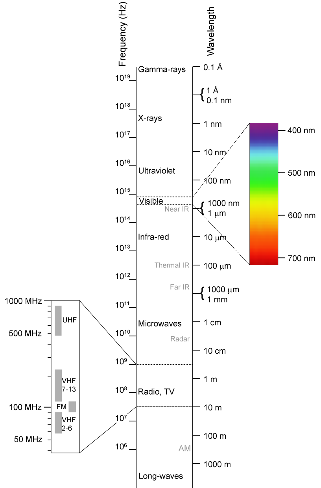

In this post we'll talk about **radiation** and **radioactivity** and I'll describe a new perspective on these topics in the context of NPQG. Let's parse through the Wikipedia definition of 'radiation' and recast it in the framework and terminology of NPQG.

> _In physics, radiation is the emission or transmission of energy in the form of waves or particles through space or through a material medium. This includes:_
> 
> _— electromagnetic radiation, such as radio waves, microwaves, infrared, visible light, ultraviolet, x-rays, and gamma radiation  
> — particle radiation, such as alpha radiation, beta radiation, and neutron radiation (particles of non-zero rest energy)  
> — acoustic radiation, such as ultrasound, sound, and seismic waves (dependent on a physical transmission medium)  
> — gravitational radiation, radiation that takes the form of gravitational waves, or ripples in the curvature of spacetime._
> 
> Wikipedia - Radiation - May 22, 2020

##### **Electromagnetic Radiation**

<figure>

<figcaption>

Wikipedia

</figcaption>

</figure>

Electromagnetic radiation is the spectrum of photons from those at the Planck energy all the way down to those at the lowest photon energy possible. In NPQG photons are assemblies of point charges. A photon is thought to be a configuration of a pro and anti Noether core, coupled and contra-rotating around their axial line of travel. Frequency is determined by the velocity magnitude of the electrinos and positrinos, which determines the local time it takes for one full cycle of the orbit or wave equation. This is a complicated dynamic because at very high energies the orbits contract and the orbits inflate/expand and peak at mid-energy and then shrink as energy dissipates towards zero. Energy changes are quantized. In addition local electric and magnetic field densities influence local permittivity and permeability.

> _`**Riemannian geometry** is designed to describe the universe of creatures who live on a curved surface or in a **curved space** and do not know about the world of higher dimensions or do not have any access to it.`_
> 
> _`**In the 1910's, A.Einstein discovered that the Riemannian geometry can be successfully used to describe General Relativity which is in fact a classical theory of gravitation.**`_
> 
> _`By its intrinsic beauty, as well as by wealth of applications, the Riemannian geometry lies at the core of modern mathematics.`_
> 
> Mikhail Shubin : Northeastern University : Department of Mathematics

We express frequency in cycles per unit local time. Wavelength is the distance the particle travels each cycle. How shall we measure distance? Should we measure the absolute Euclidean distance in the flat space foundation for our universe or is it better to use the relative Riemannian distance in the spacetime æther that permeates the universe? If we consider 'idealized' spacetime æther at constant energy with no impinging radiation, and spacetime æther is not expanding or contracting, and no gravitational gradients, then there would be a proportionality conversion between distance in absolute Euclidean space and distance in relative Riemannian spacetime æther. Note also that the photon would maintain constant energy as it passed through. However if the spacetime æther temperature has a gradient, or is expanding or contracting, then the frequency and wavelength of the photon will gradually redshift or blueshift accordingly.

We need to think through carefully to understand and express the equations describing a photon in absolute Euclidean space and not get too confused by thinking about the Riemannian coordinates of spacetime æther. After all, the potential field is truly dependent on the **actual** absolute spatial location and velocity of each electrino and positrino. I sense that while mathematics that is based upon higher level constructs may well be useful, it is ultimately doomed as we descend to the fundamental scale. The fundamental scale is truly quantum, perhaps in a new sense of the word - electrinos and positrinos are the fundamental physical quanta. They deliver a minimum physical proximity of fundamental particles, a physical symmetry of spherical potential emissions, and the characteristics of charge. They simply obey neoclassical mechanics and augmented Maxwell's equations in the fundamental Euclidean space which is the background for our Universe.

> _**Gamma rays**: high-energy electromagnetic radiation emitted by certain radionuclides when their nuclei transition from a higher to a lower energy state. These rays have high energy and a short wave length. All gamma rays emitted from a given isotope have the same energy, a characteristic that enables scientists to identify which gamma emitters are present in a sample. Gamma rays penetrate tissue farther than do beta or alpha particles, but leave a lower concentration of ions in their path to potentially cause cell damage. Gamma rays are very similar to x-rays._
> 
> _**X-ray**: electromagnetic radiation caused by deflection of electrons from their original paths, or inner orbital electrons that change their orbital levels around the atomic nucleus. X-rays, like gamma rays can travel long distances through air and most other materials. Like gamma rays, x-rays require more shielding to reduce their intensity than do beta or alpha particles. X-rays and gamma rays differ primarily in their origin: x-rays originate in the electronic shell; gamma rays originate in the nucleus._
> 
> CDC

Electromagnetic radiation is implemented by photons. High energy photons are much smaller and often penetrate through more matter before colliding. When a photon collides with fermionic matter it may excite the personality charges and influence or cause reactions. The reaction profile is an enormous n-dimensional set that defines how the particle participates in any situation. The reaction profile has regions that simply decay by emitting photons conforming to a black body spectrum defined by the shell energy and the shell temperature T. Other regions of the reaction profile include interactions with neighboring particles including spacetime æther and standard model particles and of course their energies. A radioactive particle may react with neighboring particles and change their nature — and for living tissue this can be very harmful.

Once we realize that nature is operating at this incredibly fine grain scale, it becomes obvious that no existing mathematical theory can describe nature precisely.

##### **Particle Radiation**

> _**particle radiation**, such as alpha radiation (α), beta radiation (β), and neutron radiation (particles of non-zero rest energy)._
> 
> Wikipedia - Radiation

We need to understand that the GR-QM era physics and hence Wikipedia are quite confused about particles and waves, so let's translate this. By particle radiation they mean fermionic matter particles of the standard model - which will typically be configurations of protons, neutrons, electrons, and neutrinos. These are all assemblies of point charges.

Photonic electromagnetic radiation is comprised of photons assembled from electrinos and positrinos.

> _**Neutron**: a small atomic particle possessing no electrical charge typically found within an atom’s nucleus. Neutrons are, as the name implies, neutral in their charge. That is, they have neither a positive nor a negative charge. A neutron has about the same mass as a proton._
> 
> _**Alpha particle**: the nucleus of a helium atom, made up of two neutrons and two protons with a charge of +2. Certain radioactive nuclei emit alpha particles. Alpha particles generally carry more energy than gamma or beta particles, and deposit that energy very quickly while passing through tissue. Alpha particles can be stopped by a thin layer of light material, such as a sheet of paper, and cannot penetrate the outer, dead layer of skin. Therefore, they do not damage living tissue when outside the body. When alpha-emitting atoms are inhaled or swallowed, however, they are especially damaging because they transfer relatively large amounts of ionizing energy to living cells._
> 
> _**Beta particles**: electrons ejected from the nucleus of a decaying atom. Although they can be stopped by a thin sheet of aluminum, beta particles can penetrate the dead skin layer, potentially causing burns. They can pose a serious direct or external radiation threat and can be lethal depending on the amount received. They also pose a serious internal radiation threat if beta-emitting atoms are ingested or inhaled._
> 
> CDC

##### **Acoustic Radiation**

> _**acoustic radiation,** such as ultrasound, sound, and seismic waves (dependent on a physical transmission medium)_
> 
> Wikipedia - Radiation

Acoustic radiation appears to be a vibration in matter-energy in the atomic and molecular realm. This can be translated into the canonical form of electrinos and positrinos.

##### **Gravitational Radiation**

> _**gravitational radiation**, radiation that takes the form of gravitational waves, or ripples in the curvature of spacetime._
> 
> Wikipedia - Radiation

Gravitational radiation takes two forms. First is a flux wave traveling via Noether cores of aether from the matter-energy flux of mass. In other words all assemblies are interacting with all other assemblies.

The second form of gravitational wave is a sinusoidal translational position wave of spacetime aether assemblies caused by large scale high energy events. This can also be extended into the science of spacetime æther flows, inflations, expansions, and contractions.

##### **Applying this Knowledge**

Let's call a **configuration** the specific matter-energy contents of a volume of **absolute Euclidean** space or a corresponding volume of **curvy Riemannian** spacetime æther.

What are the ways to transform a configuration with radiation **reaction profile A** to another configuration that has radiation **reaction profile B**? Certainly there are interesting applications to consider here in fields of health, mining, nuclear waste mediation, and many other industries.

The truly ultimate goal is printing matter-energy on demand directly from raw ingredients of the universe — specifically energetic electrinos and positrinos. Undoubtedly this would likely go through many stages of technology advancement but the ultimate raw ingredient is clear : spacetime æther, possibly including neutrino and photon flux. Spacetime æther, neutrinos, and photons are raw materials that are present in abundance in nearly all locales in the universe. These raw materials are environmentally safe to consume.

The apparent energy content of a spacetime particle is low, but we can make it up in volume. Even better, we may be able to discover ways to extract the Higgs energy from spacetime aether assemblies. The cumulative energy capture is the sum of assembly energy in minus assembly energy out. We can use that captured energy to power the printing process. We can also place that captured energy in the printed product. Lastly, we can use that energy to render any waste product back into spacetime æther or advanced recycled raw materials. For example we could have a machine that powers itself and prints batteries with no observable raw materials, no resource use other than a volume of spacetime æther and the natural matter-energy within and flowing nearby. To be clear, it may take quite an R&D effort to reach this level of technology.

Isn't the equation of the universe a very simple one? At any moment in time each electrino and each positrino have certain conserved metrics and are acted on by the arriving potential fields from all other electrinos and positrinos in the universe as well as their own momentum. Thus the universe obeys neoclassical electrodynamics including Maxwell's equations. All other behaviour we have observed and modeled scientifically is emergent.

**_J Mark Morris : San Diego : California_**

p.s., The [CDC Radiation Dictionary](https://www.cdc.gov/nceh/radiation/emergencies/glossary.htm) defines a number of terms precisely from with a medical point of view.
