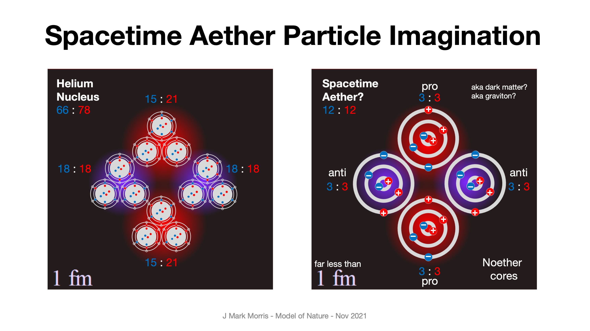

_Notation in this post is electrinos:positrinos. An anti-Noether core is shown as !(3:3)._

Spacetime assemblies permeate our universe, yet they are very lightly interactive. Nature sees fit to give them a form of "cloaking" by consequence of volume, superposition, high frequency, and velocity attenuated emission. Spacetime assemblies are so tiny they permeate most of the internal volume of every electron and quark. Even though these spacetime assemblies are tiny, they also displace volume. These behaviors are a consequence of a scalable point potential architecture.

At the point potential assembly level of nature, spacetime assemblies are often a reactant. When you consider the full state space of reactions between particle assemblies, many reactions can consume or produce spacetime assemblies. 

Spacetime is formulated as four Noether cores coupling their orbital poles together .

- (3:3)!(3:3)(3:3)!(3:3)

- 12 binaries x 2 poles per binary = 24 possible poles to couple

- 4 binaries at each of 3 energy scales.

_**The coupling of the pro and anti Noether cores in spacetime causes them to quickly synchronize their frequencies at each energy level.**_  This makes sense for many reasons, but it is a requirement for gravity/GR to be so remarkably precise!  

I also think that the three binaries in a Noether core maximize superposition by synchronizing their frequencies at different scales. The relationship of these three frequencies is yet to be discovered, but my guess is that it has a lot to do with superposition. If it didn't the Noether core would be more reactive. The cause and effect will be interesting to learn.

Let's imagine an electron neutrino decay with a spacetime assembly cluster as a reactant.

**electron-neutrino(3:3)(3:3) + spacetime (3:3)!(3:3)(3:3)!(3:3)**

reacts and produces

**photon(3:3)!(3:3) + photon(3:3)!(3:3) + ?**

At least at low spacetime and reactant energies (below collider energy where we make generation II and III fermions) the Noether cores tend to be rather resilient. Reactions depend on the energy level for each reactant, including spacetime assembly reactants. When balancing reactions, I check to see if the number of pro and anti Noether cores also balance. In the electron neutrino decay, we have more than enough point potentials. The pro and anti Noether cores work out as well.

This is a reaction where some products are assembly fragments. The fragments may sometimes lead to pair production if they react with a spacetime cluster. My guess is that charged fragments quickly find each other via their potential action.

One of the fun parts about the point potential model is extending the understanding of nature. The goal is well described by physicists in outreach media and papers. We know the major open questions in GR, QM, and LCDM. We are not fumbling in the dark trying to imagine how nature is implemented. We have a great model and an ideal situation for our imaginations.

- We know what problems we have to solve,

- We know we must match observations,

- We know the math must match at a higher level in the ontology,

- We are free to reframe interpretations and narratives,

- We have a wide-open territory for ideation and creativity.

Nature is fun!

**_J Mark Morris : Lynn : Massachusetts_**

_This post is based on a discussion with a person who **thinks** on physics and its history._

p.s.,

**_Opportunity awaits!_**

