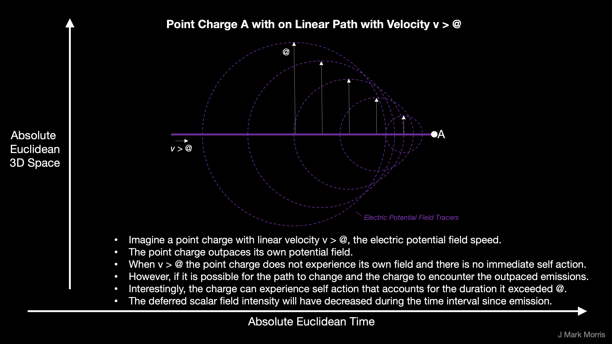

Matt O'Dowd and the PBS Space Time crew issued an episode with a bizarre premise, yet covering many concepts that have been mixed up in cosmology, so I thought I would comment on a few extracts from the transcript. I wish there were an alternative version of this episode where the premise is "**Is Science Imagining the Big Bang Incorrectly?**" with the content rearranged to postulate that all these high energy events we see through out the universe and in the CMB are in fact the "distributed bang" and that every high energy event is in a sense a collection of world lines of standard matter structures concentrating, reacting, and re-emerging in a re-energized and likely transmuted form. In other words black holes are describing the reactant ingest, which reacts and forms white holes which describes the high energy product output.

https://youtu.be/jeRgFqbBM5E

The premise seems bizarre because the one constant in the point charge universe, the propagation speed @ of the electric potential, precludes the idea of universes within universes as I see it. I think we can pretty much solve our known cosmological problems with the Klein bottle type shape traced in a way by the world line of all point charge reactants and their same world line continuing on as products.

Realize that every high energy event has consumed standard model structures, concentrated the energy, and disgorged high energy standard model structures. One breakthrough in cosmology is to realize that the sum over all such events that we observe with the oldest photons from the farthest distances in the universe has been incorrectly named the "Big Bang." There is every reason to believe high energy events are isotropic in both space and time. Therefore combined with the idea that the universe is expanding in place, not outward suggests that we need to revise our understanding of redshift as a function of photon energy and spacetime aether energy.

_Note to self : always use the term "structure". Eliminate the term "particle", except as historical reference_.

The situation in terms of the paths of point charges is not unlike the following visualization. Point charge structures can take a path inwards where density of charges and energy is very high and structures decay. Those same point charges can take a path out of the maelstrom where they may find themselves involved in a series of structure forming reactions.

https://youtu.be/LLw3BaliDUQ

Note the similarity of this twistor visualization to that of a spinor.

https://youtu.be/JaIR-cWk\_-o

The bottom line is that we can fix Einstein's conception that breaks down at a singularity. The point charges that exit a black hole most definitely entered at a prior time and while their paths may become very dense, the point charges and their paths remain distinct entities.

> _We can think of the event horizon as the surface where the flow of space itself is like a river moving at the speed of light._
> 
> Matt O'Dowd

This is fascinating. There is an interesting duality with the event horizon and the symmetry breaking point in quantum mechanics, which NPQG informs as the point charge is moving in a straight line with speed v = @ the same as its electric potential emitted by the point charge. Upon reaching the speed v = @ any continuance at that speed and the charge experiences work from it's path history moving at speed v = @. Needless to say this is an unsustainable situation because the resulting work performed would accelerate the charge and change it's speed, breaking the symmetry.

Let's think about a point charge moving on a straight line. What this says, is that point charge path segments above and below v = @ are actually quite different. For v < @ it is as if the point charge is on the inside of the spherical fields being generated and there is no immediate self-action.

When v > @ it is as if the point charge is on the outside of the spherical fields being generated and there is again no immediate self action. However, when v > @ the point charge is experiencing its own fields which were emitted when v < @. Likewise when v drops below v = @ the point charge can experience its own fields emitted when v > @.

In this sense v = @ is the event horizon for the point charge moving on a straight line.

> _In general relativity, objects that are not being acted on by a force follow something called a geodesic. These are the straightest paths that can be taken through a curved spacetime. In a sense geodesics form the grid that defines the fabric of spacetime. You can tracing the geodesic into the infinite future or all the way back to the Big Bang - it’s defined for all past and future times independently. Geodesics generally don’t just end. Except at singularities. In fact, in GR singularities are defined as the end points of geodesics. All geodesics in the universe come together and terminate at the big bang._
> 
> Matt O'Dowd on Geodesics

This is a good discussion of geodesics, but we need to repair the concept. Goedesics of point charges have no known beginning nor is an end forecasts. Point charges are conserved and indestructible. There is no such think as a singularity. Electric potential is always on a 1/r curve, no matter how close to point charges approach, and the slightest deviation at close approaches will result in action that will quickly cause them to deviate. In any case, even if they could arrive at the same point in absolute time and space, the potential is defined as plus or minus 1 at r = 0, so that seems to be a rather benign situation.

> _A time-reversed black hole is a white hole, and it’s a valid a solution to the Einstein equations. The past, space-like singularity of the white hole is surrounded by an event horizon that is the opposite to a black hole event horizon - it can only be crossed from the inside to the outside. Space flows at the speed of light across the event horizon from within. That’s starting to look like our universe - a past, space-like singularity and an event horizon that can’t be crossed from the outside. But there’s still an “outside” in which the white hole appears as a bright, localized point in space. The outside region doesn’t share the same singularity origin as the white hole. There’s also the idea that universes are born as white holes produced after the collapse of a black hole. That’s the Cosmological Natural Selection idea by Lee Smolin. In that case, black holes don’t form singularities, but rather bound back out again to create a new spacetimes from the resulting white hole - which itself creates new black holes, etc. In 1999, Stephen Hawking once showed that if a black hole is leaking its mass via Hawking radiation in perfect equilibrium with the radiation that it absorbs - for example, from the cosmic microwave background - then the line between the white hole and black hole becomes unclear. They could be the same object._
> 
> Matt O'Dowd on White Holes

It is plain as day to me that the scientists are massively confused. I think the one concept that would help straighten them out is if they understand expansion to be in place rather than outward. The notion of a single big bang event is simply flat out wrong. There is no doubt that we are in a recycling universe with distributed high energy events that release tremendous numbers of high energy point charges which form Noether core based structures which inflate and expand. This is then balanced by reactions and events that cause matter energy to gravitate back towards high energy events. A "white hole" is a silly term for a high energy event. That said, we do need a taxonomy and tabulation of all such high energy event types so we can understand all the sources and sinks of point charge structures and their contributions to the big recycling picture.

**_J Mark Morris : Boston : Massachusetts_**
