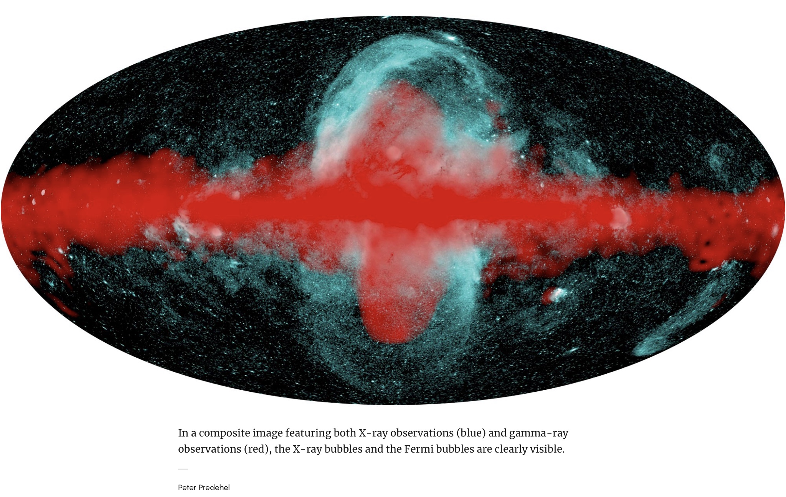
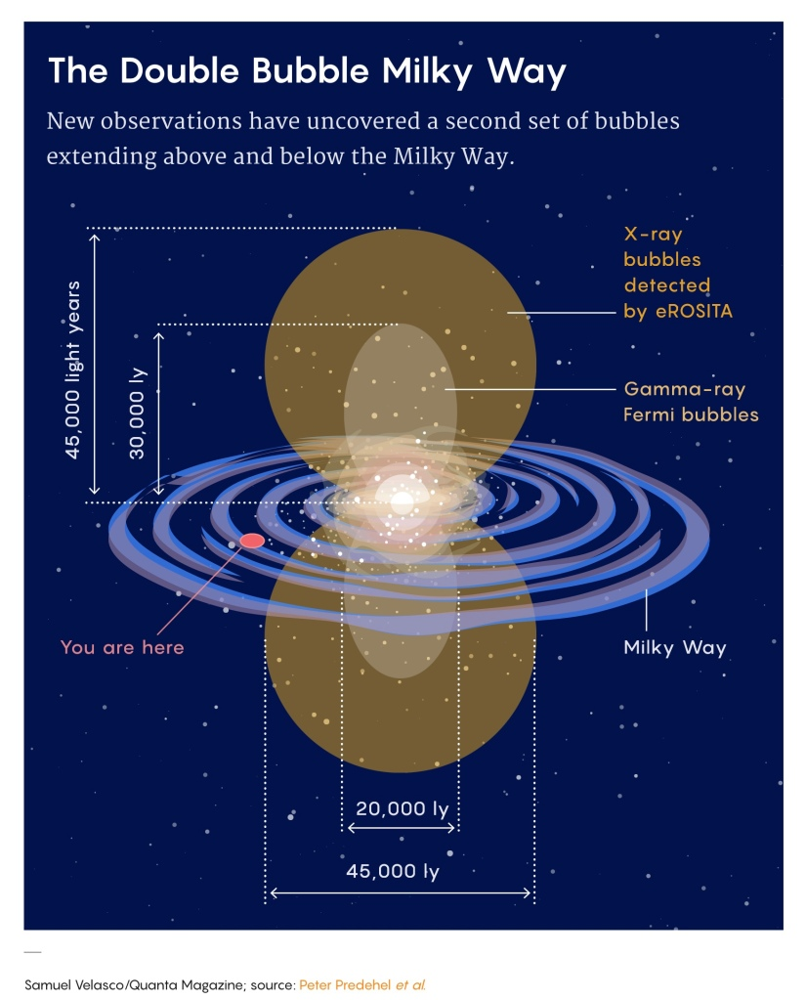

> To resolve the crisis in physics and cosmology, rethink supermassive black hole dynamics.
> 
> J Mark Morris July 2019.

Here is the Big Bang-inflation timeline visulization as imagined by cosmologists. A lot of the important reactions happen in the super high energy **jet** that comes out of the Big Bang and inflates superluminally. I am taking the liberty of calling it a jet since it appears to emit directionally from a point on the surface of the bang.

Sir Roger Penrose advocates a new idea, conformal cyclic cosmology (CCC), with a series of bang events.

In other news, this Quanta article [Galaxy-Size Bubbles Discovered Towering Over the Milky Way](https://www.quantamagazine.org/space-telescope-shows-galaxy-size-bubbles-over-the-milky-way-20210106/) describes new discoveries of even larger bubbles towering over and under the Milky Way than the already enormous Fermi bubbles. This is entirely to be expected in NPQG due to the galaxy local inflationary mini-bangs from the SMBH poles as jets of Planck scale point charge plasma.

> The meaning of eROSITA’s mushroom clouds is clear: Something went bang in the center of the Milky Way around 15 million to 20 million years ago
> 
> Quanta Article

> The map traces X-ray bubbles that stand an estimated 45,000 light-years tall, engulfing the gamma-ray Fermi bubbles. Their X-rays shine from gas that measures 3 million to 4 million degrees Kelvin as it expands outward at 300 to 400 kilometers per second. And not only does the northern bubble align perfectly with the spur, its mirror image is obvious as well
> 
> Quanta

> _\[One possible explanation\] is the supermassive black hole that sits at the galaxy’s heart. The 4-million-solar-mass leviathan is relatively quiet today. But if a large cloud of gas once strayed too close, the black hole could have switched on like a spotlight. While feasting on the hapless passerby, the black hole would have gobbled down half the cloud while energy from the other half sprayed out above and below the disk, inflating the X-ray bubbles and perhaps the Fermi bubbles too (although the two pairs could also represent separate episodes of activity)._
> 
> _Astronomers have long observed other galaxies that shoot out jets above and below their disks, and they’ve wondered what makes the central supermassive black holes in those galaxies churn so much more violently than ours does. The Fermi bubbles, and now the eROSITA bubbles, suggest that the main difference may simply be the passage of time._
> 
> Quanta

It’s slightly amusing how it never occurs to astronomers and cosmologists to consider inflationary SMBH mini-bangs even when the evidence is directly front and center. Here is Anton Petrov’s take on these enormous galaxy sized bubbles.

https://youtu.be/3pl3crD7G8c

We need physicists and cosmologists to rethink supermassive black hole (SMBH) dynamics. Black hole science had a remarkably short era from acceptance of the concept of black holes to acceptance of the idea that nothing gets out except Hawking radiation. The science findings closed the door to new insights about black hole dynamics with respect to the inside of a black hole having any relationship to the events outside a black hole.

Did black hole scientists consider high energy turmoil on the INSIDE of the black hole that could upset their simplistic ideal math about the event horizon manifold? Can it develop holes? Chaos? Of course, it can. It probably depends on spin, and charge, and Planck core volume and perhaps other factors.

I think there may well be a fundamental misunderstanding of the singularity and the jets. **My hypothesis is that under sufficient conditions a galaxy center supermassive black hole can form a core of Planck particles. This would represent the singularity and it would not observe general relativity, meaning it would present no mass. Then under a different set of sufficient conditions the Planck core can emit Planck plasma via jet or rupture.** I have depicted the idea in the following art work using real observed images of radio galaxies.

If this hypothesis is correct, the logical conclusion is that there was no Big Bang, and instead, there is an ongoing and intermittent galaxy local bang and galaxy local inflation/expansion throughout the universe. We can illustrate this by showing the Big Bang timeline superimposed on the jets of a supermassive black hole (SMBH).

When coupled with the hypothesis that Einstein's geometrically curvable spacetime is implemented by a æther of very low energy particles the two hypotheses are a basis for a revolution in physics and cosmology.

**_J Mark Morris : San Diego : California_**

p.s.

I’ve seen several YouTube videos lately from Anton Petrov talking about the variety of galaxy shapes, characteristics, and behaviors and how scientists haven’t really figured out all the patterns and how and when they occur in a galaxy lifecycle. I have complete confidence that once scientists rebase onto the NPQG cosmology with galaxy-local inflationary mini-bangs they will be able to advance galaxy science rapidly. That will be really exciting. I so look forward to the discoveries of the scientists of the NPQG era.

I contributed this comment on one of Anton’s episodes : Anton, could the warp in the shape of the Milky Way have been caused by the inflationary mini-bang polar jets from the SMBH being on an angle from the polar axis but fairly stable, i.e., not precessing? I wonder how all the types of inflationary mini-bang jet orientations, spin, asymmetric jet quenching (would that be like a Planck energy plasma powered rocket engine on an SMBH and for how long?) and all the other possibilities in the galaxy local SMBH driven inflationary minibang taxonomy. I wonder if this will be a new subfield in the next era.
