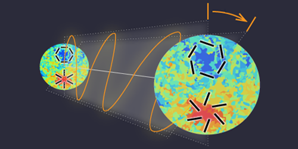

I imagine an electron neutrino as a Noether core along with a 3:3 personality layer, so that an electron neutrino would be 6:6 = 3:3\[3:3\].

I have written before about the hypothesis that spacetime aether (aka Noether core detritus, superfluid, dark matter particles, Higgs Field generators) can provide input reactants in the form of relatively low apparent energy point charge structures as well as consume products of a reaction that are also in the relatively low apparent energy range that cannot yet be directly detected.

Think of the aether as a facilitator of transmutation that provides structure templates that can be reorganized, divided, and energized. How did anyone ever believe that a Neutron just magically decays into a Proton and two other standard matter particles are observed shooting out? Again it is the priors.

When you come to believe that all of nature is a superposition of abstract mathematical fields then it seems reasonable for fields to morph into other fields. To be sure there is a lot of math behind that morphing, but I believe it will map to NPQG and lead to improved mathematical modeling.

One appealing idea is that a photon and a neutrino are related, but at different energy levels and phases. Let's imagine that a photon has these characteristics :

- is a 6:6 point charge structure,

- consisting of a Noether core and an anti-Noether core,

- at coupled energy levels,
    - similar — does this imply the cores are offset planar?
    
    - different — one core doubles as personality layer?

- and the cores counter-rotate to make the E & B fields,

- with all orbitals in planes perpendicular to the velocity,

- and it redshifts continuously as it travels through aether,

- aether which is expanding local to each galaxy,

- and the photon is still moving at local speed of light,

- and the photon eventually redshifts away enough energy,

- such that the flat-ish boson shape starts puffing out,

- meaning the orbital planes un-align like a fermion shape,

- revealing more shielded energy as mass,

- and at some point puffs up enough to no longer be a boson and to drop out of local c velocity as a neutrino.

If that is roughly what is happening, THEN a bosonic photon could very well redshift into becoming a fermionic 6:6 neutrino. That is a fascinating idea because it ties the redshift based life cycle of the photon as it becomes a neutrino which redshifts further and eventually becomes spacetime superfluid aether. It is a crucial test of NPQG to see if it can tie many processes together at many levels.

Another possibility is that the reaction processes which interact with spacetime aether to generate photons and neutrinos has a very wide energy range. We already know that photons can have a wide range of frequencies that cover many scales. What if at the lower end of reaction energy, there is simply not enough to make a full fledged photon, and the reaction product that results is a neutrino?

It also occurs to me that if "sterile neutrinos" exist, perhaps they might map to the energy core without a personality layer. In that case it may also have three generations. As we understanding more about point charge assemblies it will be possible to relatively easily simulate reactions and understand various regimes of what I believe physicists call the configuration space. A chemist might call it the phase diagram of nature and the universe.

Incorporating these new photon and neutrino structure ideas into the NPQG point charge architecture appears to add more symmetry, flexibility, and consistency. It may also extend the mapping of NPQG to existing physics theory.

* * *

Let's set aside for a moment the very high energy environments such as neutron star cores, black holes, magnetars, quasars, supernovas, and the like. There appear to be at least two different large scale processes that introduce relatively small scale energy changes in the aether. These all superimpose of course. Think of the aether as providing a floating alternating potential ground. Around dense matter the local aether energy skyrockets. In deep intergalactic space the aether settles in with a temperature around 2.8 Kelvin in apparent kinetic energy.

1. Proximity to orbiting point charges in standard matter structures which manifests as a lossless A/C gravity wave that imparts RMS energy. N.B. this is somewhat self referential as I presume the aether particles will be classified as standard matter at some point, perhaps mapping directly to the Higgs. Certainly aether particles influence each other as that is how gravity waves traverse the universe.

3. Redshift of standard matter structure energizes the aether, no matter what type of assembly is passing through. Everything redshifts.

The idea that redshifting photons and neutrinos energize the aether is a fascinating one. The redshift energy transfer mechanism is in opposition to the galaxy local expansion of the aether towards less energetic galaxy hinterlands. How cool is that? Two completely different aether energizing processes and yet they interact with each other.

There are a couple of open problems in physics that have a shift in slope that is not understood. The Hubble number H0 discrepancy is one. The other is the MOND theory that has a formula transition differentiating intragalactic and intergalactic space. See my recent [post about Dr. Justin Khoury's recent paper](https://johnmarkmorris.com/2021/09/25/dr-justin-khoury-on-dark-matter-superfluidity/) that I think is a HUGE step forward for the professional physicists. Perhaps these ideas map to one or the other of those areas of interest.

Still, we need to explore and understand how a photon can redshift in h-bar angular momentum quanta while traveling through gradually expanding galaxy local aether. Could it be implemented by a gradual shift in phase? Sort of like a continuous second hand and an h-bar minute hand?

<figure>

<figcaption>

Y. Minami/KEK

</figcaption>

</figure>

I see that there are various concepts such as cosmic polarization rotation, cosmic birefrigence, and Faraday rotation. We must remember that after escaping the gravity well of their origin, photons are traveling through spacetime aether particles that are each individually expanding towards intergalactic regions. Does that gradient have a slow but cumulative effect on each photon?

_The concepts of apparent energy, shielded energy, and mass are critically important to advancing the science of nature. This is all easily understandable visually and eminently sensible in the point charge architecture and may even lead to revisions in terminology and basic instruction in science. Physics will be so much more accessible in the new era._

* * *

Random fleeting thought : I think it is important to say that a tick is a tick in a sense, sort of like c is c. By 'tick' I mean one full cycle of the orbital of an electrino:positrino binary. These are all local concepts. Everything needs to be translated into absolute Euclidean coordinates in space and time.

**_J Mark Morris : Boston : Massachusetts_**
