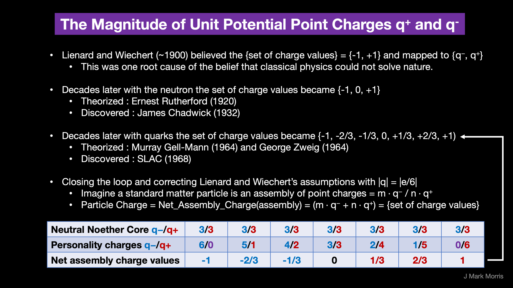

In my writings from 2018 through 2023, I have discussed many mappings between the ground breaking point potential theory to and from general relativity, quantum theories, major problems in physics, seminal false technical priors, false narratives of physics, and false narratives of cosmology.

The first figure depicts how technical false priors of assumptions circa 1900 led to the perceived failure of classical physics to explain nature. Once the false priors are corrected, we enter the neoclassical era with an understanding of the implementation of nature that maps to and from the prior era.

The second and third figures illustrate the specific false prior errors with respect to potential magnitude and speed.

Let's examine the specific callouts of failures of classical physics and discuss how neoclassical physics addresses each issue. Let's go through a [list from Bradley W. Carroll](https://physics.weber.edu/carroll/honors/failures.htm) at Weber State University.

**Blackbody Radiation**

> _"The explanation of classical physics: Light is an electromagnetic wave that is produced when an electric charge vibrates. The term "vibrates" means any change in how the charge moves — speeding up, slowing down, or changing direction. Heat is the kinetic energy of random motion. In a hot object, electrons vibrate in random directions and produce light as a result. A hotter object means more energetic vibrations and so more light is emitted. Classical physics could not explain the shape of the blackbody spectrum._
> 
> _The electrons in a hot object can vibrate with a range of frequencies, from low to high. There is no limit to how great the frequency can be. Classical physics says each frequency of vibration should have the same energy. Since there is no limit to how great the frequency can be, there is no limit to the energy of the vibrating electrons at high frequencies. This means that, according to classical physics, there should be no limit to the energy of the light produced by the electrons vibrating at high frequencies. WRONG!! Experimentally, the blackbody spectrum always becomes small at the left-hand side (short wavelength, high frequency)._
> 
> _Circa 1900, Max Planck proposed that the classical idea that each frequency of vibration should have the same energy must be wrong. Instead, he said that energy is not shared equally by electrons that vibrate with different frequencies. Planck said that energy comes in clumps. He called a clump of energy a quantum. The size of a clump of energy — a quantum — depends on the frequency of vibration. Here is Planck's rule for the a quantum of energy for a vibrating electron: energy of a quantum = (a calibration constant) x (frequency of vibration) or E = hf, where h, the calibration constant, is called Planck's constant. Its value is about 6 x 10-34, very tiny!_
> 
> _How does this explain the spectrum of blackbody radiation? Planck said that an electron vibrating with a frequency f could only have an energy of 1 hf, 2 hf, 3 hf, 4 hf, … ; that is, energy of vibrating electron = (any integer) x hf. But the electron has to have at least one quantum of energy if it is going to vibrate and produce light._
> 
> _"A ha!" said Planck: at high frequencies the amount of energy in a quantum, hf, is so large that the high-frequency vibrations can never get going! This is why the blackbody spectrum always becomes small at the left-hand (high frequency) side."_
> 
> **Classical Physics **Failure** (Carroll)**

**Neoclassical Solution**

Lienard and Wiechert made three technical errors in their assumptions, and these false priors caused physicists to conclude that nature could not be solved with classical physics. However, with those false prior errors fixed, the solution and architecture of nature becomes quite evident.

Point potentials come with a potential magnitude |e/6|. It immediately becomes apparent that standard model particles must be assemblies of point potentials. It's easy to figure out the count of each point potential per standard model particle. From there, it's not difficult to understanding the architecture of all standard matter particle assemblies. Once one realizes that the photon is an assembly of point potentials it becomes quite clear that we should not place the speed of a photon c as a limit on the speed of point potentials.

The first order assembly is a positive and negative point potential in an orbital relationship, a binary. You can imagine it as a circular or elliptical orbit moving through spacetime at some orientation to its group velocity. Around the orbital axis of each binary there is tremendous vortex of potential change. It seems that binaries like to couple or capture each other by piercing the other binaries orbits with the axial vortex. Since physics experiment is mostly conducted in low energy spacetime, only the triple binary assembly is stable. We can call this tri-binary assembly a Noether core. Noether cores are conservators and transactors of energy and momentum.

Each binary in a Noether core has a different energy which determines the binaries' orbital frequency and radius. The axes of rotation of the three binaries interplay in a momentum preserving dance that we perceive as spin 1/2.

In fermion assemblies each of the six axial poles is home to a point potential. If they are all the same, the fermion is an electron or anti-electron. If they are half and half it is a neutrino or anti-neutrino. If the point potential polarities are imbalanced, it is a quark or anti-quark. Anti-ness is determined by the configuration of the Noether core.

A photon is a contra-rotating coaxial assembly of a pro and anti Noether core in the planar boson configuration.

It turns out that spacetime is an aether of extremely low apparent energy Noether cores. Still they are Noether cores and can easily be reconfigured into photons or neutrino's to carry away energy from a reaction. The polar personality potentials in fermions appear to transducers of energy between the fermion and the aether. Physics identifies the W and Z bosons as intermediaries, and their point potentials must therefore come from the spacetime aether.

_Regarding Planck's high frequency "Aha" the description is entirely wrong. It is simple physics of self-action that determined binary behaviour in this regime._

* * *

**The Photoelectric Effect**

> _"When light shines on the surface of a metallic substance, electrons in the metal absorb the energy of the light and they can escape from the metal's surface. This is called the photoelectric effect, and it is used to produce the electric current._
> 
> _Using the idea that light is a wave with the energy distributed evenly throughout the wave, classical physicists expected that when using very dim light, it would take some time for enough light energy to build up to eject an electron from a metallic surface. WRONG!! Experiments show that if light of a certain frequency can eject electrons from a metal, it makes no difference how dim the light is. There is never a time delay._
> 
> _In 1905, Albert Einstein came up with the solution. If Max Planck's idea that energy comes in clumps (quanta) is correct, then light must consist of a stream of clumps of energy. Each clump of light energy is called a photon, said Einstein, and each photon has an energy equal to hf (Planck's constant times the frequency of the light). Therefore the energy of light is not evenly distributed along the wave, but is concentrated in the photons. A dimmer light means fewer photons, but simply turning down the light (without changing its frequency) does not alter the energy of an individual photon. So for a specific frequency light, if a single photon has enough energy to eject an electron from a metallic surface, then electrons will always be ejected immediately after the light is turned on and the photons hit the metal."_
> 
> **Classical Physics **Failure** (Carroll)**

**Neoclassical Solution**

A photon is an assembly of point potentials. Specifically it is a co-planar Noether core coupled with a co-planar anti-Noether core. Presumably these two planes are offset by an absolute distance. Alternately the point potentials may slightly interleave above and below a single plane. These are specifics yet to be modeled and discovered. A more technical term for a photon is a coaxial contra-rotating pair of tri-binaries. The photon has six binaries which are accountants and transactors of energy in units of h-bar j-s.

An electron is a tri-binary Noether core with six negatively personality point potentials, one per binary polar vortex.

When a photon reacts with an electron there can be a transfer of energy in multiples of h-bar. How exactly does the this interaction take place is not yet known. The role of nearby spacetime aether in the form of low apparent energy Noether cores is also unclear. Simulation, in due time, will reveal the interaction details, including the provenance of each and every point potential.

* * *

**The** **Hydrogen Atom**

> _"When a small tube of hydrogen gas is heated, it begins to glow and emit light. Unlike the blackbody radiation that comes from a hot dense solid or gas, this light consists of just a few colors (wavelengths): a red wavelength, a turquoise, and several violets. Classical physicists at the beginning of the century thought they should certainly be able to understand hydrogen, since it is the simplest atom. Hydrogen consists of a positively charged proton at the center, with a negatively charged electron orbiting around it. The electrical attraction between the positive proton and the negative electron keeps the electron in orbit, just like the gravitational attraction between the Sun and the Earth holds the Earth in orbit. There was just one problem. Classical physics said that because the orbiting electron is constantly changing direction, it should emit electromagnetic radiation --- light. As a result, the electron should be continually losing energy. In fact, physicists calculated that the electron should lose all of its energy and spiral down into the proton in only about 0.000000000001 second! In other words, atoms should not exist longer than a mere 10\-12 seconds. WRONG!!_
> 
> _Niels Bohr provided an explanation in 1913. In the Bohr model of the hydrogen atom, the electron can't orbit the proton in any size orbit it pleases. There are only certain allowed orbits, and each allowed orbit has a certain radius and a certain energy. Bohr invented a rule that allowed him to calculate the size and energy of each orbit. If you are curious, Bohr's rule said that 2π x (electron mass) x (electron orbital speed) x (orbit radius) = (any integer) x h which is not too obvious, to say the least! (The integer would be 1 for the smallest orbit, 2 for the next orbit out, and so on.) Bohr also made up a new rule to explain the stability of the hydrogen atom --- why it could last longer than 0.000000000001 second. He said that when an electron is in an allowed orbit, the electron will not produce electromagnetic radiation. Bohr did not explain why, he just proposed a new law of nature. And nature agreed with Niels Bohr. His new model of hydrogen gave wavelengths for hydrogen gas that precisely agreed with what was measured._
> 
> _Question: If the electrons do not produce light when they are in their allowed stable orbits, where is the source of the light that comes from hydrogen? Answer: According to Bohr, electrons have more energy when they are in larger orbits. If an electron falls from a larger orbit down to a smaller orbit, it loses energy. According to the law of conservation of energy, the energy lost by the electron must go somewhere. Bohr explained that a photon carries away the lost energy from the hydrogen atom; that is, photon energy = (electron energy in larger orbit) - (electron energy in smaller orbit)_
> 
> _It works the other way, too. If a photon strikes an atom, the atom can absorb the photon and its energy if (and only if) the photon's energy is exactly equal to the difference between two orbital energies. In this case, an electron uses the photon's energy to jump from the smaller orbit up to the larger orbit. This is called a quantum jump."_
> 
> **Classical Physics **Failure** (Carroll)**

**Neoclassical Discussion**

The Bohr solution appears on the surface to be compatible with the neoclassical solution. There is the question of why the electron does not dissipate energy as photons in reaction with nearby spacetime aether. This is an open question since we know that that charged particles changing directions due to other charged particles emit Bremsstrahlung radiation.

* * *

**Waves or Particles? Both!**

> _When light passes through a double-slit, an interference pattern consisting of bright bands and dark bands is seen on a screen. This is produced when the wave from one slit combines with the wave from the other slit. If two wave crests meet at the screen, the waves add and you get a bright band. If a wave crest from one slit meets a wave trough from the other slit, the waves cancel and you get a dark band. This proves that light is a wave._
> 
> _On the other hand, the photoelectric effect proves that light consists of massless particles called photons. So which is it? Is light a wave or a stream of particles? The answer is "Yes!"_
> 
> _Light acts like a wave if you want to know how it propagates, how it travels from one place to another. To describe how light travels from the double slits to the screen, you have to use the wave characteristics of light._
> 
> _Light acts like particles (photons) if you want to know how light interacts with matter. To describer how light interacts with the electrons in a metal and how it ejects them from the metal's surface, you have to use the particle characteristics of light._
> 
> _We say that light exhibits a wave-particle duality. It can behave like either waves or particles (but not both at the same time), depending on the situation._
> 
> _Thinking about the photoelectric effect again, how can a photon (which has no mass) knock an electron about? Einstein used his theory of relativity to show that even massless photons have momentum. Newton defined momentum = (mass) x (velocity) for a particle with mass, but Einstein was able to show that the momentum of a massless photon depends on its wavelength: The smaller the wavelength, the greater the momentum of the photon._
> 
> _In 1923, Prince Louis de Broglie of France had an idea. Maybe the wave-particle duality applies to everything in nature. He proposed that everything propagates like a wave, and that everything interacts like a particle. Say what?? What do you mean by the wavelength of an electron, or the wavelength of a baseball? De Broglie rewrote Einstein's formula for the momentum of a photon and applied it to a particle with mass: Planck's constant, h, is so tiny that we don't notice the wavelength of a thrown baseball, which is only about 10-35 meters! But an electron's mass is also tiny, so it has a wavelength about 10,000 times shorter than the wavelength of visible light. This is useful, because microscopes that use electron waves instead of light waves can see several thousand times more detail!_
> 
> _The proof that electrons propagate like a wave came when electrons were passed through a double slit and counted as they hit a screen. If the electrons traveled like a stream of particles, they would have simply piled up at two locations behind the two slits. But they didn't. They showed a double-slit interference pattern, bright bands and dark bands just like the ones produced by light waves. Without a doubt, electrons exhibit the wave-particle duality of nature. In fact, every massive object exhibits the wave-particle duality of nature. It just isn't noticeable on the large scale of our everyday world._
> 
> **Classical Physics Failure (Carroll)**

**Neoclassical Solution**

This issue is caused by the ontological confusion resulting from the false priors of Lienard and Wiechert. In the Neoclassical solution, particles are known to be assemblies of moving point potentials. Assemblies of moving point potentials produce unique wave patterns of potential in absolute time and space as well as influence the spacetime aether assemblies.

* * *

**Carroll's Summary**

> _If you look at most of the "equations" above, you will find Planck's constant, h. This is the trademark of "modern physics." The failure of classical physics to explain blackbody radiation, the photoelectric effect, and the hydrogen atom ultimately demolished the foundations of classical physics._
> 
> _Max Planck, Albert Einstein, Niels Bohr, and Louis de Broglie made inspired guesses about how nature works. Other people of their time made different guesses. Nature agreed with Planck, Einstein, Bohr, and de Broglie, but not with the others whose names are now forgotten. Like Arcadia's Thomasina, these were intuitive geniuses who went beyond mere mathematics to make creative conjectures about how the world operates. It is those rare intuitive geniuses who courageously discard the old rules and invent new ones who are in the first rank of physicists._

In summary, I've reviewed the issues that were thought to prevent classical physics from producing a solution to nature. However, as shown, the incorrect assumptions of Lienard and Wiechert caused the true solution to nature to be missed — a solution where potential comes in magnitude |e/6|, standard model particles are assemblies of moving point potentials with sub-structure and complex emergent behaviour, and point potentials are not limited to speed of the photon assembly in an ontological inversion.

**_J Mark Morris : Boston : Massachusetts_**
