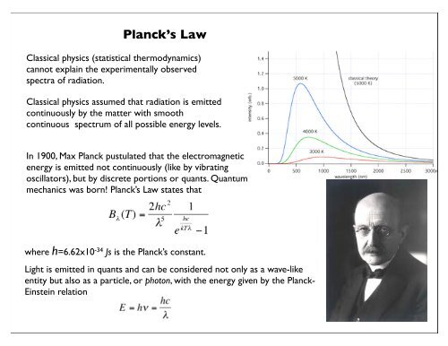

It's ironic in a way that I have come to really be quite bothered by physicists reliance on a plethora of fields, as if nature would work that way. It is is simply too complicated with too many coincidences to be considered anything more than characteristics generated by some more fundamental constituents. Yet physicists call the standard matter particles **fundamental** while at the same time they grant themselves superposition, for example, as a common lingua franca. Are physicists really serious when they say that a certain field only existed for a particular process and timeline of universe evolution? As if nature is just some recording artist mixing fields to create the universe?

<figure>

<figcaption>

https://pxhere.com/en/photo/694628

</figcaption>

</figure>

You know what, maybe physicists are directionally correct in the general sense of certain energetic structures and their environs generate unique behaviour that could be described as a field. However, I still assert that with that degree of complexity, physicists should have known that there was a simplifying layer. Add to that, physicists espouse a bunch of seemingly fundamental standard matter particles, but somehow they can transmute from one to one another with no next level lingua franca of nature that enables this bazaar. Physicists have even invented the magic woo concept of pair production to facilitate these transmutations.

<figure>

<figcaption>

https://pxhere.com/en/photo/1330517

</figcaption>

</figure>

We only need glance at the photo of the fruit bazaar, yet we all know that everything we see via photons is made of protons, neutrons, and electrons. We know that neutrinos are streaming through. Yet isn't the standard model itself another fruit bizarre?!

Let's cut to the chase. It is all so much simpler in the new era of Neoclassical Physics and Quantum Gravity (NPQG) where we have reduced nature to a handful of components combined with emergence. As a background we have a Euclidean void in absolute space and absolute time. _That's a gift for the pure and abstract geometry lovers._ In all my work so far, I had it in mind that we should ascribe no active responsibility nor interaction between the point charges and the **void**.

> **Void means void.**
> 
> J Mark Morris

Nature is object oriented apparently. The first object in our universe is one of **type Euclidean\_void** with properties of absolute 3D space and absolute time. While the Euclidean geometry defines an absolute 3 dimensional space and an absolute dimension of time, the definition does not include specific units for length or interval. The definition does not include orientation. There are no indications of anything measurable at all. These are properties which can only be defined in reference to the energetic point charge contents of the **void**.

However, given that the universe is populated by a large scale density of point charges carrying an average energy, we can map this dynamical assemblage to a Euclidean geometry of space and time. Let's pick that apart. Point charge orbits are limited by a maximum curvature that derives from field speed @. There is no singularity. A helpful physical representation of point charges is to imagine them as immutable blue and red spheres of radius Rp. They still operate as point charges and of course there is no hard surface, nor color. They don't spin on their own, but they can orbit other point charges and their paths trace wave equations.

Next, we code the object class for the **immutable point charge**, which has the following properties.

- Is conserved in all respects. Immutable.
    - Individually identifiable and traceable in point charge simulations of common reactions.

- Charge magnitude **|e/6|**

- A binary property of charge,
    - negative for electrinos,
    
    - positive for positrinos.

- Operates as an ideal point charge as in classical electromagnetics.

- No two point charges may approach within a distance D = 2Rp, where Rp is considered the radius of immutability.
    - A helpful visualization method is to imagine the point charge as having a virtual sphere of immutability at radius Rp.
    
    - Let's use '_Planck radius_' as the term for Rp.
    
    - We will show later that the Planck radius Rp = Lp/2, i.e., Planck length divided by two.

We complete the object oriented ingredients of nature by populating the model or simulation with

- a self referential spatial density D of point charges,
    - presumably half electrinos and half positrinos at large scale

- an average total energy per point charge of **E** distributed in forms of electric potential energy and kinetic energy.

_I just had a small flight of fancy imagining scientists musing on this point in the next era. What are the emergent outcomes for all possible point charge densities D and average energies E? What are the degenerate conditions? Obviously if the entire universe were packed to maximum density with point charges then there would be no way for energetic point charges to spread out and begin forming emergent structure. Likewise if the spatial density D is too low then the spacetime aether will not form and fill all space not occupied by other structures. If the spatial density D is in range yet the energy density E of the point charges is too low, then you might get an aether but standard model structures would be few and far between. At the observationally determined densities of point charges and energy will **any** possible distribution of point charges and energy lead to a seemingly steady state universe like ours (post-LCDM)_? _Are there any **ice-9** or **plasma-10** type conditions where some kind of structure creates a runaway reaction opening up spacetime aether particles for example_? _I'll need some philosophers to consider the possible initial conditions if there were any!_ _I'll only consider conditions such as those we observe in our universe._

My skills at object oriented programming and terminology are primitive. However, I think the software definition can be written to be quite precise. The objects can continue to be built up into structures with more and more properties. One beauty of this architecture is that nearly everything is computable! We will need techniques to deal with incoming gravitational potential and waves from off simulation point charges. I imagine scientists being able to crystallize quickly on the optimal ways to model nature for each specific scientific research topic.

If physicists had been cooperative as opposed to adversarial, I could have guided them to the solution to nature by year end 2018. However, proceeding without their engagement, and my thought experiments alone has taken additional years. It's all fairly obvious in retrospect and I can see the root prior error that caused 150 years of conceptual confusion and the hardest and most expensive approach to discovering nature possible.

All you have to do is define two flavors of energetic immutable charged field generators. You can keep your patchwork quilt of fields and math which are basically good, even though they are way overly complicated. Nature is so much simpler. To make real progress you need to redefine your theories and math to be expressed in terms of these charged field generators interacting with each other and in some cases with their own field.

The most important math is that of the orbiting electrino : positrino pair. Take an ideal circular orbit and look at the ranges of the velocity magnitude of the point charges. I am currently assuming that electromagnetic fields always travel at @.

**0 < v < @**

\- the point charges are never influenced by their own field, only by their partner's potential fields.

**v = @**

\- the point charge moves at the same speed as its own emanating fields, and since radius = 0 there is no self-action.

**@ < v < @ \* (pi/2)**

\- the point charge experiences it's own field along a chord with angle zero to pi.

\- could this be considered a form of asymptotic safety?

**v = @ \* (pi/2)**

\- the orbiting point charges are now Planck length / 2 apart and this is the closest approach.

\- the frequency of orbit is the Planck frequency

\- the point charges can be imagined as having spherical immunity at radius Planck length / 4.

That's the blueprint for the math. I've always done my thinking about nature in the spirit of open source, so feel free to noodle the math yourself. It's simply classical mechanics and electromagnetic E and B fields acting on point charges. My intuition suggests that Planck's Law may arise from this math.

<figure>

<figcaption>

msrc.sunysb.edu

</figcaption>

</figure>

**_J Mark Morris : San Diego : California_**
