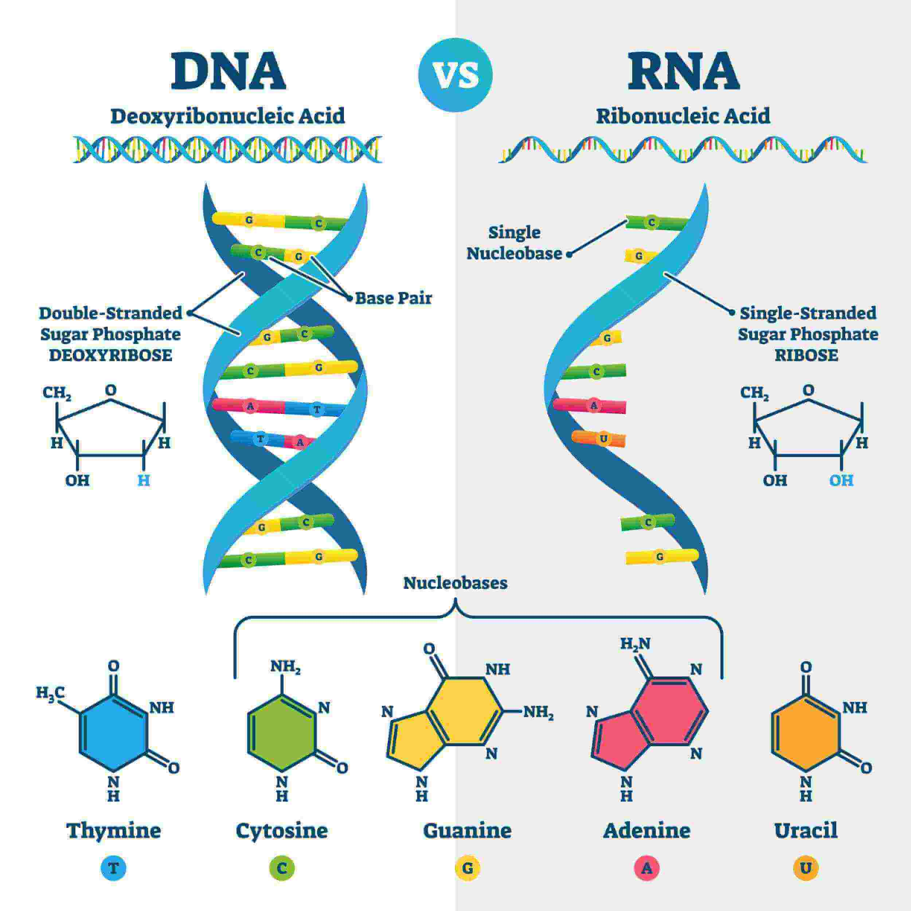

> Life energy comes from electrinos and positrinos.
> 
> J Mark Morris

Sara Walker is an astrobiologist and theoretical physicist at Arizona State University who is researching the origins of life. This is a great conversation between Sara Walker and Lex Fridman. I have written some commentary after the video.

https://youtu.be/-tDQ74I3Ovs

Sara describes the RNA hypothesis for the origin of life. Let's take a look at RNA. Wow, Guanine is made with 6,372 point charges.

Here are my unchecked calculations of the point charges comprising key constituents of RNA. I don't know the veracity of [this post](https://michaelgr.wordpress.com/2008/04/06/how-many-atoms-to-encode-the-human-genome/), but the author claims around 200 billion atoms to encode the genome. Assuming the average is approximately 350 point charges per atom in each DNA component then that is rougly 70 trillion point charges in the genome. Fascinating.

https://youtu.be/kriVPJ2pYzY

* * *

In the first assembly steps of structure, shielding of energy is essential for survival. Energy is a critically important resource and it is also highly reactive. The swirling structures which are selected and emerge have a number of properties that may be essential to their survival. Let's list some of those properties and the dualities of these structures to life-forms.

- When binaries capture each other, the lower energy binary with a larger radius provides shielding of the energy of the inner binary.

- Shielding here means standard mundane electromagnetic field cancellation by superposition.

- Left unshielded, the higher energy binary would be highly reactive, and hence less likely to survive in its extant structural form.

- Binary capture is a form of nesting, with the obvious dualities to life.

- The Noether core is formed with three nested binaries.

- Shielding has dualities to defensive (reaction avoiding) behaviours.

- The precessing of the lower energy binaries causes alternating fields that cause the Noether core to fade into the background at certain distances.

- Binaries and Noether cores also implement time. Life senses time.

- Noether cores redshift which has a duality with aging.

- Noether cores get larger as they redshift to a peak at frequencies lower than microwave and then they get smaller as they continue to redshift. Dualities : maturation and aging.

- Low energy Noether cores develop wobbly shielding of energy revealing an oscillating mass (as seen in neutrinos). Duality : aging, infirmity, imbalance.

- Noether cores can receive, store, and transmit energy. Duality : critical life sustaining resources

- The Noether core point charges are interacting with one another and in some cases themselves. Viewed individually or as an assembly the Noether core embodies self action. As Sara says, "the update rule depends on the state of the machine."

- At symmetry breaking points where a point charge velocity change crosses the field speed, @, the update rule for the system changes because above v=@ point charge self action is possible, whereas below v=@, it is not. This point is a bit esoteric, but see Wien's peak.

- Bottom line, Noether cores are the number one survivors from any high energy maelstrom (reaction vessel) and standard matter leverages Noether substructres.

I could go on and on imagining dualities. I conclude that these are strong dualities between life and the emergent behaviour at assembly steps 1, 2, and 3 of nature. Nature loves to repeat its patterns at various scales.

- In nature we need to track two types of things : the point charges which move continuously through Euclidean time and space and the field objects which expand spherically from every location in the path history of each point charge. Nature is not implemented by cells in a grid.

- Euclidean time is continuous in nature and for every point charge. Orbiting binaries also implement time in terms of their frequency which can take on discrete quantum values, but also more generally and continuously in terms of the phase shift or velocity of the orbiting point charges. Also, binaries can decay in a reaction rendering time meaningless for that former structure, but not for the point charges which are off on a new adventure.

- One can imagine a very effective simulation of point charges that is implemented with discrete fine grained time steps and by keeping track of the locations and velocities of emitted fields of point charges in a grid overlaying Euclidean time and space.

The map is not the territory. The territory is actually continuous at the base level of nature. 

**_J Mark Morris : Boston : Massachusetts_**

