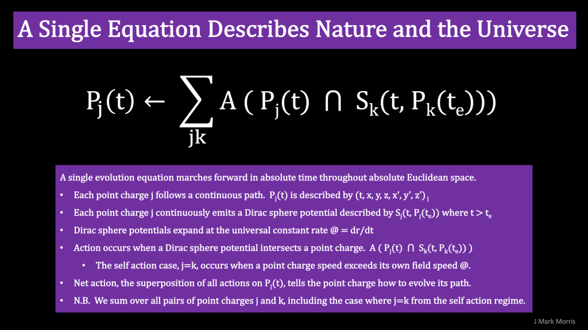

> Scalar and vector potential tell point potential how to move.
> 
> J Mark Morris

This post is about scalar and vector electric potential and how the summation, aka superposition, of these potentials controls the point potential universe. It's not precise to say that general relativity's spacetime geometry nor NPQG's spacetime aether tells matter how to move. The truth is found at the fundamental point potential layer.

Wheeler's idea is true at scales of applicability where the geometry of Noether core based structures implements general relativity. Wheeler's idea is imprecise when examined at the smallest scales in the realm of local dynamics of point potential structures. The correct statement is that the dynamical scalar and vector potential are what causes point potentials to move. Point potentials assemble into structures we call matter (standard matter) and Higgs assembly clusters that form the spacetime aether (low apparent energy Noether core detritus).

Each point potential and each assembly structure, experiences the local scalar and vector potential at all times. The scalar and vector potential tell the point potential how to move. We call this dynamic "action". We can write the equations for point potential motion along a path as the summation of all action.

As we attempt to map Wheeler's thoughts, we must ask, are point potentials material? Are assemblies of point potentials matter? As we'll see, this requires new and revised science terminology. Etymologically and ontologically the concepts of matter and mass are closely aligned. Interestingly, photons are not considered to be matter because they are considered to be massless. _The distinction regarding the photon was another blind spot in GR/QM based physics and in hindsight was an enormous clue._

This confusion around mass, energy, and matter illustrates how a false prior infection can cause an entire field to miss for a century that which is right in front of them. Still my point is that the terms _matter_ and _mass_ have not been properly understood. So when we ask whether a point potential is material, matter, or has mass we need to first set down an updated definition of those concepts themselves.

I will argue that point potentials are matter given:

1. point potentials are discrete and they exist with no known beginning nor end to their time and space path.

3. potential fields emitted by point potentials have the ability to cause action

5. point potentials are acted upon by potential fields,

7. point potentials implement asymptotic safety which has a causal result in a time and space immutability as distinct from the strict geometrical point model of the point potential.

We know from Einstein that mass represents energy. We need to update this with the concept of energy shielding and redefine mass based upon apparent energy. However, at the lowest level we must compare Coulomb's Law and the Law of Gravitation and determine how to bridge these ontological concepts and unify our language as we also tackle a new geometrical formulation.

This is going to be interesting, because standard matter at rest contains a LOT of kinetic energy in the form of rapidly orbiting point potential binaries. Obviously, that will require rethinking our concept of inertial mass and velocity = 0. For inertial mass, the velocity of the structure is considered to be at rest only in a relative sense. General relativity does not define an absolute velocity of zero. As we consider assemblies of point potentials, even if the assembly as a whole is at rest, the internal point potentials have velocity and carry kinetic energy. It turns out that for point potentials in a Euclidean void, there really is an absolute frame. Point potentials have an absolute velocity of zero when they cast no potential history, i.e., create only scalar potential and no vector potential.

_Let's tap Wikipedia on this subject._

> _In physics, chemistry, and biology, a potential gradient is the local rate of change of the potential with respect to displacement, i.e. spatial derivative, or gradient. This quantity frequently occurs in equations of physical processes because it leads to some form of flux._
> 
> Wikipedia

Suffice it to say, there is really no such thing as electrostatics at the level of the standard model given that every assembly contains multiple point potentials filling various roles and each traveling their path according the evolution equation of the universe.

This seems relevant :

I am sort of getting the picture of the patchwork quilt theories of physics as being highly related but covering different point potential structure or sub-structures. It is starting to sound to me like a change of gauge is a way to apply the theory to a different Noether core based structure, a substructure, or a structure in different conditions. If a structure is Lorentz invariant, then it is most certainly powered by one or more point potential binaries, i.e., Noether cores.

<figure>

<figcaption>

Wikipedia

</figcaption>

</figure>

Check out the Coulomb gauge where the vector potential is quantized but the Coulomb interaction is not. That makes total sense when the vector potential is caused by a Noether core assembly and we are working on problems directly related to the continuous realm of individual point potential behaviour. Wow. How cool is that?

<figure>

<figcaption>

Wikipedia

</figcaption>

</figure>

<figure>

<figcaption>

Wikipedia

</figcaption>

</figure>

That's really interesting and totally makes sense. The dynamical geometry of potential paths must include the assembly into variety of structures that are reused in structures of higher assembly number.

<figure>

<figcaption>

Wikipedia

</figcaption>

</figure>

I wonder if the Lienard-Wiechert are truly the right set of equations for point potentials or if they are confused ontologically. The mention on the Lorenz gauge is concerning because that implies the Noether core binary in my estimation. Note the timeframe 1898 & 1900. Were the Einstein's aware of this work? It is kind of dumbfounding to see that Wikipedia even states that electromagnetic radiation in the form of waves can be obtained from these potentials which originate from moving point potentials! Remind me again why point potentials were set aside?

<figure>

<figcaption>

Wikipedia

</figcaption>

</figure>

I think I found a key error in scientific logic in this Wikipedia quote. The outlook was that quantum was below the layer of potential since quantum is ontologically below the electron, neutron, and proton. That makes total sense they would think that way considering that standard matter particles are sometimes thought of as point particles.

However, I think the situation was exactly the opposite, as you can see from an assembly level below the standard model with point potentials of magnitude |e/6|. These are Liénard–Wiechert potentials which come from classical point potentials (not standard matter particles). Liénard and Wiechert lacked the knowledge to deduce that the standard model, the quantum, and general relativity were all expected behaviours of the structure that would emerge from moving point potentials emitting potentials that superimpose and time lag to cause action on point potentials.

I an non-plussed. I will have to dig into these methods and see if I can find the reason they were discarded. Note that it says they were not corrected for quantum mechanical effects, but that is because the ontological narrative was at the wrong level of abstraction.

The Liénard–Wiechert potentials appear to build in special relativity and the speed of light. That means photons. We cannot allow photons to be smuggled into a geometry from first principles describing the layer below structures that gives rise to structures. Specifically, it is not reasonable to leverage the speed of light, and photons, and special relativity based upon photons because photons are an emergent structure assembled from point potentials. Is it possible to derive special relativity for point potentials with no photon observer, so it has to be a geometrical proof?

We must redefine special relativity geometrically. Maybe that has already been done. Let's not reinvent the wheel.

> _The study of classical electrodynamics was instrumental in Albert Einstein's development of the theory of relativity. Analysis of the motion and propagation of electromagnetic waves led to the special relativity description of space and time. The Liénard–Wiechert formulation is an important launchpad into a deeper analysis of relativistic moving particles._
> 
> Wikipedia

Ok, I need to do a deep dive into the Liénard–Wiechert potentials and Jefimenko's equations. There is a huge flaw the size of a barn door in these approaches. Ontological confusion has caused a miss of the idea that point potentials are not photons and that point potential speed is not limited by c, nor by electric potential field speed. Point potentials cause some fascinating self action behaviour when they exceed their own field speed.

I'll finish this post with quick meta thoughts on theory replacement.

> _GR has its own holes and will need replacing, especially to be unified with QM, but also to handle stuff like the inside of black holes and the moment of the Big Bang. It will remain a useful simplification (lol) over quantum gravity, I am sure, for those situations where it is appropriate_
> 
> Dialogist

It's not so much that existing theories need wholesale replacing in the grand unification theory. I think it will be a new dynamical geometry that will be able to reproduce today's theories at their scales of applicability in energy, distance, and time. The new dynamical geometry may identify and correct issues with GR and QM, and will be more tightly predictive to the limits of instrumental precision. I think an important question will be whether new analytics or computational techniques can be developed that are better than the highly **effective theories** of GR and QM. If so, then those new techniques could become the norm in some subfields. However, just like COBOL or FORTRAN software, sometimes it's sensible to maintain a prior era theory if it is doing the job effectively.

Will the new dynamical geometry change the ontology in a way that is better served with a different terminology? If so, then it increases the cost of maintaining prior era theories.

**_J Mark Morris : Boston : Massachusetts_**

Here is a good reference video on electric potential.

https://youtu.be/vmW7h5YgZL8
