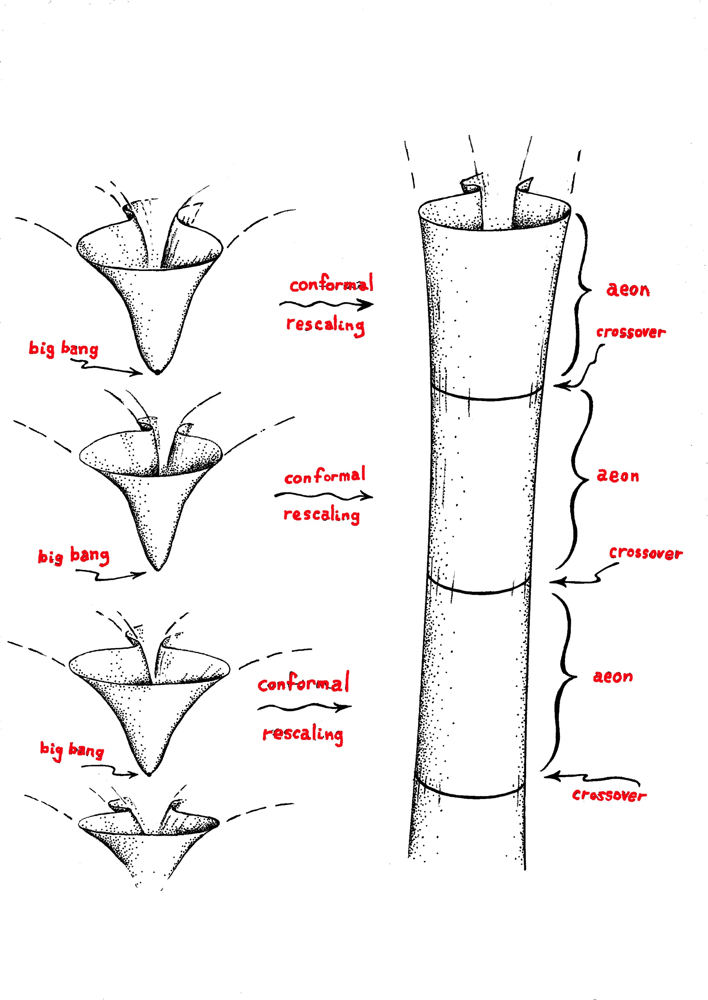

This visual depiction shows Sir Roger's Conformal Cyclic Cosmology as a **serial process**. From far away it looks like drawing of a spine and has hints of anthropocentrism physically and from the perspective of a birth, life, death, rebirth loop. Many of Escher's works depicted serial processes and this is a fascinating drawing yet I think there is an opportunity for a superior model and depiction.

Consider the set of all astronomical observations **not** including the CMB. Each of those individual photons was produced in high energy reactions from a specific source which we can bound with an arbitrarily scaled enclosing sphere. Why would we treat CMB photons any different? What is the provenance of the decision to consider CMB photons spread like peanut butter over the inside spherical surface of the observable universe?

I think Hoyle, Narlikar, and Burbridge and their steady state universe ideas were given the bum rush. 

There is a highly relevant segment of the Penrose:Krauss video 1:52:00 to 2:15:00 where Sir Roger is skeptical about the following narrative :

- CMB represents thermal equilibrium

- thermal equilibrium represents highest entropy

- the second law of thermodynamics says that entropy increases.

- which begs the question, where did the entropy of the CMB go?

The error in thinking of Sir Roger and LCDM cosmologists is already evident. It is not correct to presume that CMB photons represent a uniform condition painted across the spherical surface of the observable universe. Instead, reframe and consider that the sources of CMB photons emanate from galaxy local events distributed across the farthest reaches of the observable universe with the same isotropy at large scales throughout the interior of the observable universe.

The point charge cosmology narrative solves the problem.

- point charge core of an SMBH at or near zero entropy

- jet or catastrophic breach of Planck point charge plasma leads to high or maximum entropy

- emission of high energy stealthy spacetime aether

I speculate that Sir Roger might remove his objection to inflation in the case of the point charge formulation. It is obvious that point charge binaries inflate and follow the Planck's Law curve. I suspect that Sir Roger objects to a more specific abstract formulation of inflation. Adjudicating that dispute is moot at this point.

**_J Mark Morris : Boston : Massachusetts_**
