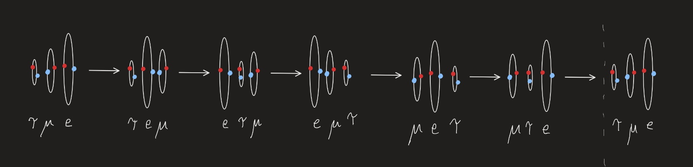

https://youtu.be/y7H1M5DQa6g

Unfortunately, this video has a number of errors that become evident with an understanding of NPQG. An electron neutrino is simply a nested tri-binary Noether core with a neutral complement of 6 personality charges on in each binary polar vortex. The ones we detect from solar radiation have relatively low apparent energy, and the three binaries are at different energies, radii of orbit and angular momentum vectors. The issue with these low energy neutrinos is that they are poor at energy shielding which is an effect that can happen several ways in NPQG. One way energy can be shielded is that some binaries mask internal energy in part or whole via superposition of their potential emissions. In this case the energy shielding is periodic. Somehow the binaries are orbiting in a way that exposes each of the three binaries’ energy a portion of the time. We should be able to look at the three superimposed wave functions and deduce the orbital geometry.

Cosmology will need to be turned inside out, but everything will click into place now and the next two decades will be the heyday of cosmology with new predictions quickly confirmed by space based instruments. I’m just a regular guy who was determined and happened to have the right mix of knowledge and intuition, lack of inculcation in the current era GR/QM/LCDM, and a more than healthy dose of skepticism and b.s. detection for nonsense narratives in physics and cosmology. Perhaps you are detecting a mix of confidence in NPQG combined with frustration that scientists just don’t get what is entirely obvious once you step into the new era for a while.

The tri-binary, the point charge geometry of fermions, and more thought experiment discoveries are coming so fast I want to share them with scientists so they too can get on this highly productive track. I still think there are plenty of good and kind physicists who will emerge to lead the next era. My wish is that all the grumpy mean physicists do their penance by cleansing the current body of physics and cosmology literature and outreach material of the nonsense narratives that have exploded into what is at best science fiction and at worst a tragedy of physicists own making.

By the way here’s an idea of how neutrino oscillation might work in the point charge universe. The picture shows three binaries each with different energies that are somewhat coupled and with orbital rotation oriented approaching orthogonal to the line of travel as a function of speed. They’re loosely coupled, so they pass through each other, over each other and when one gets too far ahead it gets pulled back by the others and they just go back-and-forth.
