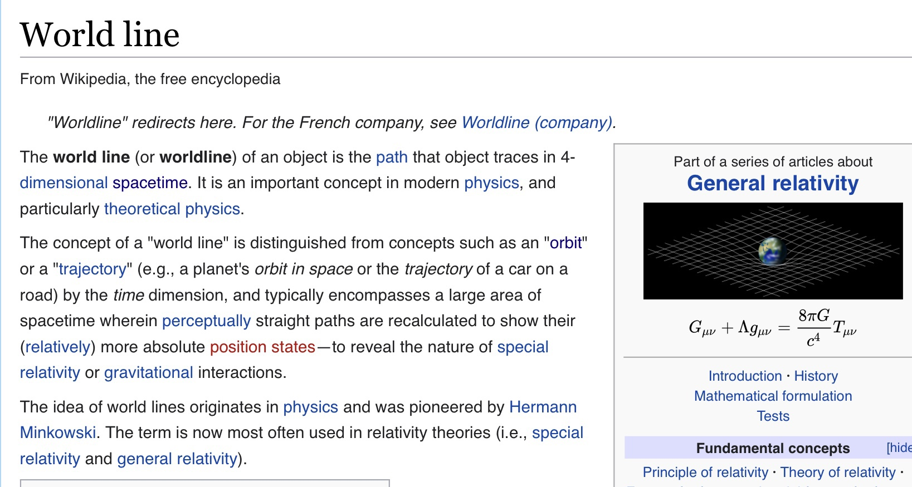

We exist, think, and observe in the midst of Einstein's curvy stretchy geometry of spacetime, which is described by an abstract geometry and is physically implemented by an aether of point charge assemblies. The spacetime aether is the sea through which both photons and gravity travel. The aether permeates everything. However, the ontological foundation for the universe is flat Euclidean time and space. This ontological and physical juxtaposition of reference frames, one absolute, one deformable, has led to great confusion in the quest to understand nature. It is therefore no surprise that we have observed and interpreted reality as though peering through a distorted lens in a house of mirrors.

Let's begin with consideration of Minkowski spacetime. The following passage provides an overview of how it relates to Euclidean time and space.

> _In mathematical physics, Minkowski space (or Minkowski spacetime) is a combination of three-dimensional Euclidean space and time into a four-dimensional manifold where the spacetime interval between any two events is independent of the inertial frame of reference in which they are recorded. Although initially developed by mathematician Hermann Minkowski for Maxwell's equations of electromagnetism, the mathematical structure of Minkowski spacetime was shown to be implied by the postulates of special relativity._
> 
> Wikipedia

What does it physically mean to preserve a spacetime interval between two events? This is of course the essence of Einstein's special relativity. Yet what is physically happening? We need to consider the entire path of the photon from emission to observation as well as the spacetime aether assemblies local to the emitter, path, and receiver.

> _Minkowski spacetime is closely associated with Einstein's theories of special relativity and general relativity and is the most common mathematical structure on which special relativity is formulated. While the individual components in Euclidean space and time may differ due to length contraction and time dilation, in Minkowski spacetime, all frames of reference will agree on the total distance in spacetime between events. Because it treats time differently than it treats the 3 spatial dimensions, Minkowski space differs from four-dimensional Euclidean space._
> 
> Wikipedia

> _In 3-dimensional Euclidean space (e.g., simply space in Galilean relativity), the isometry group (the maps preserving the regular Euclidean distance) is the Euclidean group. It is generated by rotations, reflections and translations. When time is amended as a fourth dimension, the further transformations of translations in time and Galilean boosts are added, and the group of all these transformations is called the Galilean group. All Galilean transformations preserve the 3-dimensional Euclidean distance. This distance is purely spatial. Time differences are separately preserved as well. This changes in the spacetime of special relativity, where space and time are interwoven._
> 
> Wikipedia

Of course scientists generally thought the speed of light c was a constant, and it is from the perspective of Einstein's spacetime. If one attempts to imagine Poincare's expression in absolute time and space, it becomes nonsensical due to the path dependent variable speed of light where c is the speed of the photon assembly, which is actually surfing on it's own field and is paced by local permittivity and permeability. So in absolute coordinates, in a gravitation field, the surface of a simultaneous release of photons in all directions would not describe a sphere due to the independent VSL paths of the photons. The formula in the absolute frame is x2 + y2 + z2 = @t2, where @ is the universal constant speed of potential.

Alexander Unzicker has some interesting history and commentary on the concept of spacetime.

https://youtu.be/TDjgQ\_megMI

Let's now consider world lines.

- World lines are very interesting and closely related to general relativity. We actually want to look at the worldline from flat space and time when we are imagining point charges. What is that called? The Euclidean world line? Fortunately, low energy spacetime found in deep space appears to approximate Euclidean geometry when photons are not being lensed by the mass of nearby galaxies. Yet, there is always some degree of influence of spacetime energy gradients along a photon's path (other than near the emitter and receiver).

- I wonder if Einstein’s field equations can be recast to flat space and time? That recasting also has to account for all the elements of the tensors, right? How does each element translate between these two perspectives of the universe?

- A mathematical mapping to NPQG from any of these research areas could be made fully translatable between flat spacetime and curvy spacetime

- It may be mathematically helpful to examine problems from both flat spacetime and curvy spacetime. Simulation or AI may also find that portions of a problem are more tractable from one or the other perspective.

It is fascinating that science inverted the ontology of Euclidean and Minkowski geometries. We "approximate" so many measurements as Euclidean, without need for correction of spacetime curvature. GR and QM era science have yet to understand that Einstein's curvy spacetime is an overlay on a Euclidean void in time and space. I prefer the NPQG ontology because the spacetime layer becomes isolatable as separate set of assemblies that permeate nearly all portions of the void vessel of absolute time and absolute space. The exception being of course where even the Higgs particles decay in ultra high energy.

Light cones miss the causality behaviour for point charges with v > @.

> _Causality leading to the prohibition of motion faster than the speed of light \[is an important\] principle that we can deduce from the special theory of relativity. The meaning of causality in classical physics implies that no action can occur before its cause. In Einstein’s theory of special relativity, causality means that an effect cannot occur from a cause that is not in the back (past) light cone of that event._
> 
> _A light cone is the path that a flash of light takes when emanating from a single point in space and traveling in all directions of spacetime. If you imagine the current event (or the present moment) to be a plane horizon, then the light from that spreads out as a growing circle of events, resulting in a cone. This light cone that is formed is known as the future light cone. This light cone is a mathematical representation of all future events that will occur after the event horizon. The inverse of this future light cone is what we call the past light cone. If anything were to cross the speed of light, numerous paradoxes would begin to occur._
> 
> https://www.scienceabc.com/pure-sciences/what-is-special-theory-of-relativity.html

General relativity does not have an implementation for the aether assemblies, the photon assembly, the neutrino assembly, nor the remainder of the standard model assemblies. General relativity is therefore incapable of separating the behaviour of the photon and the behaviour of the aether assemblies through which the photon travels. The implementation of redshift is not known. Clearly we need to unthink at least some of the current narrative and then build the story anew from the absolute frame in the most parsimonious way.

But there is a big aha in these realizations. If the math of relativity works so well, then it must be mirrored by the assembly zoo and in particular by Noether cores of spacetime aether. What does that mean for length contraction and time dilation? What does that mean for photons? How do we tell this story from the absolute frame? We have two assembly types involved in this interaction. The aether assemblies and the photon assemblies. The Euclidean path of the photon is influenced by both.

Let's brainstorm a few ideas :

- Einsteinian spacetime braids space and time together into a geometry of General Relativity.

- We can model and simulate the geometrical path of each point charge from the perspective of Euclidean 4-space.

- Some problems require understanding the deformable frame of spacetime.

- Einstein's General Relativity will continue to be useful in certain domains and scales.

- Special relativity has no acceleration so it uses R4.

- We can rebase on Absolute Relativity

- Euclidean time and space can be described by a mathematical structure called a 4-space, R4.

- Each point charge emits a Dirac sphere potential stream with magnitude influenced by its velocity.

- Dirac spheres travel at the universal constant field speed @.

- Euclidean time and space are not fundamentally related.

- The path history of point charges (and hence their Dirac sphere stream) illustrates the causal linkage to the action that influences the path forward in time.

- Physicists sometimes use (1,-1,-1,-1) or (-1,1,1,1) with the order being t,x,y,z It's not clear if this is the best notation in the point charge era.

It seems smart to me to give the Euclidean void as few characteristics as possible. If the Euclidean void is responsible for some behaviour, then that begs the question of "_how is it implemented?_" I think it would be best to say that the Euclidean void simply exists and that is all we know. It doesn't require a story about how it was created, although I'm sure it will be a subject of inquiry.

Let's examine the fundamental objects and dimensions in the point charge universe.

- Euclidean time and 3D space as separate dimensioned domains.

- Energetic unit potential point charges.

- The unit potential point charges emit the Dirac sphere potential streams that expand at universal constant field speed @.

- Unit potential point charges move along a path with unconstrained velocity v and are acted upon by all impinging Dirac sphere potential streams.

- The Dirac sphere streams and the point charge paths both bridge the Euclidean time and space domains.

The point charge model is based on Euclidean space and time which we can represent with R4. Point charge theory doesn't require, and would be hindered by, use of Minkowski spacetime to model the absolute position in space and time of each point charge. It is fascinating that Einstein, coming off of deep studies of Brownian motion and also the photoelectric effect, turned to an abstract Minkowski spacetime to describe what is an emergent system of particle assemblies with a triply nested binary as the core of the assembly architecture.

https://youtu.be/V4f\_1\_r80RY

Maybe this video will help others understand how I view spacetime as a sea of low apparent energy point charge-based structures. The duality I am hoping to illustrate is how the density of the particles (birds) increases and decreases in concert dynamically. It's not an ideal duality but it is a good visualization, especially given what we perceive as a Euclidean background. The aether behaves similarly as low energy Noether cores (triply nested orbiting binaries) become excited around matter energy and more excited the denser that matter-energy. The energy gradient of the excited aether yields gravity.

**TL:DR;** Consider two frames. In the absolute frame of nature time is continuous, absolute, both abstract and real, and advances at a constant rate. 3D space is Euclidean. In the Higgs assembly spacetime frame, time is discrete from the point of view of orbiting binaries at frequency f. Space is curvy due to the Higgs assembly geometry in the presence of mass energy.

**_J Mark Morris : San Diego : California_**
