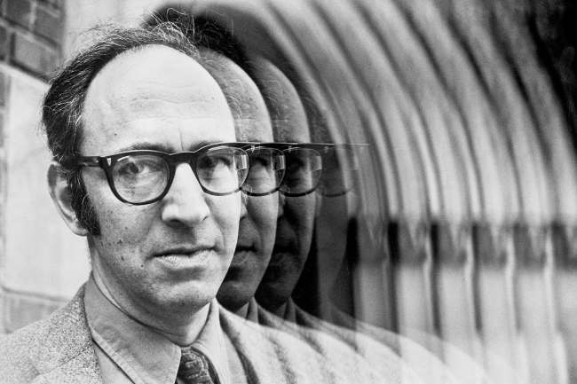

<figure>

<figcaption>

Thomas Kuhn

</figcaption>

</figure>

How does change happen? What are the dynamics that cause fundamental change in thinking in the sciences? This was a subject that  philosopher Thomas Kuhn addressed in his book _The Structure of Scientific Revolutions_.

I have this book but frankly I've been too busy on NPQG to read it. Let's see what Wikipedia has to say:

> Kuhn explains the process of scientific change as the result of various phases of paradigm change.
> 
> Phase 1 – It exists only once and is the _pre-paradigm phase_, in which there is no consensus on any particular theory. This phase is characterized by several incompatible and incomplete theories. The actors in the pre-paradigm community eventually gravitate to one of these conceptual frameworks and ultimately to a widespread consensus on the appropriate choice of methods, terminology and on the kinds of experiment that are likely to contribute to increased insights.
> 
> Phase 2 – _Normal science_ begins, in which puzzles are solved within the context of the dominant paradigm. As long as there is consensus within the discipline, normal science continues. Over time, progress in normal science may reveal anomalies, facts that are difficult to explain within the context of the existing paradigm. While usually these anomalies are resolved, in some cases they may accumulate to the point where normal science becomes difficult and where weaknesses in the old paradigm are revealed.
> 
> Phase 3 – If the paradigm proves chronically unable to account for anomalies, the community enters a _crisis period_. Crises are often resolved within the context of normal science. However, after significant efforts of normal science within a paradigm fail, science may enter the next phase.
> 
> Phase 4 – _Paradigm shift, or scientific revolution_, is the phase in which the underlying assumptions of the field are reexamined and a new paradigm is established.
> 
> Phase 5 – _Post-Revolution_, the new paradigm's dominance is established and so scientists return to normal science, solving puzzles within the new paradigm.
> 
> Wikipedia

Physics and cosmology are currently in Phase 3, **crisis**. Astronomy is in Phase 2 with a wealth of new observational techniques and astronomers do not yet realize their field is a castle in the air, built upon false narratives and models promulgated by cosmologists and physicists. It is very difficult to cause the transition from Phase 3 to Phase 4, the revolution or paradigm shift. While researching the Kuhn cycle I found the following gem of falsehood.

> **In order to convince any scientist of anything, you have to begin your argument with a fundamental understanding of the existing paradigm. You must challenge basic ideas in the language and logic of those who hold them.**
> 
> Kuhn's Cycle: Paradigms and Criticism  
> YOUTUBE : Sprightly Pedagogue

Does the quote above mirror Kuhn's thinking? If so Kuhn was wrong, with all due respect. I’m reading about Kuhn's view on the  incommensurability of the languages of the old and new paradigms, which causes a hindrance to communication. Yet, this fallacious trope of an argument has been made to me countless times in the last two years. This statement is quite offensive, wrong, and is only an artificial barrier scientists use to ward off creative thinkers. It is simply not true. It is especially not true in the case of physics and cosmology where they have made interpretive wrong turns and are now using the most expensive and slowest techniques to barely make a snails pace of progress over the last 50 years.

It is possible to approach some problems from a different direction. As you develop the idea, you look at the web of supporting logic and evidence. You can be quite confident in a new way of thinking without a full understanding of the prior paradigm when the connection network is amazingly strong at the narrative and/or deeper levels. You can also discover that the existing math and models are based on incorrect or uninformed assumptions. When both of these occur, as with NPQG, that is a very good sign indeed.

* * *

I was only six months into my new hobby of finding a Theory of Everything and was sponging up information about physics, cosmology, and astronomy as fast as I could. Even from the beginning I would read or watch information repeatedly until I absorbed the information, while also listening carefully for the scientist's reservations, which are often expressed in quite subtle prose, inflection, or body language so as as to avoid ostracism from the orthodoxy. Sometimes it is like a 'poker tell'.

> _A **tell** in poker is a change in a player's behavior or demeanor that is claimed by some to give clues to that player's assessment of their hand. **A player gains an advantage if they observe and understand the meaning of another player's tell, particularly if the tell is unconscious and reliable.**_
> 
> Wikipedia

Each time I encountered an overt or subtle '_tell_' from scientists I made a mental note. These are very important signals about where the current paradigm may be weak. These are the areas begging for further critical study and analysis. There is yet another dynamic at work here - it is often risky for scientists to take an overt position in opposition to the current paradigm. This risk can manifest itself as risks to job security, tenure possibilities, and funding opportunities. Some scientists are quite clever with their wording and will use rhetorical creativity to express their doubts.

**_J Mark Morris : San Diego : California_**
