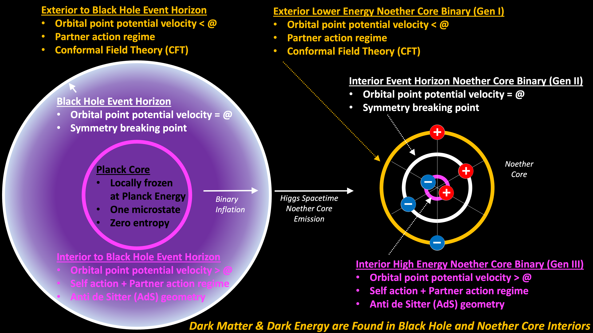

Let's concisely articulate a new ontology of cosmology and illustrate how a transformation of **LCDM** is consistent with this new ontology.

- There is an ontology unifying general relativity and quantum theory.

- All behaviour in the ontology is caused by a dynamical geometry.

- The dynamical geometry is implemented by a (mostly) scale invariant\* architecture permeating a Euclidean void of time and 3D space.

- The scale invariant architecture is comprised of an assembly of geometric objects observing the dynamical geometry.

- Einstein's spacetime is implemented with geometrical assemblies.

- The standard model is implemented with geometrical assemblies.

- Assemblies generate waves, ala "the wave equation," and they have an architectural pattern that is not recognized by quantum theory.

- Assemblies leverage superposition and can therefore shield their full energy.

- Galaxies are recycling systems.

- Standard model matter entering the black hole may be recycled and emerge as stealthy spacetime assemblies.

- Stealthy spacetime assemblies shield very high energy.

- Standard model matter generating reactions are more likely to occur in high energy spacetime.

- What we call the cosmic microwave background is the photon assembly radiation from recycling galaxies, transmitted over long distances through expanding spacetime assemblies.

- There was no big bang. We simply see the radiation of galaxies.

- The universe is a dynamic steady state on large scales.

_\* Scale invariance can vary with perturbations, including geometric decay._

What might **Sir Roger Penrose** think of this reverse Escher transformation to LCDM? Based upon his musings, and his family connection to Escher, I think he would be quite interested. The following Escher artwork is suggestive of the paths of point charges in an assembly.

What shall be the suggested name or acronym for the new transformed model? The prior model's acronym was **LCDM**, which stood for lambda cold dark matter. Lambda is for a cosmological constant associated with dark energy and determines the expansion of the universe, and both of these concepts are entirely reframed in the point charge era.

In the new model, the ill-fated cosmological constant lambda is remapped to the galaxy local aggregate expansion rate of dissipating spacetime assemblies. The detailed geometry is much more sophisticated, realizing that spacetime energy density and characteristics varies as a function of concentrated mass (i.e., apparent energy). The overall trend expresses an expansion rate as spacetime assemblies freshly emitted from a black hole or SMBH inflate and then expand as they dissipate and reach a steady state in relation to neighboring galaxies.

The new model explains dark energy and cold dark matter as matter-energy that is shielded by superposition. It turns out that the assembly that provides this scale invariant architecture is the tri-binary Noether core.

We appear to have a blank slate for naming the new cosmological model. What was previously darkness, is now apparent. Some may forego a name and simply refer to the 'cosmology of the universe'. I anticipate that academics will require an acronym to differentiate eras. Here are some words and concepts that could apply:

- cyclical, recycling, cycles of cycles

- dynamical geometry

- quasi steady state, _f/t Narlikar, Hoyle, and Burbridge._

- unbounded

- unit potential point charge

Abstractly, there is a closed loop grand cycle from the densest unit potential assemblies to the most diffuse lowest energy assemblies of spacetime. Immutable point charges may experience a wide diversity of reactions and assemblies in their travels. The notion of **cycles of cycles** is a key recursive characteristic. We know the smallest cycle. What is the largest cycle we observe? '**Cyclical**' is both more abstract and more encompassing of _dynamical geometry_ especially with a path interpretation to 'cyclical.'

It makes sense to message that the universe is 'unbounded' because we don't know if it is infinite. There is no testable way to determine anything infinite. Unbounded is more correct at this point. We are limited to observe the pattern of the most distant photons that can reach us. Those photons are of galactic origin.

**_J Mark Morris : Lynn : Massachusetts_**
