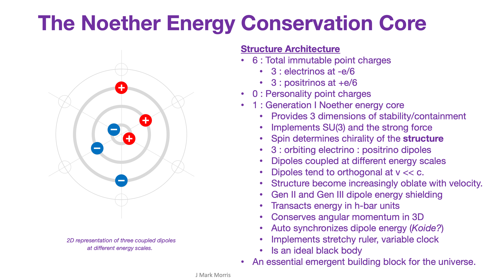

Dr. Sabine Hossenfelder posted a video to address the question, "**Do we travel through time at the speed of light?**"

https://youtu.be/iBTez-nTKes

Here are my thoughts in response to Sabine's video. Let's start by grounding ourselves in fundamentals and basics of the NPQG point charge era.

- The background for our universe is simple Euclidean space and time.
    
    - Let's call these 4 dimensions absolute space and absolute time.
    
    - These dimensions are totally flat and linear.
    
    - In the absence of point charges there is no way to mark or measure absolute space and absolute time.
    
    - When point charge**s** are present we can develop techniques to measure relative distance and relative time.
    
    - These are totally mundane facts.
    
    - Nothing stretchy. Nothing curvy. Nothing sketchy.

- The **Euclidean space** in the universe is chock full of emergent structures made from point charges.
    - Every long term stable structure is based on a Generation 1 Noether energy conservation engine, which is a set of three electrino : positrino binaries at different energy scales, coupled into a gyroscopic dynamo.
    
    - Noether engines and the binaries that make them have characteristics that are dynamical with energy such as their frequency, wavelength, binary orbit radius, and the orientation of the orbital planes of each binary.
    
    - Einstein's spacetime is implemented by a detritus of relatively low energy Noether engines that permeates everything. Suffice it to say they are rather small and are very difficult to detect since any drop of energy they absorb causes them to fly off as a photon or neutrino or maybe some other reaction product.

Each particle is a structure of point charges, and experiences time as the inverse of the orbital frequency of its Noether core binaries.

What humans experience as time ourselves, or observe as time experienced by other objects, is emergent behaviour at many scales above point charges, yet it is emergent from these lowest level fundamentals and basics as described.

Now we can translate what Sabine is saying in terms of the implementation of nature — Our sense of time is based upon all the standard model particles in and around our mind and body, including the protons, neutrons, and electrons as well as the aether that permeates us. Every single one of those particles has a Noether energy engine which guarantees that the radius (distance) and frequency (time) of the Noether engine maintains the local property of distance/time = c, the speed of light. This would be true no matter the energy level of these particles. Every binary maintains this property. It's just another routine behaviour in the point charge universe. Nothing to be excited about.

**_The astute reader and thinker will observe that from the absolute Euclidean frame of time and 3D space the observer would see a variable speed of light._**

p.s. The title of this post is a reference to the fact that our experience of time is related to the frequency of point charges orbiting at incredibly tiny radii. It is also related to mystical physics outreach material about curly dimensions, but with absolutely zero physical implementation. I give a shout out to all the people in the world who have put some serious thought into any topic in physics, cosmology, or philosophy related to the fundamentals of nature. My hat is off to you. For the last 3 and a half years I have sponged up those ideas as fast as I could and somehow was able to crystallize a vision for nature from all the facts, theories, and interpretations that were available. There is nothing new in physics or cosmology. I absolutely believe all the elements of the solution to nature have been thunk many times before in the brains of intelligent individuals. It may well be true that all of the ideas essential to the solution of nature have already been published by scientists! That would not surprise me one iota.

The magic is in searching through the mountains of current era interpretations, discarded ideas, and creative ideas and then sleuthing out the model that simplifies this universe. The tower of ideas from babbling professionals, independent ideators, enthusiasts, and dreamers is enormous and beyond the comprehension of any human individual. That said, if you relentlessly focus on root cause during extended tours of the **ideageist** throughout history, it is possible to get lucky and find a gem that leads to the solution. For me, it was a disbelief in singularities. Think about that.

In retrospect, I had somehow picked up that the difference between a distance of around 10^-35 and zero was very important. I thought it was nonsense that physicists believed in a singularity which essentially means the radius of whatever we were observing has gone to zero. No way! I was extremely skeptical. So then I bounced all over the idea pile and even focused on Iron-56 for a while, for reasons which will eventually become evident, but that was way too high a scale in distance and low in energy to really understand nature.

Eventually I trained myself to keep focusing smaller and smaller in particle physics and on the inflationary big bang in cosmology. These are both the highest energy environments in the universe. And that is the link. They are the same. The bounce point in our universe is local to each galaxy and is the core of black holes, specifically those enormous black holes which develop the ultimately dense matter-energy state of a Planck core and somehow manage to vent Planck point charge plasma via jets and renew the inflationary-minibang cycle again.

