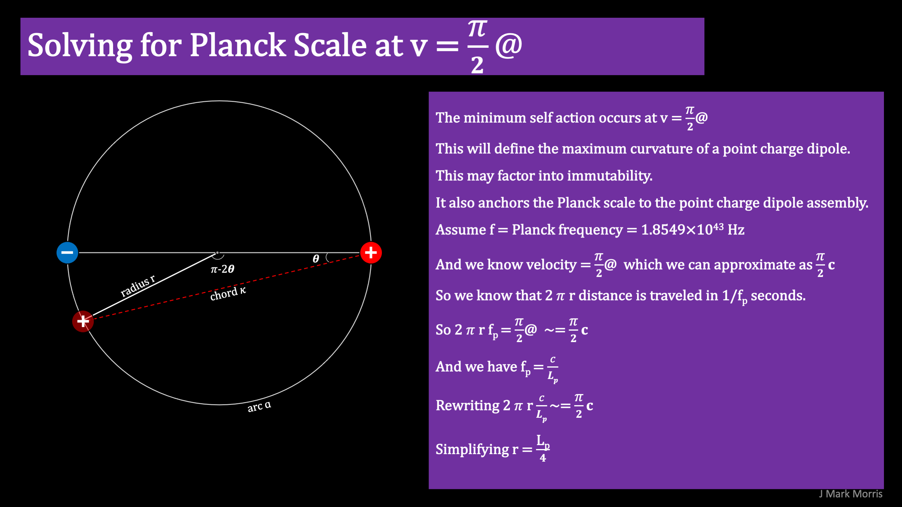

A unit potential point charge binary has a maximum curvature at the orbital point where self action results in a velocity of @ pi/2, where @ is the universal constant speed of the Planck sphere potential stream. If we presume that this limit corresponds to the Planck frequency, we can calculate the radius of orbit at maximum curvature and express it in terms of the Planck length. This simple calculation shows that the maximum curvature of a binary occurs when the orbital radius is equal to one quarter Planck length.

I suggest that the maximum curvature of a binary is the root cause of point charge immutability. If so, this provides a solution to what otherwise is a black hole singularity in general relativity. Instead, massive black holes would have a dense core that could ultimately approach Planck scale density and energy. I further suggest that in some conditions these black holes can vent Planck point charge plasma.

**_J Mark Morris : Boston : Massachusetts_**
