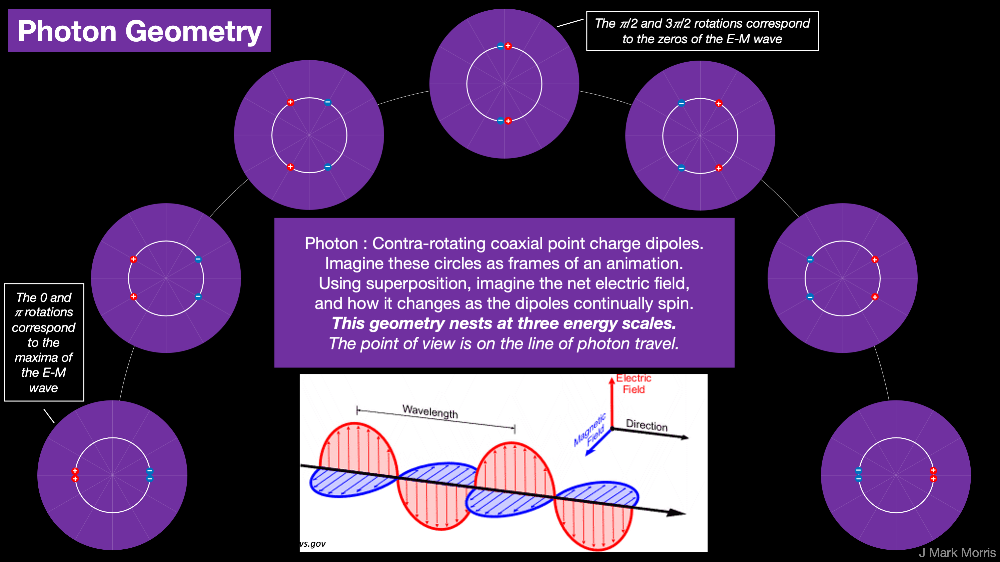

Let's discuss **The Hierarchy Problem**.

> _In theoretical physics, the hierarchy problem is the problem concerning the large discrepancy between aspects of the weak force and gravity. One example is the lack of scientific consensus on why the weak force is 1024 times stronger than gravity._
> 
> Wikipedia

Let's resolve this problem in the point charge universe. Briefly :

- All standard matter particles are assemblies made of point charges,

- and include a Noether core of orbiting point charges,
    - with a Gen I core structured as three binary subassemblies,
    
    - each an orbiting pair of point charges, the electrino and positrino
    
    - with each binary at vastly different energy and orbital radius.

- Besides the modest electric field and the huge magnetic field,

- there are three angular momentum vectors (the rotational planes),

- which change angles in response to acceleration.

- Noether cores total energy = shielded energy + apparent energy.

- The concept of mass corresponds to apparent energy,
    - and represents an A/C coupling or transitory perturbation
    
    - as swirling point charge structures interact with each other,
    
    - and with spacetime aether, aka dark matter,
    
    - Spacetime aether is possibly some sort of conglomeration or configuration of two 'pro' Noether cores and two anti Noether cores,
        - which are exactly what you need for pair production.

**TL;DR** : Mass, aka apparent energy, is due to an accumulation of alternating excitation and phase change perturbations of Noether cores. Considering both shielded energy and the orders of magnitude difference in scale of Noether core binaries and the weak charge layers, it is perfectly understandable that gravity is weak. It takes a LOT of mass to make a significant change in energy density of nearby spacetime aether. Finally, gravity is related to the floating ground energy of the aether as well as the gradient of that energy.

> _A hierarchy problem occurs when the fundamental value of some physical parameter, such as a coupling constant or a mass, in some Lagrangian is vastly different from its effective value, which is the value that gets measured in an experiment. This happens because the effective value is related to the fundamental value by a prescription known as renormalization, which applies corrections to it. Typically the renormalized value of parameters are close to their fundamental values, but in some cases, it appears that there has been a delicate cancellation between the fundamental quantity and the quantum corrections. Hierarchy problems are related to fine-tuning problems and problems of naturalness._
> 
> _Studying renormalization in hierarchy problems is difficult, because such quantum corrections are usually power-law divergent, which means that the shortest-distance physics are most important. Because we do not know the precise details of the shortest-distance theory of physics, we cannot even address how this delicate cancellation between two large terms occurs. Therefore, researchers are led to postulate new physical phenomena that resolve hierarchy problems without fine tuning._
> 
> Wikipedia

I empathize with the physicists and hobbyists that have had to deal with these complexities about nature for decades. Sadly, one wrong turn has led to a network of false narratives and this has made it extraordinarily difficult to understand nature from a non-optimal attack surface. Physicists accomplishments in effective theory and mathematics are truly amazing, considering the confusion.

That all said, I'm confident that not only does the hierarchy go away, but so does renormalization. There may very well be mathematical techniques and theories which are quite reusable with some refactoring. Yet, eventually it will settle down and there should be a quite cogent, straightforward, and elegant point charge explanation AND mathematics along the lines of the visualizations I am describing.

* * *

Under the fair use doctrine I'll quote extensively below an abridged version of the August 4, 2011 post titled **The Hierarchy Problem** from **Dr. Matt Strassler** on his blog [**Of Particular Significance**](https://profmattstrassler.com/). Please read Matt's full article in it's unabridged form and then come back here for quotes interspersed with my commentary from the point of view of the point charge universe.

> _**What is the Hierarchy Problem?**_
> 
> _An important feature of nature that puzzles scientists is known as the hierarchy, meaning the vast discrepancy in scale between aspects of the weak nuclear force and gravity. W__hile trying to figure out a possible explanation, physicists in the 1970s realized there was actually a serious problem, even a paradox, behind this number. The issue, now called the **hierarchy problem**, has to do with the size of the non-zero Higgs field, which in turn determines the mass of the W and Z particles._
> 
> Dr. Matt Strassler

This idea of the hierarchy is fascinating, because I am starting to see more and more how everything connects together. Shielding clearly plays a role, and I am quite certain that while physicists have hints like supersymmetry, they do not understand shielding of the generation II and III binaries in a Noether core. Nor do they understand that inertial mass represents only the apparent energy and not the shielded energy. Remember, Noether cores are the structures which do the inflating, expanding, contracting, and time dilating! Furthermore, every particle in the standard model is built upon a Noether core. Add to that that spacetime aether is implemented by super low apparent energy Noether cores.

We also know the orbital planes of the Noether core shift with velocity which is the result of **work** applied to change the Noether core energy and the angular momentum of each binary and this must somehow be described by Einstein's equations. I think much of this will fall out of the basic mathematics of a single spinning binary at all possible velocities, radii, etc. of the point charges. It will be really interesting to see how the existing mathematics evolves or is refactored, especially the most foundational equations in physics.

Energy shielding is a result of canceling by superposition. It is a dynamic form of superposition considering that the binaries in the Noether core have 3 vastly different frequencies and that the angular momentum vectors precess in a spin 1/2 dance.

\[See post titled : [Doh! It’s the Superposition!!!](https://johnmarkmorris.com/2022/01/03/doh-its-the-superposition/)\]

On the other hand, we know photons have quite a bit of energy yet we measure them as massless or nearly so. Is there some relationship with the planar structure and the coincidence of the three angular momentum vectors in the Noether core? Also, we know that neutrinos oscillate, so we can presume they are not quite planar, and we may also surmise that the dynamical geometry of the neutrino is such that the shielding by superposition varies, thus revealing an oscillating apparent energy, aka mass.

> _The issue, now called the **hierarchy problem**, has to do with the size of the non-zero Higgs field, which in turn determines the mass of the W and Z particles._ _The non-zero Higgs field has a size of about 250 GeV, and that gives us the W and Z particles with masses of about 100 GeV. But it turns out that quantum mechanics would lead us to expect that this size of a Higgs field is unstable. With the physics we know about so far, the tendency of quantum mechanics to jostle with those quantum fluctuations would seem to imply that there are two natural values for the Higgs field. Naively, the Higgs field should either be zero, or it should be as big as the Planck Energy, 10,000,000,000,000,000 times larger than it is observed to be. Why is it at a value that is non-zero and tiny, a value that seems, at least naively, so unnatural?_
> 
> Dr. Matt Strassler

When an energy transfer or transmutation reaction occurs, physicists describe the bosons as being the force carrying intermediaries. First of all, they are also carrying point charges! I've decoded the basic structure of the bosons and it seems as if they would be fairly planar, like the photon. So are the Z and W's real structures or just ephemeral point charge configurations in the reaction path of point charges? I am vaguely imagining some intermediate reconfiguration of the low apparent energy Noether cores which are in the spacetime aether. Potential insight : the mass, _i.e. apparent energy_, of the W and Z bosons may very well be related to the degree to which the reaction reveals the shielded energy in the Noether cores of the spacetime aether. I sort of like that idea. Hmm. Could it be? Bottom line, everything is point charges flying about, so it is a matter of figuring out the mechanisms whereby structures of point charges react.

I am really looking forward to the day when chemists can model everything at the point charge layer and can 3D visualize and trace the path and provenance of every point charge! Imagine having animation or virtual reality to look at point charge reactions with different speeds. Several metrics could be depicted, including the kinetic and potential energy of each point charge. The alignment of the orbital planes could be depicted along with velocity and the flow through the spacetime aether which itself is made of point charge structures.

Photons are bosons and they are clearly real particles and they are as depicted below, a 'pro' Noether core coupled and contra-rotating with an anti Noether core. _Aside : This topic desperately needs 3D dynamical simulations to illustrate the concept._

> _By the way, you will often read the hierarchy problem stated as a problem with the Higgs particle mass._ **_This is incorrect._** _The problem is with how big the non-zero Higgs field is. (For experts — quantum mechanics corrects not the Higgs particle mass but the Higgs mass-squared parameter, changing the Higgs field potential energy and thus the field’s value, making it zero or immense. That’s a disaster because the W and Z masses are_ **_known_**_. The Higgs mass is unknown, and therefore it_ **_could_** _be very large — if the W and Z masses were very large too. So it is the W and Z masses — and the size of the non-zero Higgs field — that are the problem, both logically and scientifically.)_
> 
> Dr. Matt Strassler

Even this drama should be easily cleared up. It seems to me that the point charge architecture concepts I have described, including apparent vs. shielded energy and how mass is related to apparent energy are highly likely to lead to the solution of all these ancillary issues.

**_J Mark Morris : San Diego : California_**
