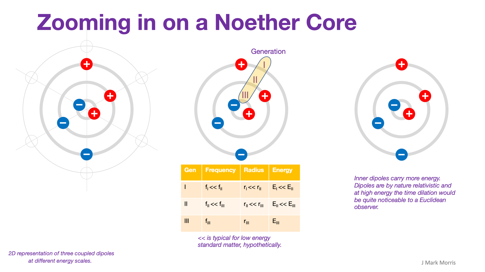

A number of insights started flowing while watching this lecture by Dr. Peter Onyisi published by Aspen Physics on July 30, 2021.

<figure>

https://youtu.be/ve2Eief5Udc

<figcaption>

Aspen Physics

</figcaption>

</figure>

At the 23:10 mark, Dr. Onyisi begins to talk about neutron decay. I paused the video and started thinking, imagining, and visualizing how and why a free neutron might 'decay' in a short time. This led me to think about the natural characteristics and capabilities of the immutable point charge architecture. At base level everyone must accept the scientific evidence that nature is simply a bunch of point charges interacting electromagnetically and kinetically in Euclidean space and time. It's rather mundane in reality. Nothing fancy or mysterious. It is absolutely true that each point charge is independent of the others at the fundamental architectural level.

However, when one considers emergent structure, and in particular the Noether energy core which is essential to the standard model, you can begin to realize the amazing flexibility and self-tuning of the immutable point charge architecture.

The Noether energy core is comprised of three electrino-positrino binaries, which are generally at vastly different scales of energy, and hence radius. The higher the energy the smaller the radius. Each binary is orbiting in a plane with an abstractly elliptical orbit which is often strongly circular and tracing an imaginary sphere (_dynamical locally oblate spheroid_?) due to precession caused by weaker external fields.

When the three orbital planes are orthogonal in an inertial spacetime aether frame then the Noether core is exhibiting its rest mass which is based on the observable energy of the outer binary, whilst the inner binaries are shielded.

The physics of shielding will likely be a new sub-field when you consider the geometries of the magnetic and electric fields, so I will simply continue my brainstorm and thought experiments. Hopefully my intuition, which is built upon the shoulders of giants can help the new field of point charge energy shielding get off to a good start.

Let's imagine that work is applied to say a stationary Starship Enterprise in the form of a linear force for a certain duration, then part of what is happening is that the orbital planes of the three binaries in each Noether core in the accelerating Enterprise and contents must start aligning towards orthogonality with the direction of travel. At low speeds this is hardly noticeable. However as we approach the speed of light we know that the ultimate speed in the aether is given by photons which orbiting entirely orthogonal to the direction of travel. It requires a lot of energy to rotate the binary orbital plane in every proton, neutron, and electron in the Enterprise and crew :

- there are three electrino-positrino binaries per Noether core,

- there is one Noether core per electron,

- there are three Noether cores per Neutron and three per Proton!

Note the difference between the case of the Starship Enterprise and the case of a SpaceX rocket launch. The SpaceX rocket starts in the earth's gravitational field at the surface, which means the orbital planes of all Noether core binaries are already tilted. The work done by the rocket must **deaccelerate** the Noether cores with respect to the radial direction by moving them to a radius in space where the slope of the aether energy gradient is much flatter.

The commonality with the equivalence principle, when it is properly expressed, is that the angle of each binaries' orbital plane to the orthogonal represents an energy level that must be supported by the energy transferred to or from the binary in h-bar j-s. of course.

N.B. This post did not cover the contribution of personality charges and other adaptive and emergent behaviours and how they do or don't impact the presentation of a fraction of the encapsulated energy as mass. Those, I'm certain, will be amazing and beautiful subjects in the point charge era and I hope to get an inkling of them some day.

That all said, let's tie this back to the flexibility and self-tunability of the immutable point charge universe. Self-tunability is self-evident in a sense — the particles wouldn't be stable in nature unless nature somehow tunes for those particles. It's tautological, isn't it? Or is it? Think about the variability of nature I have expressed in this post. Every single binary could have a different range of permissible frequencies or energy levels where it can operate in synchronization with the structured particle(s) to which it belongs. Each of those energy levels may be stable under certain angles determined by velocity or gradient to the aether energy slope. In larger atoms the number of binaries per atom rises into the hundreds and thousands. All of these binaries self sychronize at different levels. I imagine the day when simulations will track the real Euclidean space time path of every individual point charge. It is fun to imagine the optimizations in the simulation engines for the immutable point charge era. I think that there will be very bright people who will innovate in the simulation and modeling technology for the point charge era.

GR / QM / QFT / QED / QCD era physicists are in desperate need of the physical mechanisms I have described in the immutable point charge architecture. **_Should they adapt their existing techniques or start over? Yes! Both!_** There are certainly enough physicists and geometers to get this all sorted out at many scale levels in short order. It's not difficult, it really isn't. It is simply a matter of letting your mind go free and seeing how electro-magnetic-kinetic structure can emerge and evolve to create the behaviours that have been measured and theorized. Then it is a race for the scientists and entrepreneurs who have the best models.

Bosons are planar structures. Where, exactly, is the boundary between co-planar orbits with two dimensions of space and one dimension of time (i.e., bosons), vs. orbits that have a larger spacetime footprint, i.e. fermions with orbits that utilize three dimensions of space and one dimension of time? NPQG clearly differentiates the geometry of these two forms of physical behaviour and their mathematical statistics. Boson orbits appear to be idealized for a very high energy environment where the electromagnetic fields are so strong as to differentiate by orbital vector and preference orbits that lie in a narrow radius range to the energy source.

Tying this thought experiment back around, it seems to be evident that the geometry of the orbital planes of the electrino-positrino binaries in every Noether core of matter-energy are an essential factor in determining momentum in linear and angular forms. The gradient relative to the spacetime aether energy is the important factor, especially when considering the equivalence principle.

**_J Mark Morris : Boston : Massachusetts_**
