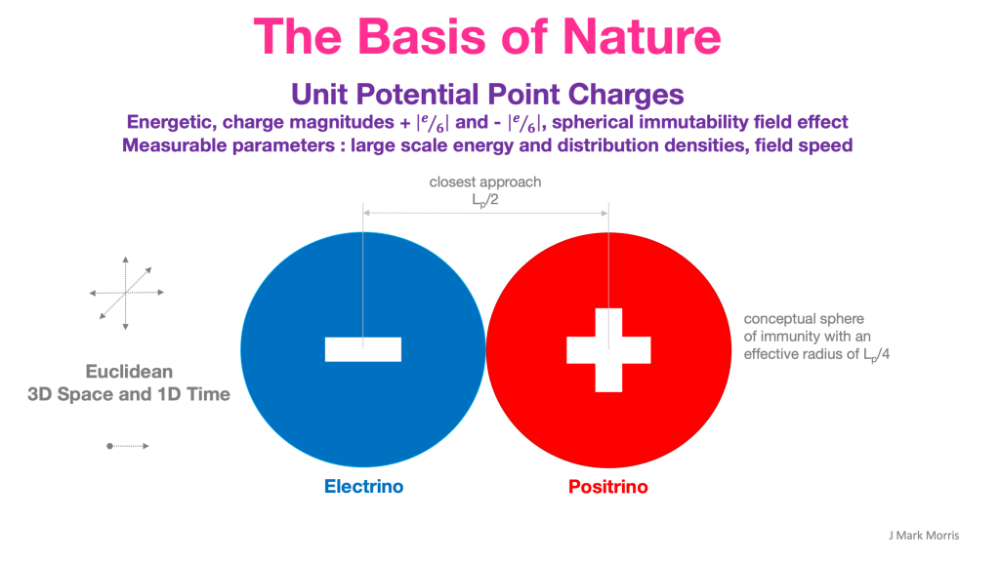

I am having an insight. I am having a clear realization of what I have known for a long time. **All Noether cores shield energy.**

Standard matter particles shield hundreds to thousands of times more energy than is apparent as mass. Eyeball and number crunch the orders of magnitude energy differences in generations of the standard model in the standard model chart. Check my math. Are **hundreds to thousands times** about right for atomic matter, i.e., protons, neutrons, electrons? That's nothing. _**Seriously that is nothing.**_ Now add in the total energy density of photons, neutrinos, and in spacetime aether particles. All of these particles are shielding Generation II and Generation III binary energy. Some of these particles are really good at shielding, and therefore difficult to detect. The photon is almost perfect, appearing massless. The neutrino sort of has a wobble between its orbital planes thus revealing three different mass profiles. Perhaps most of all, the Higgs boson spacetime aether assemblies shield a tremendous amount of energy and are very dense everywhere. If you are following my thinking, that would make the decaying Higgs a gen II particle. Spacetime aether aka dark matter is only at 2.8K, who are you kidding at 125GeV? The Higgs Noether core shielding by superposition is so effective that science hasn't been able to discover them.

What about photons and neutrinos? The universe is composed of islands of shielded energy. Our particle assemblies exist inside a universe size soup of Higgs aether assemblies, photons, and neutrinos. And Higgs assemblies dominate the population, especially at energy levels on Earth.

Every particle assembly, including spacetime aether assemblies, has shielded energy. We are talking massive shielded energy! So how does energy shielding work, exactly? Do the orbits of the binaries align in some way, for maximum cancellation of waves? Sure that must be how it works. It requires only superposition, which means no new physics and nothing required of space.

Is this related to reactions seeking the lowest energy? Is this related to objects being gravitated towards higher energy? Let's start with 2-D flatland scenario. A plane. A Euclidean plane. A point charge emits a circular field. A positive and negative point charge have a stable circular binary orbit with radius r and frequency f. Delayed by a half revolution the opposite point charge sweeps through and reverses the peak fields of its orbital partner.

What is the electric field at radius r, inside the orbit and beyond? It is mathematically calculable via electrodynamics. Is it fair to say that every point in the 2-D plane perceives a complex high frequency potential landscape, or zero in the case of the origin?

Are all of the resulting fields in flatland symmetrical? What happens close to the point charges? What happens at the center of the rotation? What is the gradient of potential at each point in 2D flatland? You must sum any fields impinging, regardless of when they were emitted in time and from all point charges including ones-self.

Now once that is all calculated, let's place another binary at the most optimum radius for shielding energy beyond that point. What is that radius and frequency? Can we calculate it? Also, how does that relate to the third binary? What is its role?

_Aside : I am presuming that there are three generations of binary in a Noether core. Not to get all woo-ish, but at some point physicists will need to look into whether 3 is the provably correct number for 3-D or if there could be additional binaries contained within - Ha ha, there could be turtles (binaries) all the way down, but only as far as Planck scale where there is a hard clank, so that's not too surprising_.

Ok, so what does this all mean? Basically, all of reality that we experience is made of proton, neutron, and electron assemblies permeated by Higgs aether assemblies. Higgs Noether cores are extremely effective at shielding energy.

Do we have the sign wrong in the energy-momentum equation? As work is applied to accelerate a particle the local result is that the particle is actually hiding apparent energy by becoming more planar and having greater shielding.

A photon is optimal at shielding energy and can travel by stealth at c. The contra-rotating cores exactly balance one another and result in the familiar electromagnetic field.

Why would nature choose to shield energy? What is the benefit to doing so? The more energy you shield, the faster you can go, apparently. Why?The more energy you shield, the less reactive you are. This is important for emergent survival. Are the particles that survive fit for purpose? Of course. They must be according to emergence. Does it turn out that in nature, as far as particles go, survival requires a 3D Noether core? Yes. Do Noether cores exhibit energy shielding? Yes.

This seems to imply that emergence favors survival of the most stable in given conditions. This is the simple chemistry of reactions. We know what happens to particles that reveal their heavy mass. Their destiny appears to be in general towards higher energy reactions and in general towards the supermassive black hole in the galaxy center.

There is nothing woo-ish about this. It's not like Noether cores are alive and making decisions to be stealthy! All assembly behaviour is emergent from the ingredients of the universe.

In my thought experiments on the point charge universe I have seen no evidence of an overarching **Will** having a hand in nature. There are remaining unknowns that will lead to much consideration and speculation. Where did each of the ingredients of nature come from? Can we reduce NPQG to something even more parsimonious? Did some higher **Will** create the ingredients for nature? _Are we in a simulation? It is very possible that we may be in a very large and long loop of self-priming Monte Carlo simulations._ _See [Debate : Alan Guth vs. Roger Penrose](https://johnmarkmorris.com/2021/11/24/debate-alan-guth-vs-roger-penrose/)._

It is rather stunning and amazing that as much as physicists know, they do not realize that the generation II and III energy levels are contained and shielded within the generation I Noether core. It is even more discombobulating that physicists do not realize that all standard matter particles are powered by Noether cores which shield generation II and III energy. Shielding is easy with no new physics. You know how superposition works, right? We are simply talking orbiting point charges here at different radii. I imagine that the middle energy binary somehow tunes to the perfect frequency and radius for maximum cancellation of emanating electromagnetic waves from itself as well as the high energy inner binary. This has perplexed physicists for ages. All that is required is to pick up point charges and endow them with the minimum necessary characteristics. Immutability is a given, because it solves so much nonsense with a stroke of the pen (singularities, wormholes, many worlds, etc.). It's an easy game to play. Call them the electrino and positrino at -/+ |e/6|.

**_J Mark Morris : Boston : Massachusetts_**

p.s., The interior binaries in a Noether core have certain dualities with black holes. Each binary has a distinct energy level which determined point charge velocity, orbital radius, and orbital frequency. It is easy to visualize if you do so logarithmically, where each orbital radius is orders of magnitude smaller than the previous. I am thinking that the point charges in the middle binary of a Noether core move at the same speed as the potential they emit, i.e. v = @. This appears to be a duality to the velocity in all binaries at a black hole event horizon.

In the spacetime aether, by definition the apparent energy presents a 2.7K kinetic energy and reacts so lightly that we call it dark matter and the gravitational medium. Thinking this through, if we imagine a spacetime aether particle as two Noether cores and two anti-Noether cores, sort of nestling like a Helium nucleus (nature repeats patterns). So it's 3/3, anti 3/3, 3/3, anti 3/3 which is 12 electrinos and 12 positrinos or 24 total point charges.

A contributor to spacetime aether may be ultimately redshifted photons and ultimately redshifted neutrinos. The photon is a construct of a Noether core and an anti-Noether core. The neutrino has the same point charge composition as a photon, but the sub-assembly configuration is different. I speculate that the neutrino assembly is nearly flat like a boson, but that the assembly oscillates thus revealing an oscillating apparent energy, aka mass.

Now to contrast this to a black hole, my first reaction is we need a whole new theory of black holes based upon the realization that point charges are the new fundamental, and that a photon is a 2nd order composite structure. In other words, the basis of the prior theory is not just falsified, it is defunct.

p.p.s., Note to reddit r/particlephysics :

_Hi - My hobby is going way back in history to the 1800's and thinking about theoretical ideal point charges rehabilitated with immutability - aka neoclassical point charges. Recently I have been thinking about the physics of shielding of energy. What is shielding? The only possibility with existing physics is superposition that has a cancelling effect. What is the lowest radiated (apparent) energy configuration of two opposite point charges moving and interacting in a Euclidean plane? Let's call this 2D Flatland for intellectual fun.If the point charges are moving they are generating a magnetic field. So I thought how could you erase that magnetic field? The best you could do would be to have the opposite point charge sweep through on the same circular orbit. That seems like a clever solution to me, especially as you zoom out by orders of magnitude in scale from this rotating binary. The only measurable signal would be a high frequency low magnitude fluctuation in the electromagnetic fields. I'm also trying to imagine the Flatland situation with one more binary of opposite point charges orbiting each other at a larger radius and lower energy scale than the first binary. Is there some radius (i.e., energy) of the 2nd binary that is optimal for canceling the radiation from the first binary? Does direction matter? Would nature favor one or the other situation and if so why?_
