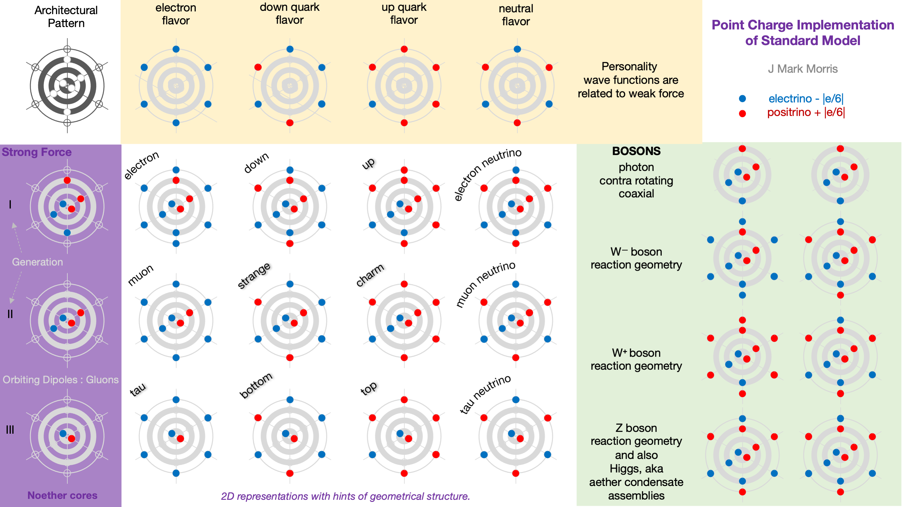

The figure shows what I call the periodic table of the standard model of particle physics. Let's walk through the sections of the table.

- In the top left is the architectural pattern of the standard model.
    - The three dark orbital paths, each support a positive and a negative unit potential point charge orbiting in a binary.
    
    - The sub-assembly of these three binaries is termed a Noether core, after Emmy Noether, because of the functionality of this mechanism. It is essentially an accountant and broker of energy and also conserves angular momentum.
    
    - Each of the binaries in the nested tri-binary Noether core may be at vastly different energy. Vastly means orders of magnitude differences in energy, frequency, and orbital radius.
    
    - The next ring shows six personality charges. There is one personality charge in each binary polar regions. Two personality charges per binary and three binaries makes six personality charges.

- Along the left side, in the purple region, are shown three Noether cores.
    - Tri-binaries are generally stable if unperturbed, although all Noether cores redshift.
    
    - It is thought that binary capture leads to the self assembly of the tri-binary Noether core.
    
    - Noether cores are net neutral.

- Along the top, in the yellow area, are shown various combinations of personality charge.

- In the white area we show the fermions, which are combinations of a Noether core and a set of six personality charges.
    - Anti-fermions are build with anti-Noether cores (not shown).

- The green area shows bosons and how they relate to spacetime aether assemblies, aka Higgs particles.

- Notice that since unit potential point charges have a charge magnitude of |e/6| and since Noether cores are neutral, that each particle shown has a net charge that matches the standard model of particle physics.

- The photon is a pro-Noether core coupled to an anti-Noether core in an offset coaxial configuration. Each Noether core's orbital planes are co-planar. The opposite orbital directions lead to superposition that cancels and what remains is the familiar electromagnetic wave form.

We'll cover each particle in more detail as we dive deeper.

_**J Mark Morris : Boston : Massachusetts**_
