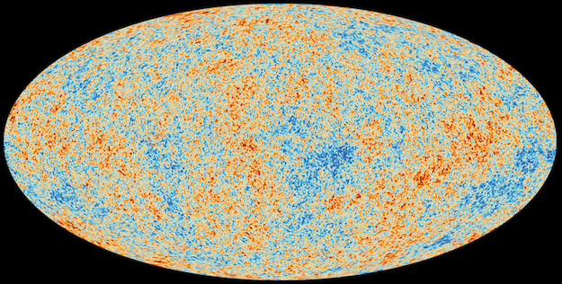
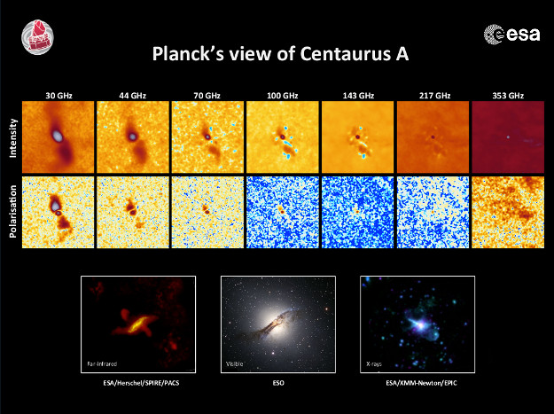

> _Planck was a space observatory operated by the European Space Agency (ESA) from 2009 to 2013, which **mapped the anisotropies of the cosmic microwave background** (CMB) at microwave and infra-red frequencies, with high sensitivity and small angular resolution. ... Planck provided a major source of information relevant to several cosmological and astrophysical issues, such as testing theories of the early Universe and the origin of cosmic structure. Since the end of its mission, Planck has defined the most precise measurements of several key cosmological parameters, including the average density of ordinary matter and dark matter in the Universe and the age of the universe. ... \[In\] 2013, the mission's first **all-sky map of the cosmic microwave background** was released with an additional expanded release including **polarization data** in 2015. The final papers by the Planck team were released in 2018._
> 
> Wikipedia July 2019

The Planck satellite was capable of measuring radiation with frequencies between 27 GHz and 1 THz. At the low end, coverage begins in the mid infrared microwave portion of the radio wave band. At the high end, the coverage ends at 1 Thz which is in the far infrared band (300GHz - 20 THz). Interestingly the Planck satellite coverage has a relatively narrow band that doesn't include visible light, x-rays, nor gamma rays.

<figure>

<figcaption>

Drawing - Wikipedia

</figcaption>

</figure>

Here is the Planck image of the cosmic microwave background (CMB).

<figure>

<figcaption>

Credit: ESA/Planck Collaboration

</figcaption>

</figure>

> _"The anisotropies of the cosmic microwave background as observed by ESA's Planck mission. The CMB is a snapshot of the oldest light in our cosmos, imprinted on the sky when the Universe was just 380 000 years old. It shows tiny temperature fluctuations that correspond to regions of slightly different densities, representing the seeds of all future structure: the stars and galaxies of today."_
> 
> ESA/Planck

Take note that the interpretation of the CMB map by GR-QM era science is that it represents the Big Bang viewpoint which is included in the Lambda Cold Dark Matter (ΛCDM) model. This means that the foundation for the interpretation was determined **_before_** the observations. Therefore, the Planck scientists believe that the age of the light they detect is an index into the past and the timeline of the Big Bang.

In 𝗡𝗣𝗤𝗚, there is no Big Bang, and the universe is in a presumably relatively steady recycling state. To interpret the Planck data there are several factors to consider:

1. Where did these photons originate?

3. What is the detailed profile of the spacetime æther path traveled to the detector? We would like to have a reasonably accurate model to determine the absolute distance traveled in any interval of absolute time including the æther flow and temperature in that interval.

5. What forms of redshift (energy loss) did these photons experience along their path?

Here is an example of the type of data available. It shows a galaxy that is jetting. From an NPQG standpoint, jetting SMBH are very interesting, because they may indicate the emission of Planck plasma from the core of the SMBH. First, the patterns are fascinating. Examining the lower left far infrared picture from ESA Herschel, we can see what may be the endpoints of the current jet. Also, it appears that there are sources even farther away that could be endpoints of an earlier jet. In the work of Halton Arp, he interpreted such images as potential child galaxies being formed.

_**J Mark Morris : San Diego : California**_
