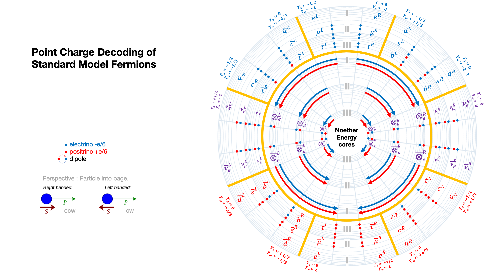
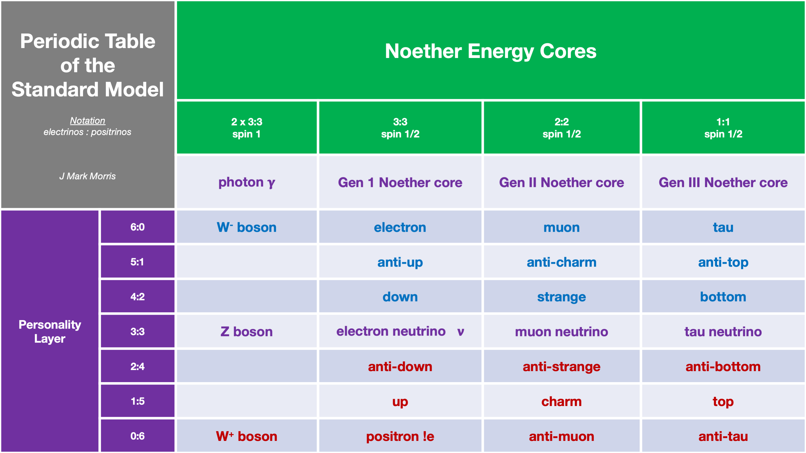

_I posted this on reddit r/particlephysics and the PBS Space Time discord._

My **hobby** is to see if I can recreate the standard model from immutable point charges at e/6. I have found important patterns I am seeing. Here is a possible decoding of the standard model in point charges. Blue dots are electrinos at -e/6 and red dots are positrinos at +e/6 in my hypothetical universe.

If I decode the standard model like this, there would be what I call a Noether core in all the fermions and it would be the main structure responsible for conservation of energy and momentum (hence why I call it a Noether core) and it would generate some mighty awesome magnetic fields. Then the lower energy personality charges would do their wave equation around this Noether core.

This decoding seems to map well to regular and anti particles and left and right handed particles and be complete. There's nothing missing and its parsimonious. One possible insight is that it has a physical explanation for pro vs. antiness (direction of core rotation or wave equation) and for left vs. right handedness (direction of personality layer rotation or wave equation). Also, it should be possible to evolve this to a 3D representation that might be helpful visualizing reactions and decays.

_Me : Is the formula for g/2 something reasonably short, symbol wise? I'm looking at three frequencies for the binar_ies _in the Noether core, then some pattern for the six electrinos in the weak personality layer. Maybe if the SM formula is compact it would be interesting to see if there is a mapping._

> reddit : No, There isn't "a formula" for it in the way you are thinking. And matching symbols in a calculation to unrelated ideas is not how to do maths.
> 
> The prediction of g/2 proceeds from first principles about how electrons interact with photons. It requires that you add up all the contributions from every possible way that the quantum fields can oscillate/interact in the presence of an electron. The final value ends up depending on nearly every fundamental quantity describing those fields. Like the particle masses/coupling strengths and their overall structure in the SM.
> 
> The way the calculation is done is actually an infinite series of smaller and smaller contributions that get progressively more complicated. Eventually you have to stop calculating the contributions, so there is an uncertainty due to the fact that you didn't include the even smaller contributions.
> 
> Some of those contributions aren't calculable exactly because they involve the strong force. Those have to be done by making some assumptions or using computers to model them. Both ways only give you an approximate answer, which is another reason why there there is uncertainty in final predicted value. But since the values are small, and the approximations are good, the overall uncertainty on the final value is tiny.
> 
> This is why the prediction is so important. It is immensely precise in itself (which is not usually the case for real world measurements) and it relates nearly every value in the SM back to a very precisely measurable quantity. It's an incredibly strict test of the SM, that's why we measure it so precisely. If the measured value didn't match the prediction it would be a huge breakthrough.
> 
> Most simple modifications to the SM cause a change in the predicted value, which then makes it disagree with experiment. Theorists have to be cunning to come up with models that give predictions that match the current experimental value, and good enough _to produce predictions precise enough to be falsifiable_. It's useless to have no predictions, or predictions with such huge uncertainties that they match everything.
> 
> https://indico.fnal.gov/event/7309/contributions/101335/attachments/66130/79359/notes-3.pdf  
> 
> https://pdg.lbl.gov/2019/reviews/rpp2018-rev-g-2-muon-anom-mag-moment.pdf

Several days later, without any warning, I was permanently banned from r/particlephysics and all my prior posts on that subreddit were removed. Such is the intellectual dishonesty of the guardians of physics.

**_J Mark Morris : Boston : Massachusetts_**

p.s. after several requests to the moderators over three+ weeks, they finally got back to me and said, "Unbanned. No idea what happened sorry." I don't buy it.
