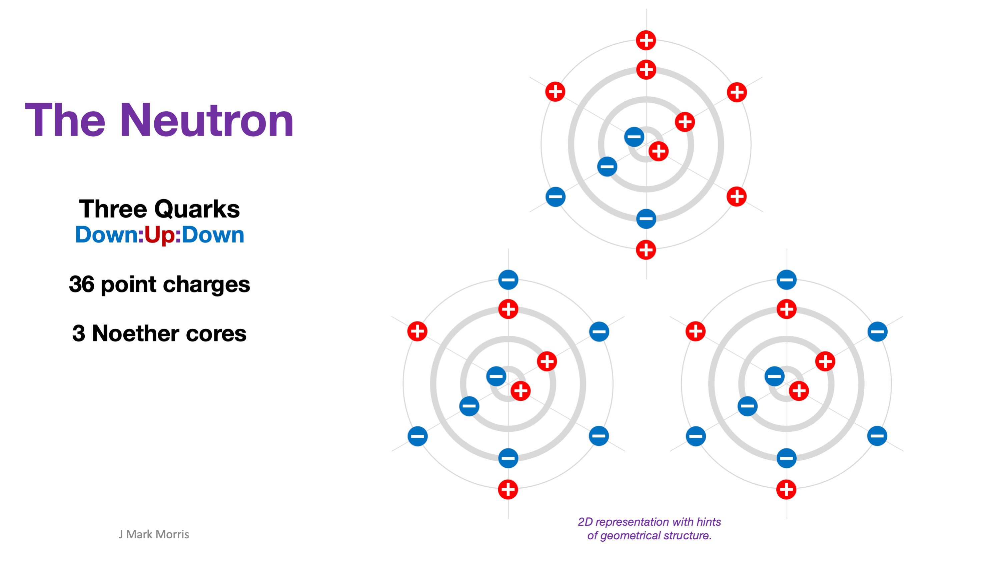
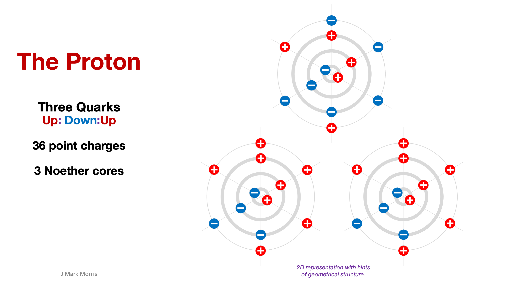
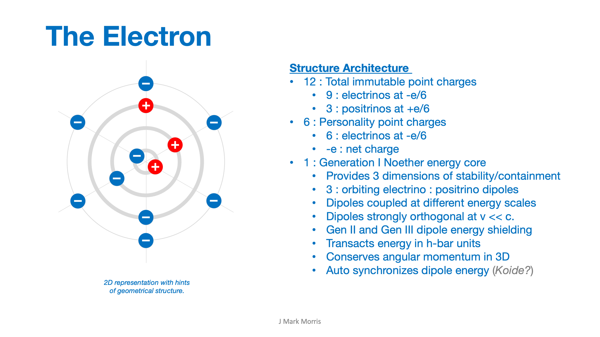

> _In physical cosmology, the Alpher–Bethe–Gamow paper, or **αβγ** paper, was created by Ralph Alpher, then a physics PhD student, and his advisor George Gamow. The work, which would become the subject of Alpher's PhD dissertation, argued that the Big Bang would create hydrogen, helium and heavier elements in the correct proportions to explain their abundance in the early universe. While the original theory neglected a number of processes important to the formation of heavy elements, subsequent developments showed that Big Bang nucleosynthesis is consistent with the observed constraints on all primordial elements._
> 
> _Formally titled "The Origin of Chemical Elements", it was published in the April 1948 issue of Physical Review._
> 
> Wikipedia

Let's first review the precursor to the **αβγ** paper and then the **αβγ** paper itself and I'll make comments from the perspective of **NPQG** and the immutable point potential universe.

- Nature loves to repeat at large scales, the patterns from small scales

- Orbital rotation is a huge hint that nature gave to physicists,

- Repeating the pattern of point potentials obeying Coulomb's law.

- Why did physicists discard point potentials as a theoretical basis?

- The point potential model can be rehabilitated.

- As a first step, we must determine the most parsimonious set of characteristics that enable point potential assembly behaviour that matches the observations of GR/QM/LCDM era physics, sans interpretations.

- The continuous build up in a very high energy environment followed by rapid expansion and cooling describes a number of processes in our universe including nova, supernova, quasars, blazars, and supermassive black hole jets to name a few.

- Immutable point potentials cannot form a singularity or wormhole, because the densest they could be packed would be a crystal structure (FCC or BCC) at the core of a black hole of sufficient conditions, possibly more typically in supermassive black holes.

- With this new knowledge, it is apparent that the GR/QM/LCDM era physics of black holes is vague and uninformed.

- Riddle me this : Which is more powerful? The event horizon through which nothing can supposedly escape, or the Planck core of point potentials that creates the event horizon to begin with?

- Examine the ideas in the images below. It seems to me that there must be a way for some black holes to emit interior point potentials via jet or eruption.

- The **αβγ** paper now introduces the concept of a neutron gas. First, here is the point potential periodic table of the standard model.

- Here is a primitive 2D composition of a Neutron.

- A Neutron is a structure made of 18 electrinos and 18 positrinos.

- I long for the day when 3D animations are available.

- The reality of the dynamic dance of the 36 point potentials in a Neutron (or Proton) must be quite amazing considering that it sounds like the Noether core binaries serve as gluons and are juggled back and forth and play a part in behaviour that physicists describe as color charge.

- Next, imagine the superstructures including Protons and Electrons.

- A Proton is a structure made of 15 electrinos and 21 positrinos.

- An Electron is a structure made of 9 electrinos and 3 positrinos.

- The **αβγ** paper describes expansion from a vague higher energy state from which electrons, protons, and neutrons emerged as if that is some magical unknown state.

- There really isn't any magic at all, it is simple NPQG era physics.
    - A high energy, density, and pressure event occurs,
    
    - point potential plasma emits from the event,
    
    - the energetic point potential plasma begins spreading out in space,
    
    - free electrinos and positrinos may capture each other, and
    
    - form tiny orbital binaries with an energy, frequency, and radius,
    
    - and these dimensional relationships lead to Einstein's GR, and
    
    - lower energy binaries may capture higher energy binaries, and
    
    - a three binary, three dimensional structure is Noether core,
    
    - and is extremely stable and adaptable and,
    
    - is found in all Gen I standard matter particles.

- Oof! I just don't know what to say to the argument in the paper as if there is always one dominant process that produces the elements.

- How can we know the source of the elements in a particular orb?

- Surely there are local phenomena that influence the situation.

- At larger scales there may be many processes that generate the various elements.

- It is too myopic to only consider the condensate of one Big Bang!

- With the advent of NPQG, scientists should be able to improve models of where the elements arise and in what proportions.
    - The new knowledge of point potential conservation is key.

The **αβγ** paper was written at a time when there was a vague understanding that there must be some unknown high energy event that preceded and generated the conditions from which the elements precipitated. Although the **αβγ** paper is extremely vague regarding the processes that might generate the elements, in short order, the idea of a single Big Bang emerged from the minds of physicists and quickly became cemented into the set of faulty interpretations of the GR/QM/LCDM era. Unfortunately this interpretational wrong turn into the Big Bang will be painful to undo since it is baked in to so much of the narrative in textbooks, papers, and outreach material.

**_J Mark Morris : San Diego : California_**
